# T8 Creative DNA Prompt Library

**简体中文** | [English](./README_EN.md)

[](https://github.com/T8mars/minimax-h3-prompt-skill-T8/actions/workflows/ci.yml)
[](https://github.com/T8mars/minimax-h3-prompt-skill-T8/releases)
[](./LICENSE)

面向 **MiniMax H3** 与 **Seedance 2.0** 的高质量短视频 Creative DNA 案例库、可安装 Skills 与带完整视频的 Electron 桌面查看器。

A curated Creative DNA library, installable Skills, and a video-first Electron desktop viewer for **MiniMax H3** and **Seedance 2.0**.

**相关 GitHub 仓库**

- [T8 Creative DNA Prompt Library](https://github.com/T8mars/minimax-h3-prompt-skill-T8)
- [ComfyUI MiniMax H3 Prompt Enhancer T8](https://github.com/T8mars/comfyui-minimax-h3-prompt-enhancer-T8)

> 这里收录可复用的创意机制，而不是技术教程、性能 Benchmark、模型对比、工作流帖子或僵硬的关键词堆叠。

## 五种内容，互相对应

| 内容 | 用途 | 视频呈现 |
| --- | --- | --- |
| `catalog/` | 浏览案例、Creative DNA、来源和双模型提示词 | GitHub 使用轻量循环 GIF；点击可回到原帖 |
| `skills/` | 安装到支持 Skills 的 Agent，直接复用案例机制 | Skill 引用同一案例与来源 |
| `catalog/official-skills/` | 固定索引 MiniMax 官方仓库收录的 9 个 Skills | 本地官方示例 GIF；H3 打开上游固定版本；Seedance 使用本库原创伴侣 Skill |
| `catalog/community-skills/` | 浏览非官方、用户贡献的高质量提示词 Skills | GitHub 有 GIF/海报；Electron 包含完整有声样片 |
| Electron 桌面版 | 中英文搜索与详情、默认最新和多种排序、筛选、播放、收藏、合集、浏览历史、对比、分区复制和整案复制 | 安装包内置真实动态预览；同一 Release 的两个无损媒体分卷包含全部可分发 MP4，解压到同一目录后支持声音和离线播放 |

GitHub 的 GIF 是快速预览，不替代原视频。每个案例都保留作者、平台及原始帖子引用地址；Electron 详情页同时提供“查看原帖”。

## MiniMax 官方仓库 Skills（9）

下表收录 [MiniMax-AI/MiniMax-H3 官方仓库的 `skills/` 目录](https://github.com/MiniMax-AI/MiniMax-H3/tree/main/skills)：1 个通用 H3 提示词 Skill 与 8 个风格制作 Skill。这里的“官方仓库收录”不等于 9 项都由 MiniMax 原创；上游 `meta.yaml` 的来源分类包括 `official`、`official-featured` 和 `community`，本库按原值展示。

本仓库不复制上游 Skill 正文，只保存固定 commit、目录 SHA、文件 SHA-256、安装命令和链接。为便于直观看效果，9 个条目均提供哈希绑定的本地 GIF：8 个来自对应官方演示 GIF，通用写作条目由官方 T2VA 示例转换。Seedance 2.0 支持由本库独立编写的 9 个伴侣 Skills 提供。

| 预览 | 官方仓库 Skill | 上游来源分类 | Seedance 2.0 伴侣 Skill |
| --- | --- | --- | --- |
| 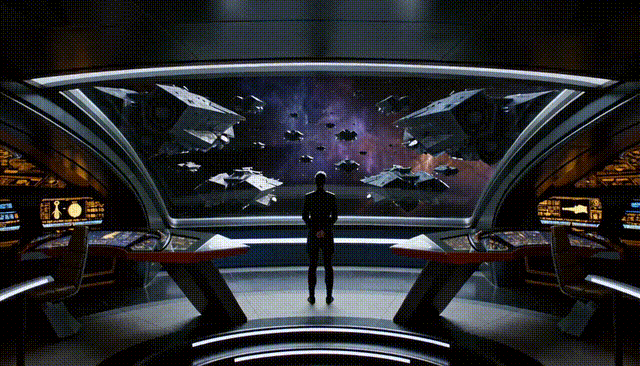 | [`h3-prompt-writing`](https://github.com/MiniMax-AI/MiniMax-H3/tree/b7227fa6a6206e9fb30562383d39e53cf3866a48/skills/h3-prompt-writing) | 官方仓库自有 | [`write-seedance-video-prompts`](./skills/write-seedance-video-prompts/) |
|  | [`minimalist-product-ad-generator`](https://github.com/MiniMax-AI/MiniMax-H3/tree/b7227fa6a6206e9fb30562383d39e53cf3866a48/skills/minimalist-product-ad-generator) | community | [`direct-seedance-minimalist-product-ad`](./skills/direct-seedance-minimalist-product-ad/) |
|  | [`3d-animation-short-generator`](https://github.com/MiniMax-AI/MiniMax-H3/tree/b7227fa6a6206e9fb30562383d39e53cf3866a48/skills/3d-animation-short-generator) | community | [`direct-seedance-3d-animation`](./skills/direct-seedance-3d-animation/) |
|  | [`papercraft-stop-motion-explainer`](https://github.com/MiniMax-AI/MiniMax-H3/tree/b7227fa6a6206e9fb30562383d39e53cf3866a48/skills/papercraft-stop-motion-explainer) | official | [`direct-seedance-papercraft-explainer`](./skills/direct-seedance-papercraft-explainer/) |
|  | [`brand-promo-video-generator`](https://github.com/MiniMax-AI/MiniMax-H3/tree/b7227fa6a6206e9fb30562383d39e53cf3866a48/skills/brand-promo-video-generator) | official-featured | [`direct-seedance-brand-promo`](./skills/direct-seedance-brand-promo/) |
|  | [`music-video-subtitle-generator`](https://github.com/MiniMax-AI/MiniMax-H3/tree/b7227fa6a6206e9fb30562383d39e53cf3866a48/skills/music-video-subtitle-generator) | official-featured | [`direct-seedance-music-typography`](./skills/direct-seedance-music-typography/) |
|  | [`co-op-game-intro-generator`](https://github.com/MiniMax-AI/MiniMax-H3/tree/b7227fa6a6206e9fb30562383d39e53cf3866a48/skills/co-op-game-intro-generator) | official | [`direct-seedance-coop-game-intro`](./skills/direct-seedance-coop-game-intro/) |
|  | [`paper-collage-explainer-generator`](https://github.com/MiniMax-AI/MiniMax-H3/tree/b7227fa6a6206e9fb30562383d39e53cf3866a48/skills/paper-collage-explainer-generator) | official-featured | [`direct-seedance-paper-collage`](./skills/direct-seedance-paper-collage/) |
|  | [`handdrawn-live-video-generator`](https://github.com/MiniMax-AI/MiniMax-H3/tree/b7227fa6a6206e9fb30562383d39e53cf3866a48/skills/handdrawn-live-video-generator) | official-featured | [`direct-seedance-handdrawn-live-fusion`](./skills/direct-seedance-handdrawn-live-fusion/) |

这 9 个官方仓库条目明确设置 `comfyui_import=false`：目标 ComfyUI 节点已经包含对应官方能力，本库不会重复导入或修改节点。

## 非官方 / 用户贡献 Skills

这一区域与 MiniMax 官方仓库索引完全分开。条目由用户提供的视频与提示词组启发，经完整媒体解码、时长核对、机制拆解、反复制重构和双模型编译后发布；卡片和详情始终显示“非官方 · 用户贡献”。

| 预览 | Skill | 模型与重点 |
| --- | --- | --- |
| [](catalog/community-skills/direct-street-interview-video/SUMMARY.md) | **[`direct-street-interview-video`](./skills/direct-street-interview-video/)**<br><sub>自然街拍互动 · 用户提供 AIGC 样片</sub> | MiniMax H3 · Seedance 2.0<br>连续路线、第一人称手持、短对白、自然光与环境视差 |
| [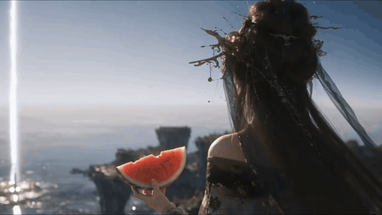](catalog/community-skills/stage-startle-to-truce-encounter/SUMMARY.md) | **[`stage-startle-to-truce-encounter`](./skills/stage-startle-to-truce-encounter/)**<br><sub>突遇惊吓到手势和解 · 用户提供 AIGC 样片</sub> | MiniMax H3 · Seedance 2.0<br>双方视角、非致命升级、距离反转、透明边界与求和手势 |

两份非官方 Skill 都以成片而不是长提示词的承诺为准：街拍 Skill 修复 10.125 秒样片的对白与片尾分镜过载；突遇 Skill 则修复 13.373 秒横屏样片与“15 秒竖屏、完整导弹追逐”文本之间的失配，只保留被画面证明的距离反转、惊吓和手势降级机制。

## 案例画廊 / Case gallery

下面区域由 `catalog/manifest.json` 和每个案例的 `preview.gif` 生成。GIF 点击后打开原始帖子。

<!-- CASE_GALLERY:START -->

| 预览 | 案例 | 模型 |
| --- | --- | --- |
| [](https://x.com/abulu8/status/2085626141759709286) | **[产品广告｜功能证据递进](catalog/cases/x-abulu8-2085626141759709286-browser-2085626141759709286-video-1/SUMMARY.md)**<br><sub>x-abulu8-2085626141759709286-browser-2085626141759709286-video-1</sub> | MiniMax H3 · Seedance 2.0 |
| [](https://x.com/Dheepanratnam/status/2086312209919963371) | **[固定机位｜从线稿生成成品](catalog/cases/x-dheepanratnam-2086312209919963371-browser-2086312209919963371-video-1/SUMMARY.md)**<br><sub>x-dheepanratnam-2086312209919963371-browser-2086312209919963371-video-1</sub> | MiniMax H3 · Seedance 2.0 |
| [](https://x.com/godofprompt/status/2086142925063516348) | **[形态奇观｜平面升级到现实](catalog/cases/x-godofprompt-2086142925063516348-browser-2086142925063516348-video-1/SUMMARY.md)**<br><sub>x-godofprompt-2086142925063516348-browser-2086142925063516348-video-1</sub> | MiniMax H3 · Seedance 2.0 |
| [](https://x.com/iamahmedfaraz66/status/2086298926617903365) | **[人物旅程｜从困境走向目标](catalog/cases/x-iamahmedfaraz66-2086298926617903365-browser-2086298926617903365-video-1/SUMMARY.md)**<br><sub>x-iamahmedfaraz66-2086298926617903365-browser-2086298926617903365-video-1</sub> | MiniMax H3 · Seedance 2.0 |
| [](https://www.reddit.com/r/StableDiffusion/comments/1vgynd7/2d_chibi_girl_added_just_a_pinch_minimax_h3/) | **[二维角色｜真人接触三级反应](catalog/cases/reddit-1vgynd7-chibi-pinch/SUMMARY.md)**<br><sub>reddit-1vgynd7-chibi-pinch</sub> | MiniMax H3 · Seedance 2.0 |
| [](https://www.reddit.com/r/comfyui/comments/1vh8jy6/minimax_h3_15s_t2v_in_23_minutes_using_the/) | **[一对多反转｜单一证据胜出](catalog/cases/reddit-1vh8jy6-h3-high-card/SUMMARY.md)**<br><sub>reddit-1vh8jy6-h3-high-card</sub> | MiniMax H3 · Seedance 2.0 |
| [](https://www.reddit.com/r/StableDiffusion/comments/1vhloyz/walter_white_and_the_minimax_h3_official/) | **[风险揭晓｜证据交给人物反应](catalog/cases/reddit-1vhloyz-walter-prompt-guide/SUMMARY.md)**<br><sub>reddit-1vhloyz-walter-prompt-guide</sub> | MiniMax H3 · Seedance 2.0 |
| [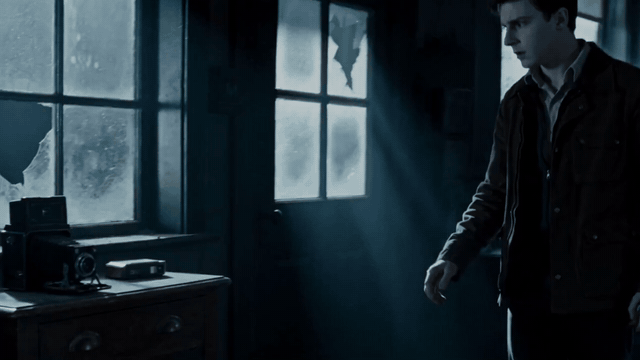](https://x.com/mimu_ai1/status/2086474098859987150) | **[未来证据｜异常闯入现实](catalog/cases/x-mimu-ai1-2086474098859987150-browser-2086474098859987150-video-1/SUMMARY.md)**<br><sub>x-mimu-ai1-2086474098859987150-browser-2086474098859987150-video-1</sub> | MiniMax H3 · Seedance 2.0 |
| [](https://x.com/Strength04_X/status/2086471165581902327) | **[第一视角探险｜穿越后巡检](catalog/cases/x-strength04-x-2086471165581902327-browser-2086471165581902327-video-1/SUMMARY.md)**<br><sub>x-strength04-x-2086471165581902327-browser-2086471165581902327-video-1</sub> | MiniMax H3 · Seedance 2.0 |
| [](https://x.com/ZephyraLeigh/status/2086466812347297938) | **[复古手持｜日常送别回眸](catalog/cases/x-zephyraleigh-2086466812347297938-browser-2086466812347297938-video-1/SUMMARY.md)**<br><sub>x-zephyraleigh-2086466812347297938-browser-2086466812347297938-video-1</sub> | MiniMax H3 · Seedance 2.0 |
| [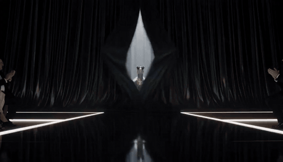](https://x.com/DeCat2025/status/2086476172783759520) | **[反差喜剧｜越从容越失控](catalog/cases/x-decat2025-2086476172783759520-browser-2086476172783759520-video-1/SUMMARY.md)**<br><sub>x-decat2025-2086476172783759520-browser-2086476172783759520-video-1</sub> | MiniMax H3 · Seedance 2.0 |
| [](https://x.com/adithatipalli/status/2086477914699170293) | **[人物档案｜能力逐层点亮](catalog/cases/x-adithatipalli-2086477914699170293-browser-2086477914699170293-video-1/SUMMARY.md)**<br><sub>x-adithatipalli-2086477914699170293-browser-2086477914699170293-video-1</sub> | MiniMax H3 · Seedance 2.0 |
| [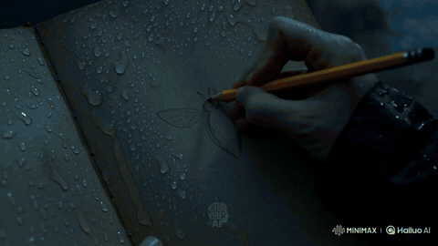](https://x.com/FutureVibesAi/status/2086443552649941148) | **[画中物成真｜小光点变奇观](catalog/cases/x-futurevibesai-2086443552649941148-browser-2086443552649941148-video-1/SUMMARY.md)**<br><sub>x-futurevibesai-2086443552649941148-browser-2086443552649941148-video-1</sub> | MiniMax H3 · Seedance 2.0 |
| [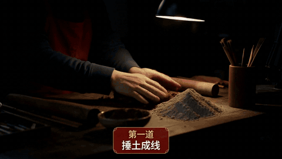](https://x.com/derek_wall90176/status/2086464559439855938) | **[工艺过程｜材料覆盖当进度](catalog/cases/x-derek-wall90176-2086464559439855938-browser-2086464559439855938-video-1/SUMMARY.md)**<br><sub>x-derek-wall90176-2086464559439855938-browser-2086464559439855938-video-1</sub> | MiniMax H3 · Seedance 2.0 |
| [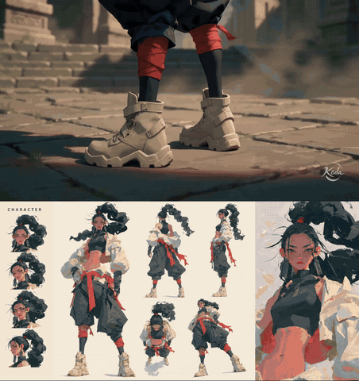](https://x.com/aimikoda/status/2086412223061135392) | **[角色登场｜细节到全身揭晓](catalog/cases/x-aimikoda-2086412223061135392-browser-2086412223061135392-video-1/SUMMARY.md)**<br><sub>x-aimikoda-2086412223061135392-browser-2086412223061135392-video-1</sub> | MiniMax H3 · Seedance 2.0 |
| [](https://x.com/saniaspeaks_/status/2085932310923251950) | **[机械同行｜启动后稳定伴行](catalog/cases/x-saniaspeaks-2085932310923251950-browser-2085932310923251950-video-1/SUMMARY.md)**<br><sub>x-saniaspeaks-2085932310923251950-browser-2085932310923251950-video-1</sub> | MiniMax H3 · Seedance 2.0 |
| [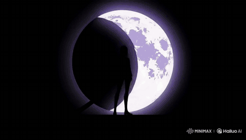](https://x.com/Mayz1169/status/2086427292755247409) | **[平面重组｜几何节奏品牌片](catalog/cases/x-mayz1169-2086427292755247409-browser-2086427292755247409-video-1/SUMMARY.md)**<br><sub>x-mayz1169-2086427292755247409-browser-2086427292755247409-video-1</sub> | MiniMax H3 · Seedance 2.0 |
| [](https://x.com/Soranlan/status/2086461295818084617) | **[景别收紧｜从世界到眼神](catalog/cases/x-soranlan-2086461295818084617-browser-2086461295818084617-video-1/SUMMARY.md)**<br><sub>x-soranlan-2086461295818084617-browser-2086461295818084617-video-1</sub> | MiniMax H3 · Seedance 2.0 |
| [](https://x.com/ImaStudio_ai/status/2086429537127297091) | **[角色卡验真｜四类证据锁定角色](catalog/cases/x-imastudio-ai-2086429537127297091-browser-2086429537127297091-video-1/SUMMARY.md)**<br><sub>x-imastudio-ai-2086429537127297091-browser-2086429537127297091-video-1</sub> | MiniMax H3 · Seedance 2.0 |
| [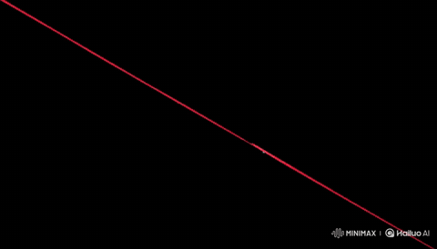](https://x.com/Mayz1169/status/2086430481072218307) | **[平面重组｜纸艺无障碍示例](catalog/cases/x-mayz1169-2086430481072218307-browser-2086430481072218307-video-1/SUMMARY.md)**<br><sub>x-mayz1169-2086430481072218307-browser-2086430481072218307-video-1</sub> | MiniMax H3 · Seedance 2.0 |
| [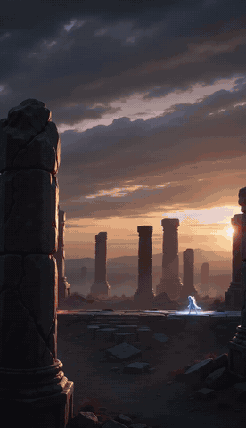](https://x.com/airina_xyz/status/2086404681480233236) | **[双系统碰撞｜同时证明两种规则](catalog/cases/x-airina-xyz-2086404681480233236-browser-2086404681480233236-video-1/SUMMARY.md)**<br><sub>x-airina-xyz-2086404681480233236-browser-2086404681480233236-video-1</sub> | MiniMax H3 · Seedance 2.0 |
| [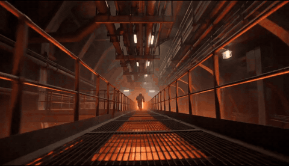](https://x.com/DeCat2025/status/2086379637874078201) | **[单目标逃生｜前后灾害交替逼近](catalog/cases/x-decat2025-2086379637874078201-browser-2086379637874078201-video-1/SUMMARY.md)**<br><sub>x-decat2025-2086379637874078201-browser-2086379637874078201-video-1</sub> | MiniMax H3 · Seedance 2.0 |
| [](https://x.com/CharaspowerAI/status/2086105326978281608) | **[对决节奏｜静止密战一击定局](catalog/cases/x-charaspowerai-2086105326978281608-browser-2086105326978281608-video-1/SUMMARY.md)**<br><sub>x-charaspowerai-2086105326978281608-browser-2086105326978281608-video-1</sub> | MiniMax H3 · Seedance 2.0 |
| [](https://x.com/DeCat2025/status/2086287667948396933) | **[路线坍塌｜安全空间逐段消失](catalog/cases/x-decat2025-2086287667948396933-browser-2086287667948396933-video-1/SUMMARY.md)**<br><sub>x-decat2025-2086287667948396933-browser-2086287667948396933-video-1</sub> | MiniMax H3 · Seedance 2.0 |
| [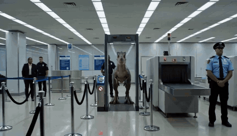](https://x.com/DeCat2025/status/2086134168992236013) | **[流程错位｜扫描到实物双确认](catalog/cases/x-decat2025-2086134168992236013-browser-2086134168992236013-video-1/SUMMARY.md)**<br><sub>x-decat2025-2086134168992236013-browser-2086134168992236013-video-1</sub> | MiniMax H3 · Seedance 2.0 |
| [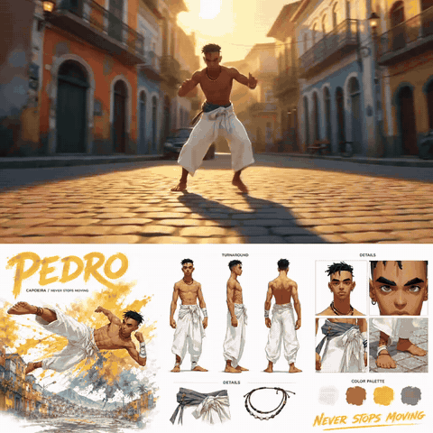](https://x.com/TechieBySA/status/2086089483682734427) | **[技能展示｜基础动作串联升级](catalog/cases/x-techiebysa-2086089483682734427-browser-2086089483682734427-video-1/SUMMARY.md)**<br><sub>x-techiebysa-2086089483682734427-browser-2086089483682734427-video-1</sub> | MiniMax H3 · Seedance 2.0 |
| [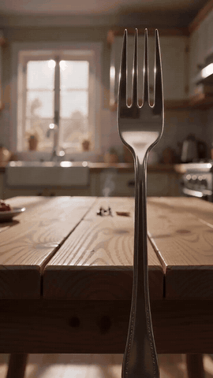](https://x.com/nicolasmariar/status/2086226500538273920) | **[微缩介入｜外部物只进入一次](catalog/cases/x-nicolasmariar-2086226500538273920-browser-2086226500538273920-video-1/SUMMARY.md)**<br><sub>x-nicolasmariar-2086226500538273920-browser-2086226500538273920-video-1</sub> | MiniMax H3 · Seedance 2.0 |
| [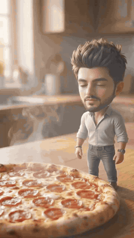](https://x.com/Arzoo12sh/status/2086407184309792852) | **[微缩闯关｜同一材质连续变形](catalog/cases/x-arzoo12sh-2086407184309792852-browser-2086407184309792852-video-1/SUMMARY.md)**<br><sub>x-arzoo12sh-2086407184309792852-browser-2086407184309792852-video-1</sub> | MiniMax H3 · Seedance 2.0 |
| [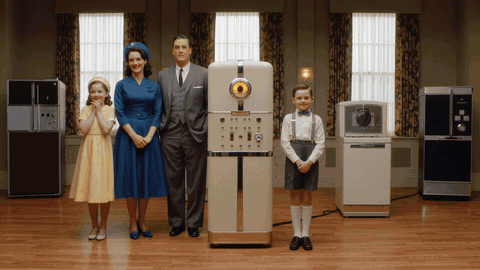](https://x.com/Dheepanratnam/status/2086493087707086919) | **[升级讽刺｜新物登场旧爱被移走](catalog/cases/x-dheepanratnam-2086493087707086919-browser-2086493087707086919-video-1/SUMMARY.md)**<br><sub>x-dheepanratnam-2086493087707086919-browser-2086493087707086919-video-1</sub> | MiniMax H3 · Seedance 2.0 |
| [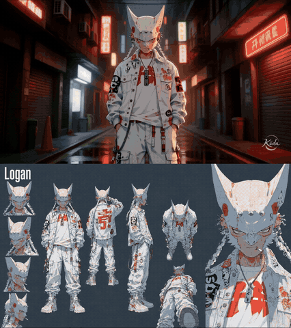](https://x.com/aimikoda/status/2086553240448241802) | **[身份板｜环境变化，身份不变](catalog/cases/x-aimikoda-2086553240448241802-browser-2086553240448241802-video-1/SUMMARY.md)**<br><sub>x-aimikoda-2086553240448241802-browser-2086553240448241802-video-1</sub> | MiniMax H3 · Seedance 2.0 |
| [](https://x.com/aripratama293/status/2058715926451896397) | **[相机记忆｜固定取景框串联日常](catalog/cases/x-aripratama293-2058715926451896397-browser-2058715926451896397-video-1/SUMMARY.md)**<br><sub>x-aripratama293-2058715926451896397-browser-2058715926451896397-video-1</sub> | MiniMax H3 · Seedance 2.0 |
| [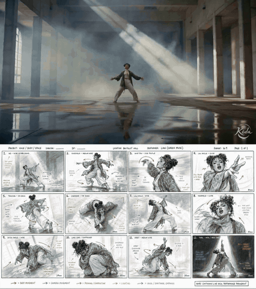](https://x.com/aimikoda/status/2053053922332262547) | **[舞台表演｜远景起势到倒地复起](catalog/cases/x-aimikoda-2053053922332262547-browser-2053053922332262547-video-1/SUMMARY.md)**<br><sub>x-aimikoda-2053053922332262547-browser-2053053922332262547-video-1</sub> | MiniMax H3 · Seedance 2.0 |
| [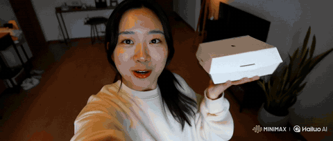](https://x.com/oggii_0/status/2083436822085165289) | **[UGC测评｜开箱到一口实证](catalog/cases/x-oggii-0-2083436822085165289-browser-2083436822085165289-video-1/SUMMARY.md)**<br><sub>x-oggii-0-2083436822085165289-browser-2083436822085165289-video-1</sub> | MiniMax H3 · Seedance 2.0 |
| [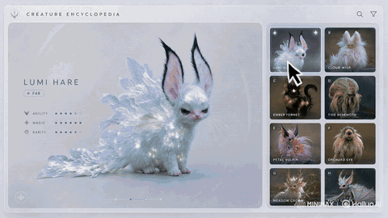](https://x.com/aimikoda/status/2083949566009778473) | **[互动图鉴｜固定菜单切换生物](catalog/cases/x-aimikoda-2083949566009778473-browser-2083949566009778473-video-1/SUMMARY.md)**<br><sub>x-aimikoda-2083949566009778473-browser-2083949566009778473-video-1</sub> | MiniMax H3 · Seedance 2.0 |
| [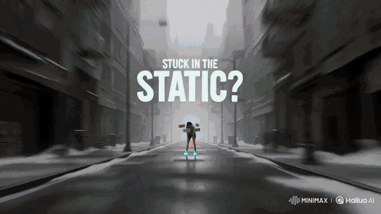](https://x.com/sebatheepan/status/2084311486277599712) | **[动力短片｜文字障碍逐个击碎](catalog/cases/x-sebatheepan-2084311486277599712-browser-2084311486277599712-video-1/SUMMARY.md)**<br><sub>x-sebatheepan-2084311486277599712-browser-2084311486277599712-video-1</sub> | MiniMax H3 · Seedance 2.0 |
| [](https://x.com/craftian_keskin/status/2082658222247137433) | **[力量反差｜小体型用杠杆反制](catalog/cases/x-craftian-keskin-2082658222247137433-browser-2082658222247137433-video-1/SUMMARY.md)**<br><sub>x-craftian-keskin-2082658222247137433-browser-2082658222247137433-video-1</sub> | MiniMax H3 · Seedance 2.0 |
| [](https://x.com/CharaspowerAI/status/2085622021812039920) | **[材质字效｜霜花成字再归位](catalog/cases/x-charaspowerai-2085622021812039920-browser-2085622021812039920-video-1/SUMMARY.md)**<br><sub>x-charaspowerai-2085622021812039920-browser-2085622021812039920-video-1</sub> | MiniMax H3 · Seedance 2.0 |
| [](https://x.com/techhalla/status/2081333381401334006) | **[纪实跟拍｜行进中偶遇再离开](catalog/cases/x-techhalla-2081333381401334006-browser-2081333381401334006-video-1/SUMMARY.md)**<br><sub>x-techhalla-2081333381401334006-browser-2081333381401334006-video-1</sub> | MiniMax H3 · Seedance 2.0 |
| [](https://x.com/TechieBySA/status/2084600512180113820) | **[对话喜剧｜双人镜头、停顿与无声反应](catalog/cases/x-techiebysa-2084600512180113820-browser-2084600512180113820-video-1/SUMMARY.md)**<br><sub>x-techiebysa-2084600512180113820-browser-2084600512180113820-video-1</sub> | MiniMax H3 · Seedance 2.0 |
| [](https://x.com/john87445528/status/2086787356556685419) | **[第一视角查岗｜遮挡失效到摆烂收口](catalog/cases/x-john87445528-2086787356556685419-browser-2086787356556685419-video-1/SUMMARY.md)**<br><sub>x-john87445528-2086787356556685419-browser-2086787356556685419-video-1</sub> | MiniMax H3 · Seedance 2.0 |
| [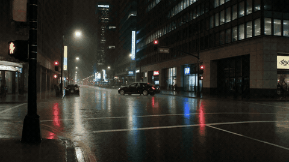](https://x.com/I_amShiti/status/2086828210457604364) | **[雨夜追逐｜街巷近战到机车脱身](catalog/cases/x-i-amshiti-2086828210457604364-browser-2086828210457604364-video-1/SUMMARY.md)**<br><sub>x-i-amshiti-2086828210457604364-browser-2086828210457604364-video-1</sub> | MiniMax H3 · Seedance 2.0 |
| [](https://x.com/aimikoda/status/2086782084723405173) | **[对话反应｜冷静回答引爆大笑](catalog/cases/x-aimikoda-2086782084723405173-browser-2086782084723405173-video-1/SUMMARY.md)**<br><sub>x-aimikoda-2086782084723405173-browser-2086782084723405173-video-1</sub> | MiniMax H3 · Seedance 2.0 |
| [](https://x.com/TechieBySA/status/2086773163870871656) | **[对话喜剧｜双轮停顿与无声回击](catalog/cases/x-techiebysa-2086773163870871656-browser-2086773163870871656-video-1/SUMMARY.md)**<br><sub>x-techiebysa-2086773163870871656-browser-2086773163870871656-video-1</sub> | MiniMax H3 · Seedance 2.0 |
| [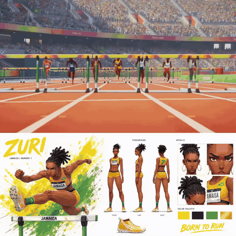](https://x.com/TechieBySA/status/2086815556930281726) | **[角色板验真｜跨栏全程身份锁定](catalog/cases/x-techiebysa-2086815556930281726-browser-2086815556930281726-video-1/SUMMARY.md)**<br><sub>x-techiebysa-2086815556930281726-browser-2086815556930281726-video-1</sub> | MiniMax H3 · Seedance 2.0 |
| [](https://x.com/gizakdag/status/2086774589426643034) | **[单人表演弧｜坐起、前倾，再松弛回落](catalog/cases/x-gizakdag-2086774589426643034-browser-2086774589426643034-video-1/SUMMARY.md)**<br><sub>x-gizakdag-2086774589426643034-browser-2086774589426643034-video-1</sub> | MiniMax H3 · Seedance 2.0 |
| [](https://x.com/CharaspowerAI/status/2086754531698725200) | **[材质字效｜云层成字再见光](catalog/cases/x-charaspowerai-2086754531698725200-browser-2086754531698725200-video-1/SUMMARY.md)**<br><sub>x-charaspowerai-2086754531698725200-browser-2086754531698725200-video-1</sub> | MiniMax H3 · Seedance 2.0 |
| [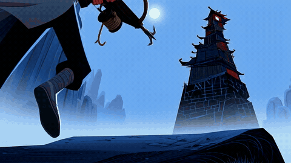](https://x.com/NVTDanh/status/2086774974921200055) | **[多功能救援线｜跨裂隙送补给再撤离](catalog/cases/x-nvtdanh-2086774974921200055-browser-2086774974921200055-video-1/SUMMARY.md)**<br><sub>x-nvtdanh-2086774974921200055-browser-2086774974921200055-video-1</sub> | MiniMax H3 · Seedance 2.0 |
| [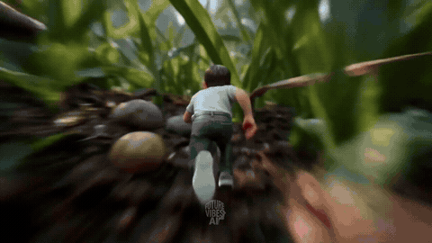](https://x.com/FutureVibesAi/status/2086777152666796255) | **[微缩逃亡｜巨物追赶到资源补给](catalog/cases/x-futurevibesai-2086777152666796255-browser-2086777152666796255-video-1/SUMMARY.md)**<br><sub>x-futurevibesai-2086777152666796255-browser-2086777152666796255-video-1</sub> | MiniMax H3 · Seedance 2.0 |
| [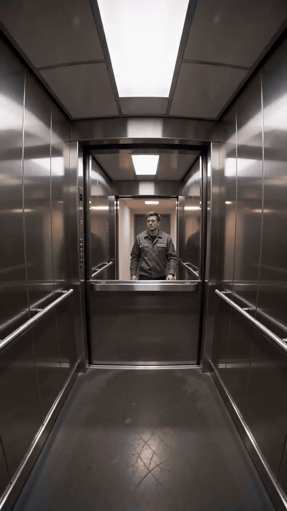](https://x.com/nicolasmariar/status/2086951328098513269) | **[气闸异境｜物理异常后空间崩坏](catalog/cases/x-nicolasmariar-2086951328098513269-browser-2086951328098513269-video-1/SUMMARY.md)**<br><sub>x-nicolasmariar-2086951328098513269-browser-2086951328098513269-video-1</sub> | MiniMax H3 · Seedance 2.0 |
| [](https://x.com/BrittaniNatali/status/2086846696101962006) | **[异质航行｜维修出发到巨尺度揭示](catalog/cases/x-brittaninatali-2086846696101962006-browser-2086846696101962006-video-1/SUMMARY.md)**<br><sub>x-brittaninatali-2086846696101962006-browser-2086846696101962006-video-1</sub> | MiniMax H3 · Seedance 2.0 |
| [](https://x.com/ManuAGI01/status/2086784467981697343) | **[平面重组｜图标开启档案世界](catalog/cases/x-manuagi01-2086784467981697343-browser-2086784467981697343-video-1/SUMMARY.md)**<br><sub>x-manuagi01-2086784467981697343-browser-2086784467981697343-video-1</sub> | MiniMax H3 · Seedance 2.0 |
| [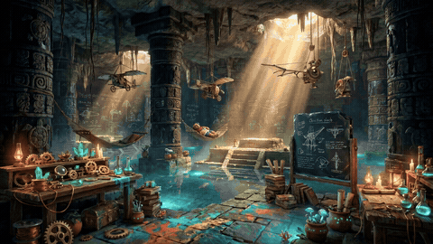](https://x.com/guicastellanos1/status/2086895492437532803) | **[角色登场｜失误后借身体特征破局](catalog/cases/x-guicastellanos1-2086895492437532803-browser-2086895492437532803-video-1/SUMMARY.md)**<br><sub>x-guicastellanos1-2086895492437532803-browser-2086895492437532803-video-1</sub> | MiniMax H3 · Seedance 2.0 |
| [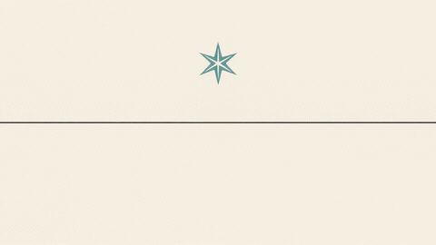](https://x.com/ManuAGI01/status/2086778003422671069) | **[双角色职责｜独立建立后共同完成](catalog/cases/x-manuagi01-2086778003422671069-browser-2086778003422671069-video-1/SUMMARY.md)**<br><sub>x-manuagi01-2086778003422671069-browser-2086778003422671069-video-1</sub> | MiniMax H3 · Seedance 2.0 |
| [](https://x.com/Yoni_attlan/status/2087162663922975137) | **[冲击后揭示｜从私密困境到城市尺度真因](catalog/cases/x-yoni-attlan-2087162663922975137-browser-2087162663922975137-video-1/SUMMARY.md)**<br><sub>x-yoni-attlan-2087162663922975137-browser-2087162663922975137-video-1</sub> | MiniMax H3 · Seedance 2.0 |
| [](https://x.com/cso6709/status/2087327019579392231) | **[分层接力｜小物体穿越多区域完成传递](catalog/cases/x-cso6709-2087327019579392231-browser-2087327019579392231-video-1/SUMMARY.md)**<br><sub>x-cso6709-2087327019579392231-browser-2087327019579392231-video-1</sub> | MiniMax H3 · Seedance 2.0 |
| [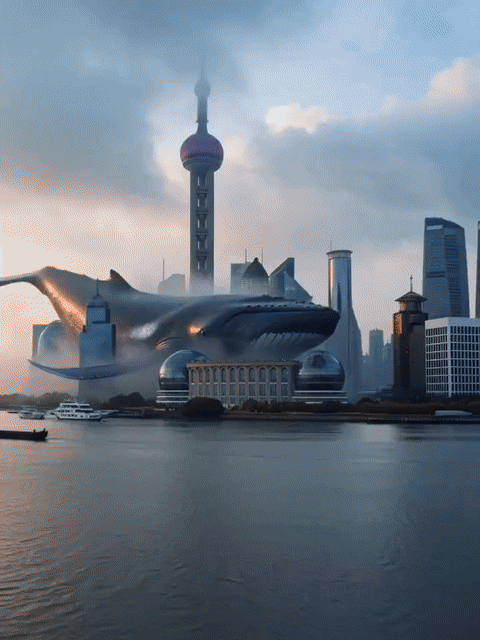](https://x.com/sada_ai/status/2087294907786600770) | **[尺度奇观阶梯｜每镜重置参照再逼近](catalog/cases/x-sada-ai-2087294907786600770-browser-2087294907786600770-video-1/SUMMARY.md)**<br><sub>x-sada-ai-2087294907786600770-browser-2087294907786600770-video-1</sub> | MiniMax H3 · Seedance 2.0 |
| [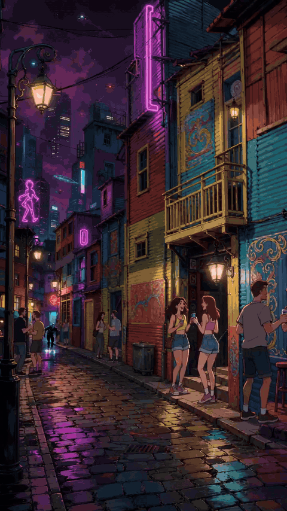](https://x.com/nicolasmariar/status/2087313673312256276) | **[背景异常｜先被观众发现再由记录设备证实](catalog/cases/x-nicolasmariar-2087313673312256276-browser-2087313673312256276-video-1/SUMMARY.md)**<br><sub>x-nicolasmariar-2087313673312256276-browser-2087313673312256276-video-1</sub> | MiniMax H3 · Seedance 2.0 |
| [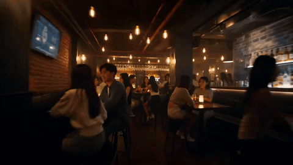](https://x.com/doyamarke/status/2087150954340929655) | **[产品证据变体｜场景结果到机理再回人群](catalog/cases/x-doyamarke-2087150954340929655-browser-2087150954340929655-video-1/SUMMARY.md)**<br><sub>x-doyamarke-2087150954340929655-browser-2087150954340929655-video-1</sub> | MiniMax H3 · Seedance 2.0 |
| [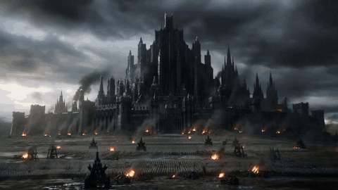](https://x.com/CharaspowerAI/status/2087192378880721150) | **[非对称突破｜密集阻力到空间制度改变](catalog/cases/x-charaspowerai-2087192378880721150-browser-2087192378880721150-video-1/SUMMARY.md)**<br><sub>x-charaspowerai-2087192378880721150-browser-2087192378880721150-video-1</sub> | MiniMax H3 · Seedance 2.0 |
| [](https://x.com/vkuoo/status/2087148758954053985) | **[表面生长｜沿既有几何扩散并回收到手作载体](catalog/cases/x-vkuoo-2087148758954053985-browser-2087148758954053985-video-1/SUMMARY.md)**<br><sub>x-vkuoo-2087148758954053985-browser-2087148758954053985-video-1</sub> | MiniMax H3 · Seedance 2.0 |
| [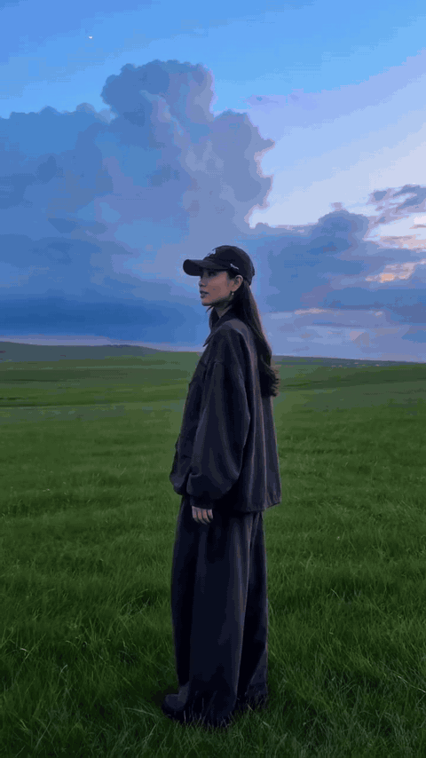](https://x.com/Primee32/status/2087285945213059079) | **[步速到抵达｜目的地延迟出现并由环境庆祝](catalog/cases/x-primee32-2087285945213059079-browser-2087285945213059079-video-1/SUMMARY.md)**<br><sub>x-primee32-2087285945213059079-browser-2087285945213059079-video-1</sub> | MiniMax H3 · Seedance 2.0 |
| [](https://x.com/steftranquillin/status/2087233814665814190) | **[动作成字｜方向笔画驱动角色切换与终态标记](catalog/cases/x-steftranquillin-2087233814665814190-browser-2087233814665814190-video-1/SUMMARY.md)**<br><sub>x-steftranquillin-2087233814665814190-browser-2087233814665814190-video-1</sub> | MiniMax H3 · Seedance 2.0 |
| [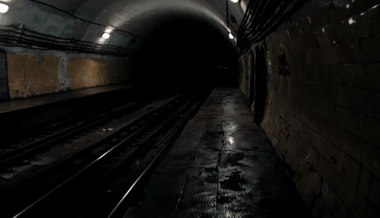](https://x.com/UnrealRafael/status/2087161642702315868) | **[连续推进｜重复地标计时并抵达更深通道](catalog/cases/x-unrealrafael-2087161642702315868-browser-2087161642702315868-video-1/SUMMARY.md)**<br><sub>x-unrealrafael-2087161642702315868-browser-2087161642702315868-video-1</sub> | MiniMax H3 · Seedance 2.0 |
| [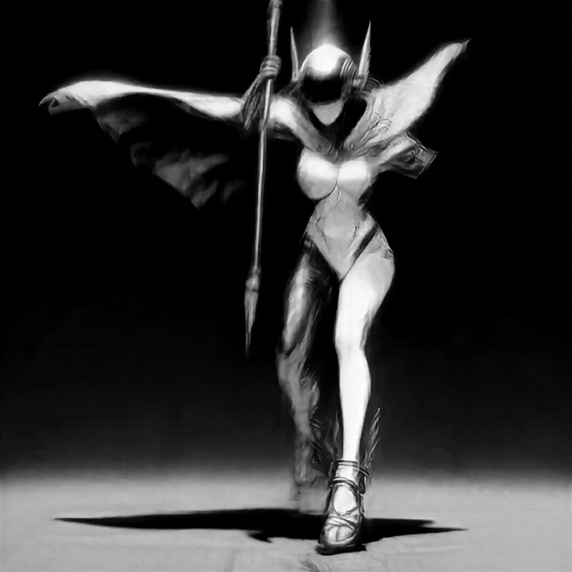](https://x.com/macbethAI/status/2087310945009995972) | **[轮廓接力｜闪光换形后完成攻势闭环](catalog/cases/x-macbethai-2087310945009995972-browser-2087310945009995972-video-1/SUMMARY.md)**<br><sub>x-macbethai-2087310945009995972-browser-2087310945009995972-video-1</sub> | MiniMax H3 · Seedance 2.0 |
| [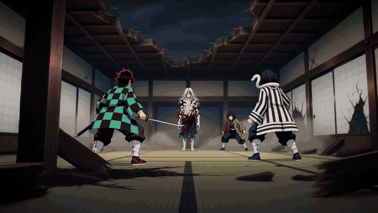](https://x.com/itsphotogptai/status/2087276933222695045) | **[多人攻势接力｜独立入场后同步收束](catalog/cases/x-itsphotogptai-2087276933222695045-browser-2087276933222695045-video-1/SUMMARY.md)**<br><sub>x-itsphotogptai-2087276933222695045-browser-2087276933222695045-video-1</sub> | MiniMax H3 · Seedance 2.0 |
| [](https://x.com/Alone1Moon/status/2087282913410764864) | **[微表情问候｜侧身发现到笑容回稳](catalog/cases/x-alone1moon-2087282913410764864-browser-2087282913410764864-video-1/SUMMARY.md)**<br><sub>x-alone1moon-2087282913410764864-browser-2087282913410764864-video-1</sub> | MiniMax H3 · Seedance 2.0 |
| [](https://x.com/100xMart/status/2087298018668077160) | **[地貌变形揭示｜局部异常到巨体逼近](catalog/cases/x-100xmart-2087298018668077160-browser-2087298018668077160-video-1/SUMMARY.md)**<br><sub>x-100xmart-2087298018668077160-browser-2087298018668077160-video-1</sub> | MiniMax H3 · Seedance 2.0 |
| [](https://x.com/antonioleivag/status/2087290562781081994) | **[表演让位于环境｜近脸到全景的连续退镜](catalog/cases/x-antonioleivag-2087290562781081994-browser-2087290562781081994-video-1/SUMMARY.md)**<br><sub>x-antonioleivag-2087290562781081994-browser-2087290562781081994-video-1</sub> | MiniMax H3 · Seedance 2.0 |
| [](https://x.com/imagvio_trends/status/2087163509125878029) | **[结果先行广告｜终态承诺倒推证据](catalog/cases/x-imagvio-trends-2087163509125878029-browser-2087163509125878029-video-1/SUMMARY.md)**<br><sub>x-imagvio-trends-2087163509125878029-browser-2087163509125878029-video-1</sub> | MiniMax H3 · Seedance 2.0 |
| [](https://x.com/UnrealRafael/status/2087275532517884174) | **[连续跟随｜步态与弯曲地标共同计时](catalog/cases/x-unrealrafael-2087275532517884174-browser-2087275532517884174-video-1/SUMMARY.md)**<br><sub>x-unrealrafael-2087275532517884174-browser-2087275532517884174-video-1</sub> | MiniMax H3 · Seedance 2.0 |
| [](https://x.com/donhyeon_choi/status/2087163007491268632) | **[分组对话覆盖｜两边接力后全桌合流](catalog/cases/x-donhyeon-choi-2087163007491268632-browser-2087163007491268632-video-1/SUMMARY.md)**<br><sub>x-donhyeon-choi-2087163007491268632-browser-2087163007491268632-video-1</sub> | MiniMax H3 · Seedance 2.0 |
| [](https://x.com/ravfx777/status/2087152046114038024) | **[群演聚焦接力｜全场到主位再回合奏](catalog/cases/x-ravfx777-2087152046114038024-browser-2087152046114038024-video-1/SUMMARY.md)**<br><sub>x-ravfx777-2087152046114038024-browser-2087152046114038024-video-1</sub> | MiniMax H3 · Seedance 2.0 |
| [](https://x.com/Dheepanratnam/status/2042910477320114293) | **[载具启程｜微观检查累积到离场证明](catalog/cases/x-dheepanratnam-2042910477320114293-video-1/SUMMARY.md)**<br><sub>x-dheepanratnam-2042910477320114293-video-1</sub> | MiniMax H3 · Seedance 2.0 |
| [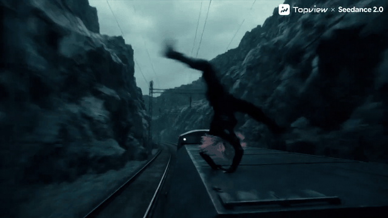](https://x.com/iamfakhrealam/status/2041485269602631944) | **[巨体攻防｜共享空间中的连续闪避](catalog/cases/x-iamfakhrealam-2041485269602631944-video-1/SUMMARY.md)**<br><sub>x-iamfakhrealam-2041485269602631944-video-1</sub> | MiniMax H3 · Seedance 2.0 |
| [](https://x.com/JeroenvanH/status/2052849887041974577) | **[表情校准｜固定身份下的动作单元序列](catalog/cases/x-jeroenvanh-2052849887041974577-video-1/SUMMARY.md)**<br><sub>x-jeroenvanh-2052849887041974577-video-1</sub> | MiniMax H3 · Seedance 2.0 |
| [](https://x.com/umesh_ai/status/2041561378495082582) | **[踏面异变｜重复触点到基底破裂](catalog/cases/x-umesh-ai-2041561378495082582-video-1/SUMMARY.md)**<br><sub>x-umesh-ai-2041561378495082582-video-1</sub> | MiniMax H3 · Seedance 2.0 |
| [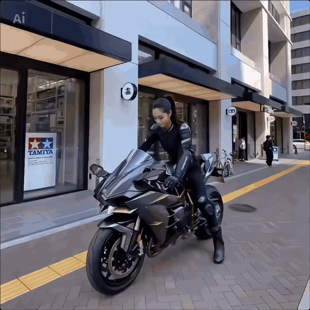](https://x.com/Me_Rock369/status/2043622237396410608) | **[移动兑现｜载具跃迁到生活结果](catalog/cases/x-me-rock369-2043622237396410608-video-1/SUMMARY.md)**<br><sub>x-me-rock369-2043622237396410608-video-1</sub> | MiniMax H3 · Seedance 2.0 |
| [](https://x.com/KimikoOsugi/status/2036241060763148376) | **[类型预告｜同一主角跨场景升级到片名](catalog/cases/x-kimikoosugi-2036241060763148376-video-1/SUMMARY.md)**<br><sub>x-kimikoosugi-2036241060763148376-video-1</sub> | MiniMax H3 · Seedance 2.0 |
| [](https://x.com/iX00AI/status/2040784936316338316) | **[静态伏击｜从被动锚点升级到异能出口](catalog/cases/x-ix00ai-2040784936316338316-video-1/SUMMARY.md)**<br><sub>x-ix00ai-2040784936316338316-video-1</sub> | MiniMax H3 · Seedance 2.0 |
| [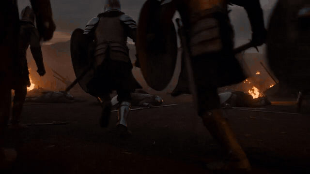](https://x.com/Artedeingenio/status/2039333442077241627) | **[环境前沿｜局部点燃到全域占据](catalog/cases/x-artedeingenio-2039333442077241627-video-1/SUMMARY.md)**<br><sub>x-artedeingenio-2039333442077241627-video-1</sub> | MiniMax H3 · Seedance 2.0 |
| [](https://x.com/Lordofacca/status/2039127175949922542) | **[尺度球局｜共享球体串联反差挑战](catalog/cases/x-lordofacca-2039127175949922542-video-1/SUMMARY.md)**<br><sub>x-lordofacca-2039127175949922542-video-1</sub> | MiniMax H3 · Seedance 2.0 |
| [](https://x.com/0xbisc/status/2037481799325286426) | **[连续变线｜逐层防守到垂直终结](catalog/cases/x-0xbisc-2037481799325286426-video-1/SUMMARY.md)**<br><sub>x-0xbisc-2037481799325286426-video-1</sub> | MiniMax H3 · Seedance 2.0 |
| [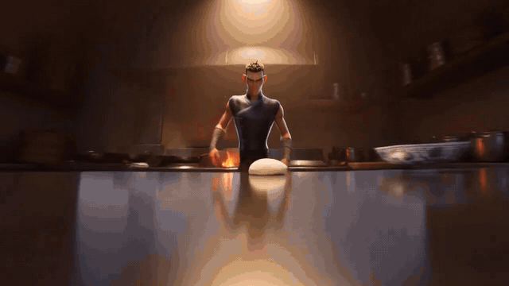](https://x.com/0xbisc/status/2036407484836094014) | **[技艺递进｜原料变形到成品特写](catalog/cases/x-0xbisc-2036407484836094014-video-1/SUMMARY.md)**<br><sub>x-0xbisc-2036407484836094014-video-1</sub> | MiniMax H3 · Seedance 2.0 |
| [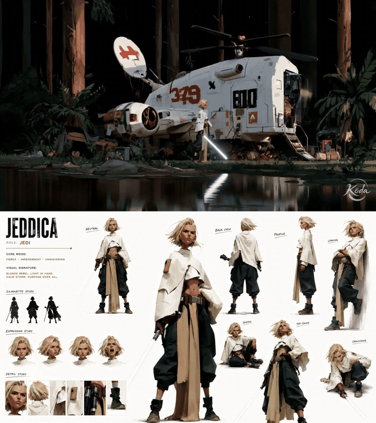](https://x.com/aimikoda/status/2062516255941095583) | **[角色板验真｜光轨技能跨镜锁定身份](catalog/cases/x-aimikoda-2062516255941095583-video-1/SUMMARY.md)**<br><sub>x-aimikoda-2062516255941095583-video-1</sub> | MiniMax H3 · Seedance 2.0 |
| [](https://x.com/lepadphone/status/2084217085308326385) | **[材质引路｜空间生长到版式定格](catalog/cases/x-lepadphone-2084217085308326385-browser-2084217085308326385-video-1/SUMMARY.md)**<br><sub>x-lepadphone-2084217085308326385-browser-2084217085308326385-video-1</sub> | MiniMax H3 · Seedance 2.0 |
| [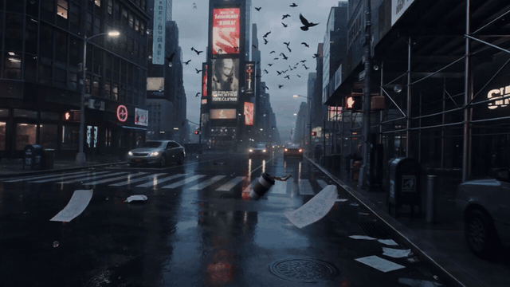](https://x.com/azed_ai/status/2085034121844396472) | **[世界悬停｜持续靠近到末端复流](catalog/cases/x-azed-ai-2085034121844396472-browser-2085034121844396472-video-1/SUMMARY.md)**<br><sub>x-azed-ai-2085034121844396472-browser-2085034121844396472-video-1</sub> | MiniMax H3 · Seedance 2.0 |
| [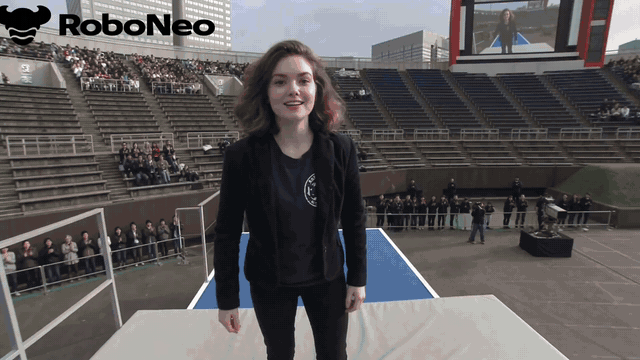](https://x.com/SimplyAnnisa/status/2085371269537845497) | **[动态承载｜平衡升级到失败落点](catalog/cases/x-simplyannisa-2085371269537845497-browser-2085371269537845497-video-1/SUMMARY.md)**<br><sub>x-simplyannisa-2085371269537845497-browser-2085371269537845497-video-1</sub> | MiniMax H3 · Seedance 2.0 |
| [](https://x.com/AIwithkhan/status/2087390177190645831) | **[事故悬停｜主动取样后独自离场](catalog/cases/x-aiwithkhan-2087390177190645831-browser-2087390177190645831-video-1/SUMMARY.md)**<br><sub>x-aiwithkhan-2087390177190645831-browser-2087390177190645831-video-1</sub> | MiniMax H3 · Seedance 2.0 |
| [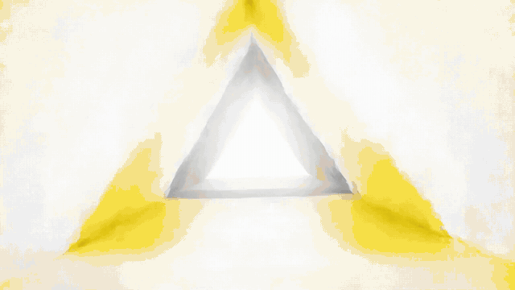](https://x.com/ZaraIrahh/status/2087762931777716345) | **[标志入境｜穿行世界后回收到原形](catalog/cases/x-zarairahh-2087762931777716345-browser-2087762931777716345-video-1/SUMMARY.md)**<br><sub>x-zarairahh-2087762931777716345-browser-2087762931777716345-video-1</sub> | MiniMax H3 · Seedance 2.0 |
| [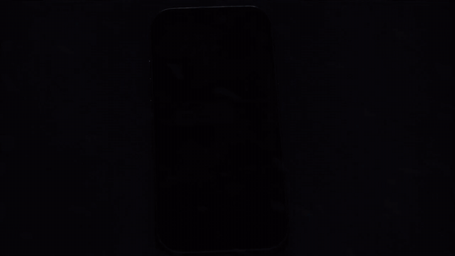](https://x.com/iam_nafisahmed/status/2087921744166420808) | **[未来来信｜私密警告被外部世界兑现](catalog/cases/x-iam-nafisahmed-2087921744166420808-browser-2087921744166420808-video-1/SUMMARY.md)**<br><sub>x-iam-nafisahmed-2087921744166420808-browser-2087921744166420808-video-1</sub> | MiniMax H3 · Seedance 2.0 |
| [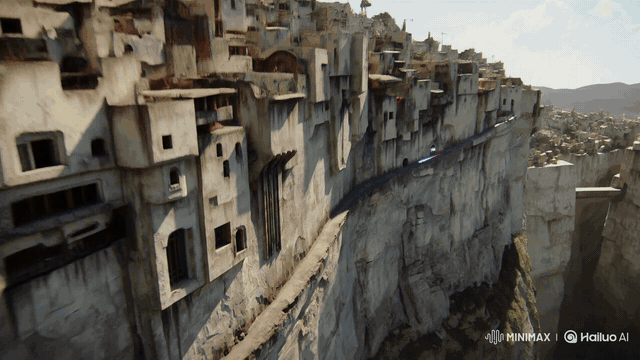](https://x.com/umesh_ai/status/2082499539735588916) | **[窄路追逐｜连续压缩后豁然释放](catalog/cases/x-umesh-ai-2082499539735588916-browser-2082499539735588916-video-1/SUMMARY.md)**<br><sub>x-umesh-ai-2082499539735588916-browser-2082499539735588916-video-1</sub> | MiniMax H3 · Seedance 2.0 |
| [](https://x.com/nusratsid1/status/2086721194527510942) | **[信息逼近｜远端警告压缩到当前空间](catalog/cases/x-nusratsid1-2086721194527510942-browser-2086721194527510942-video-1/SUMMARY.md)**<br><sub>x-nusratsid1-2086721194527510942-browser-2086721194527510942-video-1</sub> | MiniMax H3 · Seedance 2.0 |
| [](https://x.com/johnAGI168/status/2087432258693001579) | **[外部装配｜逐件安装到整机动作验收](catalog/cases/x-johnagi168-2087432258693001579-browser-2087432258693001579-video-1/SUMMARY.md)**<br><sub>x-johnagi168-2087432258693001579-browser-2087432258693001579-video-1</sub> | MiniMax H3 · Seedance 2.0 |
| [](https://x.com/Goodmanprotocol/status/2086806078105551218) | **[纪实跟拍｜屋顶日常到镜头致意](catalog/cases/x-goodmanprotocol-2086806078105551218-browser-2086806078105551218-video-1/SUMMARY.md)**<br><sub>x-goodmanprotocol-2086806078105551218-browser-2086806078105551218-video-1</sub> | MiniMax H3 · Seedance 2.0 |
| [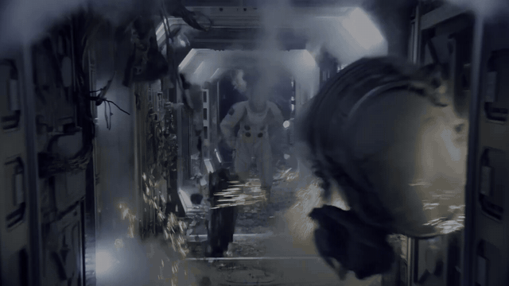](https://x.com/LudovicCreator/status/1946487695011668420) | **[正面撤退｜通道坍缩逼向唯一庇护](catalog/cases/x-ludoviccreator-1946487695011668420-browser-1946487695011668420-video-1/SUMMARY.md)**<br><sub>x-ludoviccreator-1946487695011668420-browser-1946487695011668420-video-1</sub> | MiniMax H3 · Seedance 2.0 |
| [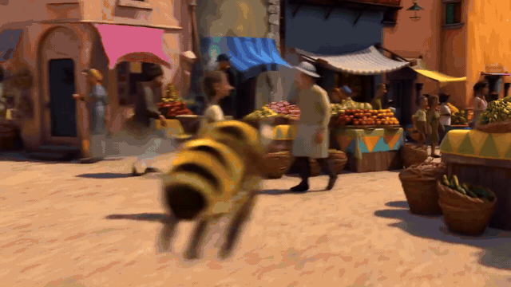](https://x.com/azed_ai/status/1979547337077981268) | **[微型引路｜重复现身到终点材质回声](catalog/cases/x-azed-ai-1979547337077981268-browser-1979547337077981268-video-1/SUMMARY.md)**<br><sub>x-azed-ai-1979547337077981268-browser-1979547337077981268-video-1</sub> | MiniMax H3 · Seedance 2.0 |
| [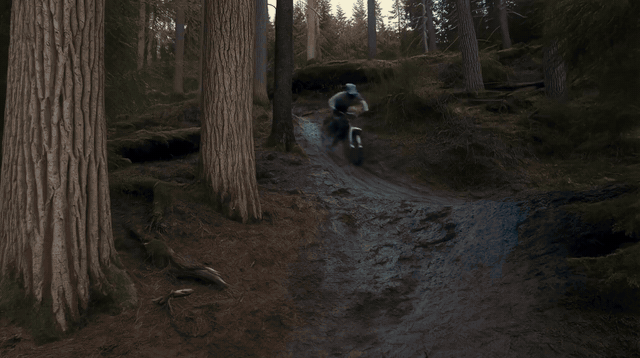](https://x.com/azed_ai/status/1965494859818827964) | **[世界换材｜主体不断线穿过环境突变](catalog/cases/x-azed-ai-1965494859818827964-browser-1965494859818827964-video-1/SUMMARY.md)**<br><sub>x-azed-ai-1965494859818827964-browser-1965494859818827964-video-1</sub> | MiniMax H3 · Seedance 2.0 |
| [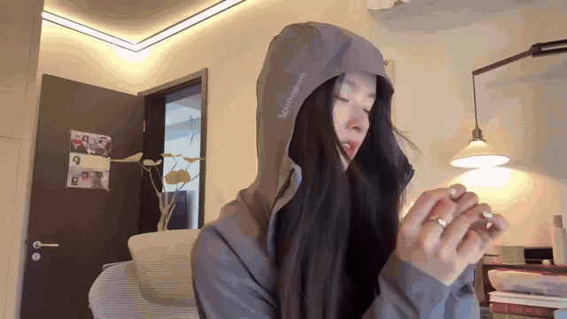](https://x.com/Aqsahere_/status/2087386090315616601) | **[渲染扫描｜局部带逐段改写整体](catalog/cases/x-aqsahere-2087386090315616601-browser-2087386090315616601-video-1/SUMMARY.md)**<br><sub>x-aqsahere-2087386090315616601-browser-2087386090315616601-video-1</sub> | MiniMax H3 · Seedance 2.0 |
| [](https://x.com/Noor_ul_ain43/status/2087774014957850843) | **[连续脱险｜假安全后升级为尺度威胁](catalog/cases/x-noor-ul-ain43-2087774014957850843-browser-2087774014957850843-video-1/SUMMARY.md)**<br><sub>x-noor-ul-ain43-2087774014957850843-browser-2087774014957850843-video-1</sub> | MiniMax H3 · Seedance 2.0 |
| [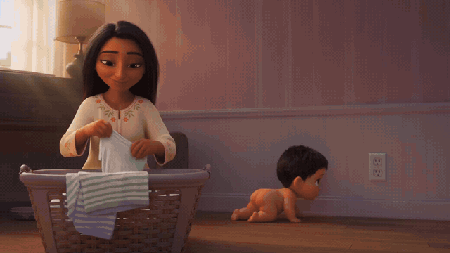](https://x.com/JuliaClarky/status/2087748648981745821) | **[重复复位｜多场景小灾难逐次升级](catalog/cases/x-juliaclarky-2087748648981745821-browser-2087748648981745821-video-1/SUMMARY.md)**<br><sub>x-juliaclarky-2087748648981745821-browser-2087748648981745821-video-1</sub> | MiniMax H3 · Seedance 2.0 |
| [](https://x.com/Zyrellix/status/2085927821126324588) | **[工序递进｜多层处理到揭膜验收](catalog/cases/x-zyrellix-2085927821126324588-browser-2085927821126324588-video-1/SUMMARY.md)**<br><sub>x-zyrellix-2085927821126324588-browser-2085927821126324588-video-1</sub> | MiniMax H3 · Seedance 2.0 |
| [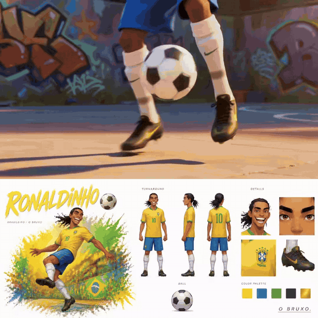](https://x.com/TechieBySA/status/2084294993628262554) | **[角色板验真｜足球动作与多机位锁定身份](catalog/cases/x-techiebysa-2084294993628262554-browser-2084294993628262554-video-1/SUMMARY.md)**<br><sub>x-techiebysa-2084294993628262554-browser-2084294993628262554-video-1</sub> | MiniMax H3 · Seedance 2.0 |
| [](https://x.com/hey_am_jasmine/status/2085940554379182530) | **[纪实跟拍｜旧城行走到轻微回应](catalog/cases/x-hey-am-jasmine-2085940554379182530-browser-2085940554379182530-video-1/SUMMARY.md)**<br><sub>x-hey-am-jasmine-2085940554379182530-browser-2085940554379182530-video-1</sub> | MiniMax H3 · Seedance 2.0 |
| [](https://x.com/Naiknelofar788/status/2087589767542407490) | **[护送穿行｜关系确认到发光门槛](catalog/cases/x-naiknelofar788-2087589767542407490-browser-2087589767542407490-video-1/SUMMARY.md)**<br><sub>x-naiknelofar788-2087589767542407490-browser-2087589767542407490-video-1</sub> | MiniMax H3 · Seedance 2.0 |
| [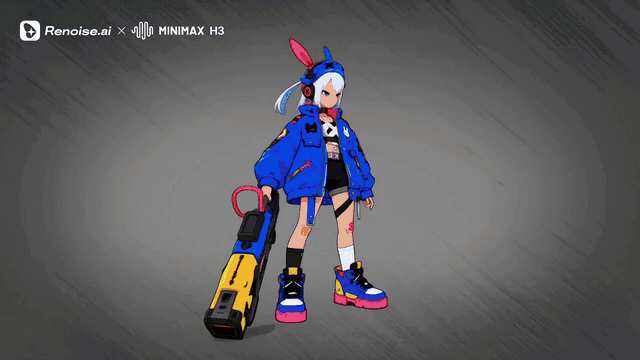](https://x.com/Mayz1169/status/2087870514400502028) | **[平面重组｜角色海报到嘉年华版式](catalog/cases/x-mayz1169-2087870514400502028-browser-2087870514400502028-video-1/SUMMARY.md)**<br><sub>x-mayz1169-2087870514400502028-browser-2087870514400502028-video-1</sub> | MiniMax H3 · Seedance 2.0 |
| [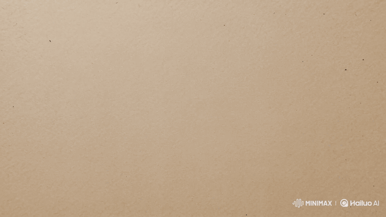](https://x.com/aziz4ai/status/2084775075656466886) | **[平面重组｜讲解人物与纸片信息节拍](catalog/cases/x-aziz4ai-2084775075656466886-browser-2084775075656466886-video-1/SUMMARY.md)**<br><sub>x-aziz4ai-2084775075656466886-browser-2084775075656466886-video-1</sub> | MiniMax H3 · Seedance 2.0 |
| [](https://x.com/bmx_ai13/status/2081350068280631801) | **[屏中蒙太奇｜外层连续内屏切换](catalog/cases/x-bmx-ai13-2081350068280631801-browser-2081350068280631801-video-1/SUMMARY.md)**<br><sub>x-bmx-ai13-2081350068280631801-browser-2081350068280631801-video-1</sub> | MiniMax H3 · Seedance 2.0 |
| [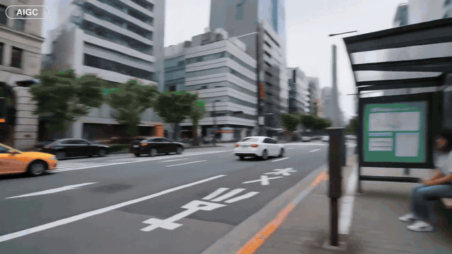](https://x.com/Naiknelofar788/status/2077382054275436584) | **[逐物改写｜局部对象到整片环境](catalog/cases/x-naiknelofar788-2077382054275436584-browser-2077382054275436584-video-1/SUMMARY.md)**<br><sub>x-naiknelofar788-2077382054275436584-browser-2077382054275436584-video-1</sub> | MiniMax H3 · Seedance 2.0 |
| [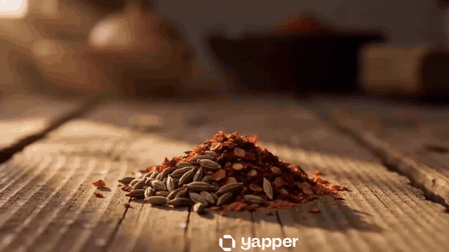](https://x.com/noorwithwifi/status/2051983365688242324) | **[尺度展开｜微小材质扩张后原样回收](catalog/cases/x-noorwithwifi-2051983365688242324-browser-2051983365688242324-video-1/SUMMARY.md)**<br><sub>x-noorwithwifi-2051983365688242324-browser-2051983365688242324-video-1</sub> | MiniMax H3 · Seedance 2.0 |
| [](https://local.t8/user-supplied/8cc6ac74d1d823cc7d99d90451f6214e) | **[双人递进｜共享接触从地面升到空中峰值](catalog/cases/user-video-8cc6ac74d1d823cc7d99d90451f6214e/SUMMARY.md)**<br><sub>user-video-8cc6ac74d1d823cc7d99d90451f6214e</sub> | MiniMax H3 · Seedance 2.0 |
| [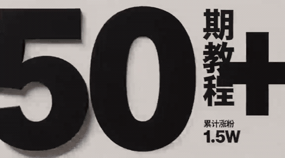](https://local.t8/user-supplied/123094afc2fed97c8846b3cb370ead5f) | **[数据折叠｜总量下钻到当前值](catalog/cases/user-video-123094afc2fed97c8846b3cb370ead5f/SUMMARY.md)**<br><sub>user-video-123094afc2fed97c8846b3cb370ead5f</sub> | MiniMax H3 · Seedance 2.0 |
| [](https://local.t8/user-supplied/28168005f9240ddaa23e1c9d97492961) | **[手势对齐｜前景动作触发后景状态](catalog/cases/user-video-28168005f9240ddaa23e1c9d97492961/SUMMARY.md)**<br><sub>user-video-28168005f9240ddaa23e1c9d97492961</sub> | MiniMax H3 · Seedance 2.0 |
| [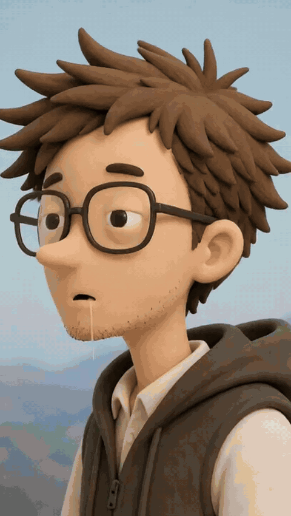](https://local.t8/user-supplied/62b8eb07cf1e85858d73598c271fb2d6) | **[图形复位｜身份卡与动作证明交替](catalog/cases/user-video-62b8eb07cf1e85858d73598c271fb2d6/SUMMARY.md)**<br><sub>user-video-62b8eb07cf1e85858d73598c271fb2d6</sub> | MiniMax H3 · Seedance 2.0 |
| [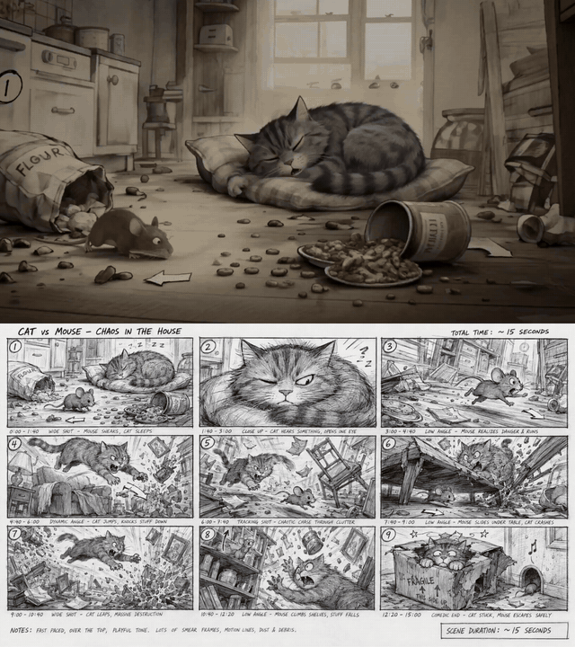](https://x.com/beginnersblog1/status/2088312289405673506) | **[计划对照｜固定分镜条见证执行升级](catalog/cases/x-beginnersblog1-2088312289405673506-browser-2088312289405673506-video-1/SUMMARY.md)**<br><sub>x-beginnersblog1-2088312289405673506-browser-2088312289405673506-video-1</sub> | MiniMax H3 · Seedance 2.0 |
| [](https://x.com/aimikoda/status/2088569547494199485) | **[日程闭环｜重复锚点串联整日任务](catalog/cases/x-aimikoda-2088569547494199485-browser-2088569547494199485-video-1/SUMMARY.md)**<br><sub>x-aimikoda-2088569547494199485-browser-2088569547494199485-video-1</sub> | MiniMax H3 · Seedance 2.0 |
| [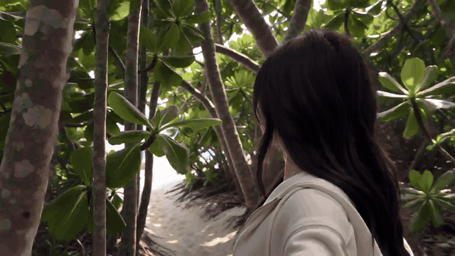](https://x.com/Aqsahere_/status/2088105767408730563) | **[镜头交接｜外部观察转为主体掌镜](catalog/cases/x-aqsahere-2088105767408730563-browser-2088105767408730563-video-1/SUMMARY.md)**<br><sub>x-aqsahere-2088105767408730563-browser-2088105767408730563-video-1</sub> | MiniMax H3 · Seedance 2.0 |
| [](https://github.com/T8mars/minimax-h3-prompt-skill-T8/tree/main/catalog/cases/user-video-hailuo-449361583639670787) | **[感官封闭｜人群静止点到异地恢复](catalog/cases/user-video-hailuo-449361583639670787/SUMMARY.md)**<br><sub>user-video-hailuo-449361583639670787</sub> | MiniMax H3 · Seedance 2.0 |
| [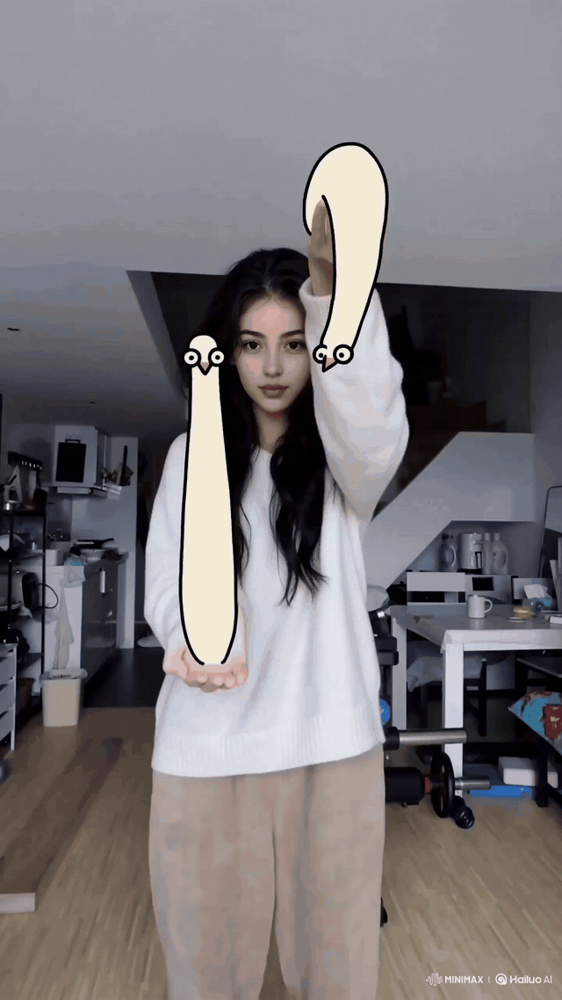](https://github.com/T8mars/minimax-h3-prompt-skill-T8/tree/main/catalog/cases/user-video-hailuo-539597726151069704) | **[双支座弹性偶｜控制器驱动形变复位](catalog/cases/user-video-hailuo-539597726151069704/SUMMARY.md)**<br><sub>user-video-hailuo-539597726151069704</sub> | MiniMax H3 · Seedance 2.0 |
| [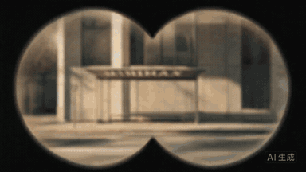](https://github.com/T8mars/minimax-h3-prompt-skill-T8/tree/main/catalog/cases/user-video-hailuo-539455495249870848) | **[光学搜索｜远景线索递进到细节确认](catalog/cases/user-video-hailuo-539455495249870848/SUMMARY.md)**<br><sub>user-video-hailuo-539455495249870848</sub> | MiniMax H3 · Seedance 2.0 |
| [](https://github.com/T8mars/minimax-h3-prompt-skill-T8/tree/main/catalog/cases/user-video-hailuo-539548087632777219) | **[造型轮播变体｜同装束跨海报版式](catalog/cases/user-video-hailuo-539548087632777219/SUMMARY.md)**<br><sub>user-video-hailuo-539548087632777219</sub> | MiniMax H3 · Seedance 2.0 |
| [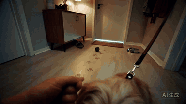](https://github.com/T8mars/minimax-h3-prompt-skill-T8/tree/main/catalog/cases/user-video-hailuo-540189229734940672) | **[画内涂鸦｜现实互动逐步绘出隐藏世界](catalog/cases/user-video-hailuo-540189229734940672/SUMMARY.md)**<br><sub>user-video-hailuo-540189229734940672</sub> | MiniMax H3 · Seedance 2.0 |
| [](https://github.com/T8mars/minimax-h3-prompt-skill-T8/tree/main/catalog/cases/user-video-hailuo-539984531455201282) | **[造型轮播｜身份锁定跨风格世界](catalog/cases/user-video-hailuo-539984531455201282/SUMMARY.md)**<br><sub>user-video-hailuo-539984531455201282</sub> | MiniMax H3 · Seedance 2.0 |
| [](https://github.com/T8mars/minimax-h3-prompt-skill-T8/tree/main/catalog/cases/user-video-hailuo-423900387218210818) | **[身份机体跃迁｜同一特征跨陆空载具升级](catalog/cases/user-video-hailuo-423900387218210818/SUMMARY.md)**<br><sub>user-video-hailuo-423900387218210818</sub> | MiniMax H3 · Seedance 2.0 |
| [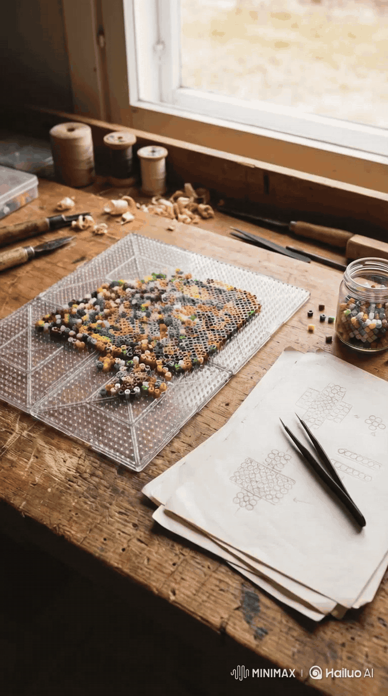](https://github.com/T8mars/minimax-h3-prompt-skill-T8/tree/main/catalog/cases/user-video-hailuo-448227283749875713) | **[固定工坊｜平面珠阵逐层立体成型](catalog/cases/user-video-hailuo-448227283749875713/SUMMARY.md)**<br><sub>user-video-hailuo-448227283749875713</sub> | MiniMax H3 · Seedance 2.0 |
| [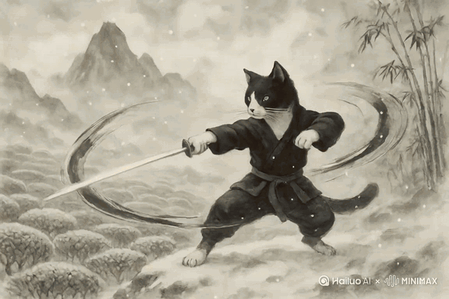](https://github.com/T8mars/minimax-h3-prompt-skill-T8/tree/main/catalog/cases/user-video-hailuo-394176964477943816) | **[独演成敌｜动作材质凝成对手后碰撞](catalog/cases/user-video-hailuo-394176964477943816/SUMMARY.md)**<br><sub>user-video-hailuo-394176964477943816</sub> | MiniMax H3 · Seedance 2.0 |
| [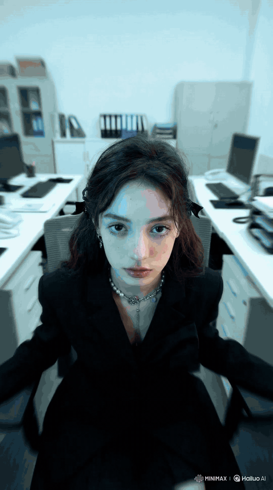](https://github.com/T8mars/minimax-h3-prompt-skill-T8/tree/main/catalog/cases/user-video-hailuo-460563497509273606) | **[造型轮播｜身份锁定跨风格世界](catalog/cases/user-video-hailuo-460563497509273606/SUMMARY.md)**<br><sub>user-video-hailuo-460563497509273606</sub> | MiniMax H3 · Seedance 2.0 |
| [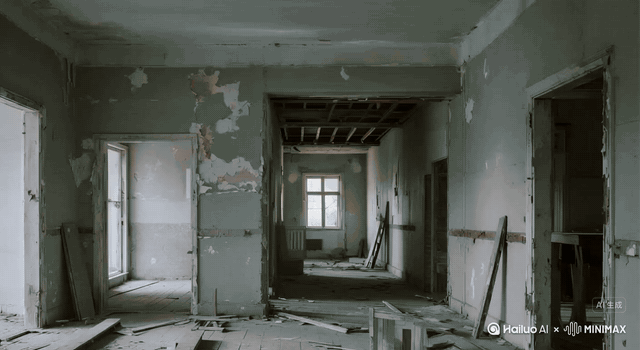](https://github.com/T8mars/minimax-h3-prompt-skill-T8/tree/main/catalog/cases/user-video-hailuo-418751301536092163) | **[固定空间｜毛坯阶段生成完成室内](catalog/cases/user-video-hailuo-418751301536092163/SUMMARY.md)**<br><sub>user-video-hailuo-418751301536092163</sub> | MiniMax H3 · Seedance 2.0 |
| [](https://github.com/T8mars/minimax-h3-prompt-skill-T8/tree/main/catalog/cases/user-video-hailuo-437298335184588801) | **[样本倍增｜机器开启后连续输出同类群体](catalog/cases/user-video-hailuo-437298335184588801/SUMMARY.md)**<br><sub>user-video-hailuo-437298335184588801</sub> | MiniMax H3 · Seedance 2.0 |
| [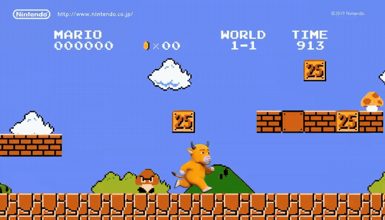](https://github.com/T8mars/minimax-h3-prompt-skill-T8/tree/main/catalog/cases/user-video-a3110e84c7e432b0cef18edfe0b99c30) | **[规则闯关｜吸收能力后从平面赛道升维](catalog/cases/user-video-a3110e84c7e432b0cef18edfe0b99c30/SUMMARY.md)**<br><sub>user-video-a3110e84c7e432b0cef18edfe0b99c30</sub> | MiniMax H3 · Seedance 2.0 |
| [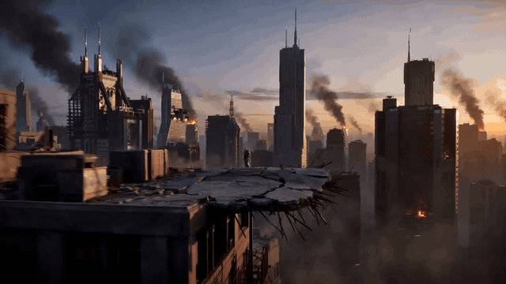](https://x.com/Lily_collins3/status/2090096886405591532) | **[单次决策兑现｜准备—执行—后果—回归](catalog/cases/x-lily-collins3-2090096886405591532-browser-2090096886405591532-video-1/SUMMARY.md)**<br><sub>x-lily-collins3-2090096886405591532-browser-2090096886405591532-video-1</sub> | MiniMax H3 · Seedance 2.0 |
| [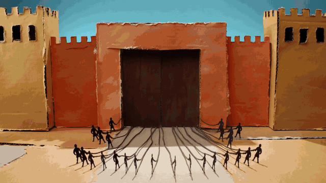](https://x.com/MayorKingAI/status/2090145591083077637) | **[延迟载体释放｜进入—静置—开启—扩散](catalog/cases/x-mayorkingai-2090145591083077637-browser-2090145591083077637-video-1/SUMMARY.md)**<br><sub>x-mayorkingai-2090145591083077637-browser-2090145591083077637-video-1</sub> | MiniMax H3 · Seedance 2.0 |
| [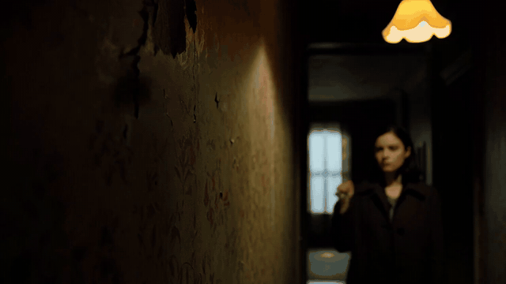](https://x.com/PromptSin/status/2090166948239909375) | **[画外定位悬念｜反应递进但不揭示来源](catalog/cases/x-promptsin-2090166948239909375-browser-2090166948239909375-video-1/SUMMARY.md)**<br><sub>x-promptsin-2090166948239909375-browser-2090166948239909375-video-1</sub> | MiniMax H3 · Seedance 2.0 |
| [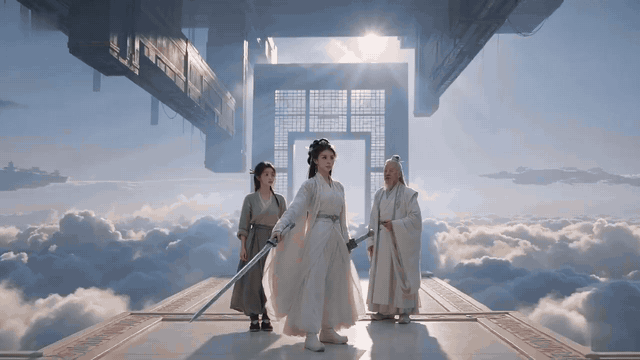](https://x.com/Soranlan/status/2090595035435692237) | **[关系重排｜群体建立—双人收紧—前后站位](catalog/cases/x-soranlan-2090595035435692237-browser-2090595035435692237-video-1/SUMMARY.md)**<br><sub>x-soranlan-2090595035435692237-browser-2090595035435692237-video-1</sub> | MiniMax H3 · Seedance 2.0 |
| [](https://x.com/kinovi_ai/status/2090557730318881014) | **[见证释放｜封闭近景—外部尺度—双视图证明](catalog/cases/x-kinovi-ai-2090557730318881014-browser-2090557730318881014-video-1/SUMMARY.md)**<br><sub>x-kinovi-ai-2090557730318881014-browser-2090557730318881014-video-1</sub> | MiniMax H3 · Seedance 2.0 |
| [](https://x.com/tokyo_Valentine/status/2090556760348323875) | **[信息接力｜稳定载体穿越多种实体媒介](catalog/cases/x-tokyo-valentine-2090556760348323875-browser-2090556760348323875-video-1/SUMMARY.md)**<br><sub>x-tokyo-valentine-2090556760348323875-browser-2090556760348323875-video-1</sub> | MiniMax H3 · Seedance 2.0 |
| [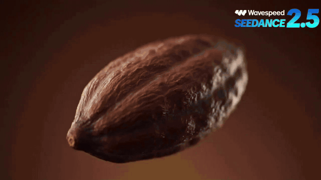](https://x.com/Itswsm105f/status/2091031704873881889) | **[价值阶梯｜原料—转化—装配—使用回报](catalog/cases/x-itswsm105f-2091031704873881889-browser-2091031704873881889-video-1/SUMMARY.md)**<br><sub>x-itswsm105f-2091031704873881889-browser-2091031704873881889-video-1</sub> | MiniMax H3 · Seedance 2.0 |
| [](https://x.com/ayzalnooor24521/status/2091039543046943010) | **[能力见证｜装备特写—连贯表演—人群反应—挑战交接](catalog/cases/x-ayzalnooor24521-2091039543046943010-browser-2091039543046943010-video-1/SUMMARY.md)**<br><sub>x-ayzalnooor24521-2091039543046943010-browser-2091039543046943010-video-1</sub> | MiniMax H3 · Seedance 2.0 |
| [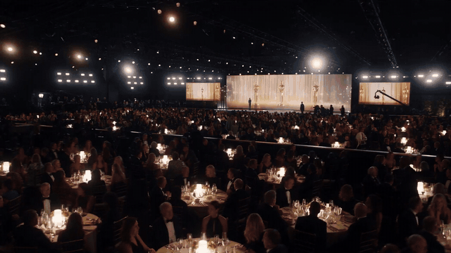](https://x.com/Diplomeme/status/2091037153463791956) | **[公共兑现｜席间期待—揭晓—群体释放—登台锁定](catalog/cases/x-diplomeme-2091037153463791956-browser-2091037153463791956-video-1/SUMMARY.md)**<br><sub>x-diplomeme-2091037153463791956-browser-2091037153463791956-video-1</sub> | MiniMax H3 · Seedance 2.0 |
| [](https://x.com/umesh_ai/status/2083909535593644291) | **[语义字效｜短语物理逐级升级到整句锁定](catalog/cases/x-umesh-ai-2083909535593644291-browser-2083909535593644291-video-1/SUMMARY.md)**<br><sub>x-umesh-ai-2083909535593644291-browser-2083909535593644291-video-1</sub> | MiniMax H3 · Seedance 2.0 |
| [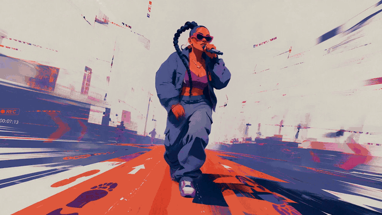](https://x.com/aimikoda/status/2084336165369311502) | **[歌词表演｜稳定主唱锚点与逐句语义升能](catalog/cases/x-aimikoda-2084336165369311502-browser-2084336165369311502-video-1/SUMMARY.md)**<br><sub>x-aimikoda-2084336165369311502-browser-2084336165369311502-video-1</sub> | MiniMax H3 · Seedance 2.0 |
| [](https://x.com/SimplyAnnisa/status/2085185518774685846) | **[感官体验｜对象建立—质感证明—试用反应—终态兑现](catalog/cases/x-simplyannisa-2085185518774685846-browser-2085185518774685846-video-1/SUMMARY.md)**<br><sub>x-simplyannisa-2085185518774685846-browser-2085185518774685846-video-1</sub> | MiniMax H3 · Seedance 2.0 |
| [](https://x.com/AIwithSynthia/status/2084107248910152167) | **[流程压缩｜动作载体接力到目的地兑现](catalog/cases/x-aiwithsynthia-2084107248910152167-browser-2084107248910152167-video-1/SUMMARY.md)**<br><sub>x-aiwithsynthia-2084107248910152167-browser-2084107248910152167-video-1</sub> | MiniMax H3 · Seedance 2.0 |
| [](https://x.com/VxRender/status/2086375302192644445) | **[边界执行｜正式基线—干扰定位—处置—复位](catalog/cases/x-vxrender-2086375302192644445-browser-2086375302192644445-video-1/SUMMARY.md)**<br><sub>x-vxrender-2086375302192644445-browser-2086375302192644445-video-1</sub> | MiniMax H3 · Seedance 2.0 |
| [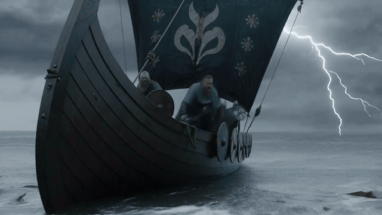](https://x.com/MichaelGannotti/status/2086765186107801649) | **[群体登陆｜载体抵达—先锋越界—队列释放](catalog/cases/x-michaelgannotti-2086765186107801649-browser-2086765186107801649-video-1/SUMMARY.md)**<br><sub>x-michaelgannotti-2086765186107801649-browser-2086765186107801649-video-1</sub> | MiniMax H3 · Seedance 2.0 |
| [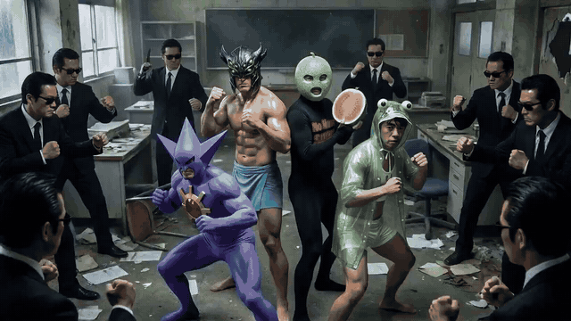](https://x.com/akazomesirou/status/2022254290795151859) | **[协作应战｜多人角色接力到共同收束](catalog/cases/x-akazomesirou-2022254290795151859-browser-2022254290795151859-video-1/SUMMARY.md)**<br><sub>x-akazomesirou-2022254290795151859-browser-2022254290795151859-video-1</sub> | MiniMax H3 · Seedance 2.0 |
| [](https://x.com/AIwithNatalia/status/2086754256439443895) | **[伪弱势反转｜困境诱近—准备微证据—能力破局—继续上路](catalog/cases/x-aiwithnatalia-2086754256439443895-browser-2086754256439443895-video-1/SUMMARY.md)**<br><sub>x-aiwithnatalia-2086754256439443895-browser-2086754256439443895-video-1</sub> | MiniMax H3 · Seedance 2.0 |
| [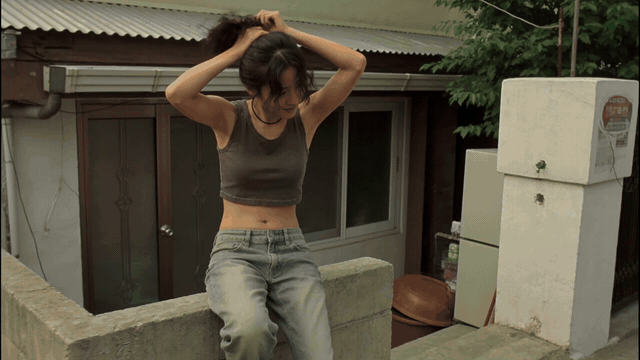](https://x.com/john_my07/status/2071977017474789557) | **[日常跟拍｜巷道小事到回眸离开](catalog/cases/x-john-my07-2071977017474789557-browser-2071977017474789557-video-1/SUMMARY.md)**<br><sub>x-john-my07-2071977017474789557-browser-2071977017474789557-video-1</sub> | MiniMax H3 · Seedance 2.0 |
| [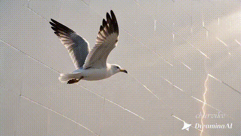](https://x.com/churvikv/status/2076716204031389757) | **[破界航线｜主体不断线穿过材质世界到达终点](catalog/cases/x-churvikv-2076716204031389757-browser-2076716204031389757-video-1/SUMMARY.md)**<br><sub>x-churvikv-2076716204031389757-browser-2076716204031389757-video-1</sub> | MiniMax H3 · Seedance 2.0 |
| [](https://x.com/Kollab_AI/status/2072214959866646811) | **[计划对照｜固定分镜条见证材质制作链](catalog/cases/x-kollab-ai-2072214959866646811-browser-2072214959866646811-video-1/SUMMARY.md)**<br><sub>x-kollab-ai-2072214959866646811-browser-2072214959866646811-video-1</sub> | MiniMax H3 · Seedance 2.0 |
| [](https://x.com/MrDavids1/status/2043483738001035369) | **[显物兑现｜空手基线到道具功能与终态回扣](catalog/cases/x-mrdavids1-2043483738001035369-browser-2043483738001035369-video-1/SUMMARY.md)**<br><sub>x-mrdavids1-2043483738001035369-browser-2043483738001035369-video-1</sub> | MiniMax H3 · Seedance 2.0 |
| [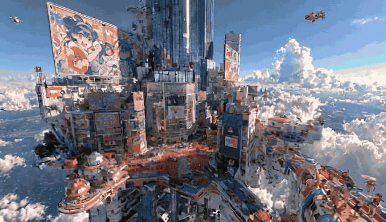](https://x.com/Bianca_AIart_mu/status/2088493898582892617) | **[动作留痕｜接触旋转逐步绘出群舞色场](catalog/cases/x-bianca-aiart-mu-2088493898582892617-browser-2088493898582892617-video-1/SUMMARY.md)**<br><sub>x-bianca-aiart-mu-2088493898582892617-browser-2088493898582892617-video-1</sub> | MiniMax H3 · Seedance 2.0 |
| [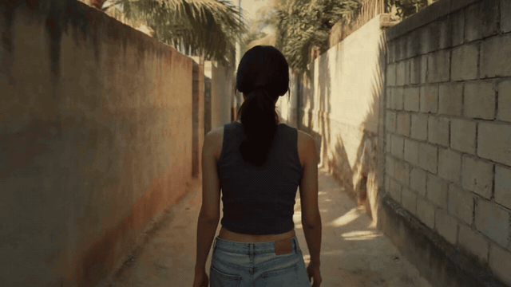](https://x.com/HeyAbhishek/status/2073676993875575170) | **[日常偶遇｜路线中断、克制接触再结伴离开](catalog/cases/x-heyabhishek-2073676993875575170-browser-2073676993875575170-video-1/SUMMARY.md)**<br><sub>x-heyabhishek-2073676993875575170-browser-2073676993875575170-video-1</sub> | MiniMax H3 · Seedance 2.0 |
| [](https://x.com/TechieBySA/status/2088217512475287733) | **[路线揭幕｜重复通道依次亮出原创反应场景](catalog/cases/x-techiebysa-2088217512475287733-browser-2088217512475287733-video-1/SUMMARY.md)**<br><sub>x-techiebysa-2088217512475287733-browser-2088217512475287733-video-1</sub> | MiniMax H3 · Seedance 2.0 |
| [](https://x.com/Just_sharon7/status/2042918853135732925) | **[世界悬停｜主动冻结、例外穿行到一次复流](catalog/cases/x-just-sharon7-2042918853135732925-browser-2042918853135732925-video-1/SUMMARY.md)**<br><sub>x-just-sharon7-2042918853135732925-browser-2042918853135732925-video-1</sub> | MiniMax H3 · Seedance 2.0 |
| [](https://x.com/LeeLinAI123/status/2088099733550096717) | **[微表情表演｜直视、半笑、垂眼到开放回稳](catalog/cases/x-leelinai123-2088099733550096717-browser-2088099733550096717-video-1/SUMMARY.md)**<br><sub>x-leelinai123-2088099733550096717-browser-2088099733550096717-video-1</sub> | MiniMax H3 · Seedance 2.0 |
| [](https://x.com/NadzuAI/status/2088631283018879166) | **[冻结修复｜事故悬停、唯一修复者到全域复流](catalog/cases/x-nadzuai-2088631283018879166-browser-2088631283018879166-video-1/SUMMARY.md)**<br><sub>x-nadzuai-2088631283018879166-browser-2088631283018879166-video-1</sub> | MiniMax H3 · Seedance 2.0 |
| [](https://x.com/minchoi/status/2083941707234828794) | **[道具复得｜外部夺走、同伴安抚与隐蔽取回](catalog/cases/x-minchoi-2083941707234828794-browser-2083941707234828794-video-1/SUMMARY.md)**<br><sub>x-minchoi-2083941707234828794-browser-2083941707234828794-video-1</sub> | MiniMax H3 · Seedance 2.0 |
| [](https://x.com/hey_am_jasmine/status/2087391641607033317) | **[纪实随拍｜偶发干扰、群体片段与继续离开](catalog/cases/x-hey-am-jasmine-2087391641607033317-browser-2087391641607033317-video-1/SUMMARY.md)**<br><sub>x-hey-am-jasmine-2087391641607033317-browser-2087391641607033317-video-1</sub> | MiniMax H3 · Seedance 2.0 |
| [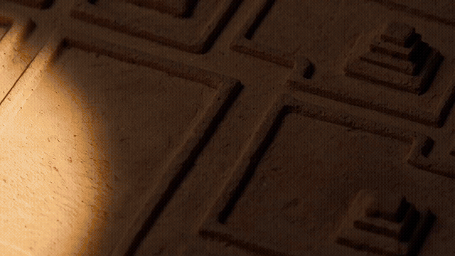](https://x.com/HBCoop_/status/2087539373420228818) | **[材质片头｜多件物证承载职员表到总标题](catalog/cases/x-hbcoop-2087539373420228818-browser-2087539373420228818-video-1/SUMMARY.md)**<br><sub>x-hbcoop-2087539373420228818-browser-2087539373420228818-video-1</sub> | MiniMax H3 · Seedance 2.0 |
| [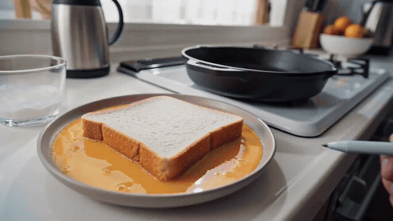](https://x.com/Sairah_0/status/2086637783318487379) | **[触控换媒｜接触触发、状态推进与成品回归](catalog/cases/x-sairah-0-2086637783318487379-browser-2086637783318487379-video-1/SUMMARY.md)**<br><sub>x-sairah-0-2086637783318487379-browser-2086637783318487379-video-1</sub> | MiniMax H3 · Seedance 2.0 |
| [](https://x.com/Strength04_X/status/2086311675456823296) | **[群体随拍｜自拍锚点、快切活动到共同收束](catalog/cases/x-strength04-x-2086311675456823296-browser-2086311675456823296-video-1/SUMMARY.md)**<br><sub>x-strength04-x-2086311675456823296-browser-2086311675456823296-video-1</sub> | MiniMax H3 · Seedance 2.0 |
| [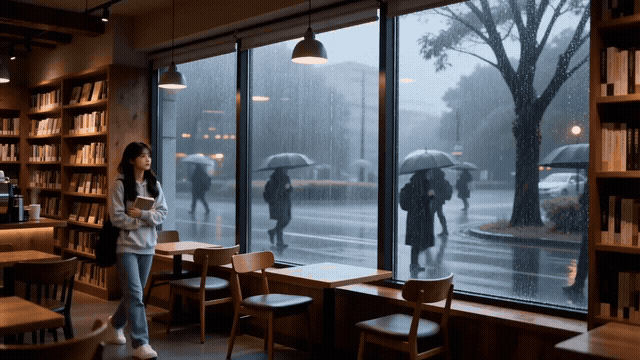](https://x.com/iamahmedfaraz66/status/2087507191763009632) | **[阻断改道｜资源检查后落入替代活动](catalog/cases/x-iamahmedfaraz66-2087507191763009632-browser-2087507191763009632-video-1/SUMMARY.md)**<br><sub>x-iamahmedfaraz66-2087507191763009632-browser-2087507191763009632-video-1</sub> | MiniMax H3 · Seedance 2.0 |
| [](https://x.com/Ciri_ai/status/2086672264712556614) | **[情绪压力曲线｜压抑、峰值、遮挡与残余](catalog/cases/x-ciri-ai-2086672264712556614-browser-2086672264712556614-video-1/SUMMARY.md)**<br><sub>x-ciri-ai-2086672264712556614-browser-2086672264712556614-video-1</sub> | MiniMax H3 · Seedance 2.0 |
| [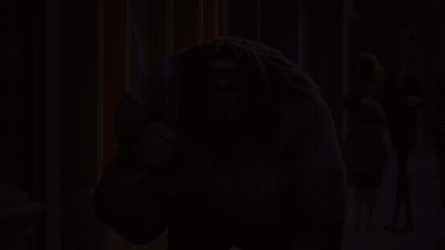](https://x.com/itsshara_ai/status/2084164954870174171) | **[服务改造｜私域工序到公开身份回归](catalog/cases/x-itsshara-ai-2084164954870174171-browser-2084164954870174171-video-1/SUMMARY.md)**<br><sub>x-itsshara-ai-2084164954870174171-browser-2084164954870174171-video-1</sub> | MiniMax H3 · Seedance 2.0 |
| [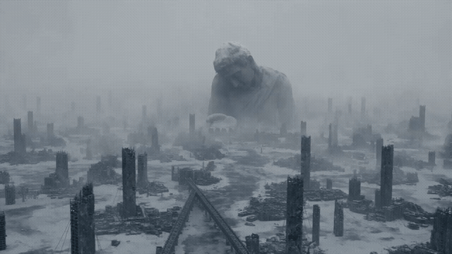](https://x.com/itsshara_ai/status/2086339231488872478) | **[单色激活｜唯一色彩信号跨尺度接力](catalog/cases/x-itsshara-ai-2086339231488872478-browser-2086339231488872478-video-1/SUMMARY.md)**<br><sub>x-itsshara-ai-2086339231488872478-browser-2086339231488872478-video-1</sub> | MiniMax H3 · Seedance 2.0 |
| [](https://x.com/ElsaSofia__AI/status/2088582116615610532) | **[场所反制｜追踪威胁与环境物件接力](catalog/cases/x-elsasofia-ai-2088582116615610532-browser-2088582116615610532-video-1/SUMMARY.md)**<br><sub>x-elsasofia-ai-2088582116615610532-browser-2088582116615610532-video-1</sub> | MiniMax H3 · Seedance 2.0 |
| [](https://x.com/SimplyAnnisa/status/2087078357595009085) | **[疲劳回场｜短恢复后完成困难末次并离开](catalog/cases/x-simplyannisa-2087078357595009085-browser-2087078357595009085-video-1/SUMMARY.md)**<br><sub>x-simplyannisa-2087078357595009085-browser-2087078357595009085-video-1</sub> | MiniMax H3 · Seedance 2.0 |
| [](https://x.com/ShamiWeb3/status/2087510864798576655) | **[异客日常化｜多项普通任务累积到黄昏返回](catalog/cases/x-shamiweb3-2087510864798576655-browser-2087510864798576655-video-1/SUMMARY.md)**<br><sub>x-shamiweb3-2087510864798576655-browser-2087510864798576655-video-1</sub> | MiniMax H3 · Seedance 2.0 |
| [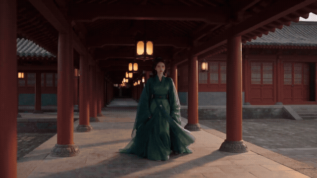](https://x.com/SimplyAnnisa/status/2090268350693687564) | **[叙事拆幕｜情绪场景连续退到片场与监看层](catalog/cases/x-simplyannisa-2090268350693687564-browser-2090268350693687564-video-1/SUMMARY.md)**<br><sub>x-simplyannisa-2090268350693687564-browser-2090268350693687564-video-1</sub> | MiniMax H3 · Seedance 2.0 |
| [](https://x.com/ElsaSofia__AI/status/2090260966797918629) | **[触觉旅行章法｜近物接触到高位全景递进](catalog/cases/x-elsasofia-ai-2090260966797918629-browser-2090260966797918629-video-1/SUMMARY.md)**<br><sub>x-elsasofia-ai-2090260966797918629-browser-2090260966797918629-video-1</sub> | MiniMax H3 · Seedance 2.0 |
| [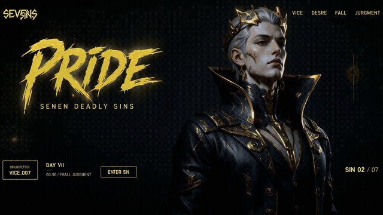](https://x.com/aimikoda/status/2090242494193660134) | **[定版角色谱系｜同字段框架区分多种原型](catalog/cases/x-aimikoda-2090242494193660134-browser-2090242494193660134-video-1/SUMMARY.md)**<br><sub>x-aimikoda-2090242494193660134-browser-2090242494193660134-video-1</sub> | MiniMax H3 · Seedance 2.0 |
| [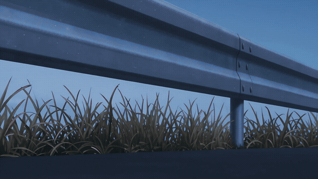](https://x.com/sarischerika/status/2090235034989142300) | **[训练复投｜计时检查触发受挫后重新上路](catalog/cases/x-sarischerika-2090235034989142300-browser-2090235034989142300-video-1/SUMMARY.md)**<br><sub>x-sarischerika-2090235034989142300-browser-2090235034989142300-video-1</sub> | MiniMax H3 · Seedance 2.0 |
| [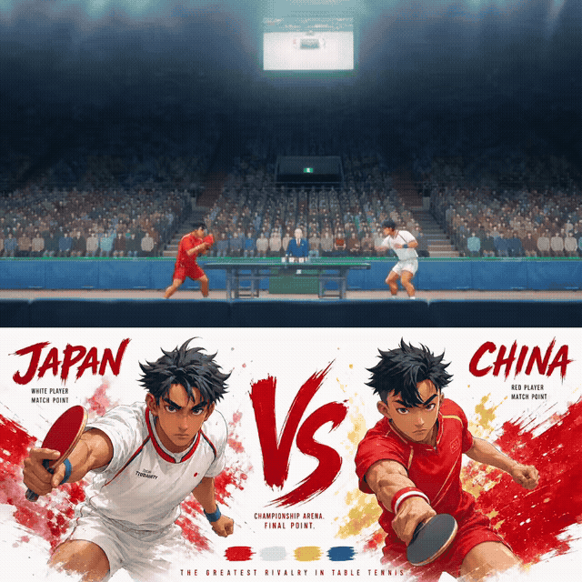](https://x.com/TechieBySA/status/2090130971823612281) | **[对阵条不掉线｜小球方向连续到决胜反应](catalog/cases/x-techiebysa-2090130971823612281-browser-2090130971823612281-video-1/SUMMARY.md)**<br><sub>x-techiebysa-2090130971823612281-browser-2090130971823612281-video-1</sub> | MiniMax H3 · Seedance 2.0 |
| [](https://x.com/GamerHashCom/status/2090104453684748398) | **[功能问答闭环｜人物疑问由设备状态完成证明](catalog/cases/x-gamerhashcom-2090104453684748398-browser-2090104453684748398-video-1/SUMMARY.md)**<br><sub>x-gamerhashcom-2090104453684748398-browser-2090104453684748398-video-1</sub> | MiniMax H3 · Seedance 2.0 |
| [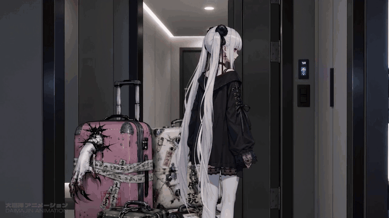](https://x.com/daimajinart/status/2090162242650026202) | **[入住迟到异样｜先完成社交接纳再揭示行李异常](catalog/cases/x-daimajinart-2090162242650026202-browser-2090162242650026202-video-1/SUMMARY.md)**<br><sub>x-daimajinart-2090162242650026202-browser-2090162242650026202-video-1</sub> | MiniMax H3 · Seedance 2.0 |
| [](https://x.com/aymducking/status/2090150758758928522) | **[连续目标防御｜固定核心、双角色接力与威胁环升级](catalog/cases/x-aymducking-2090150758758928522-browser-2090150758758928522-video-1/SUMMARY.md)**<br><sub>x-aymducking-2090150758758928522-browser-2090150758758928522-video-1</sub> | MiniMax H3 · Seedance 2.0 |
| [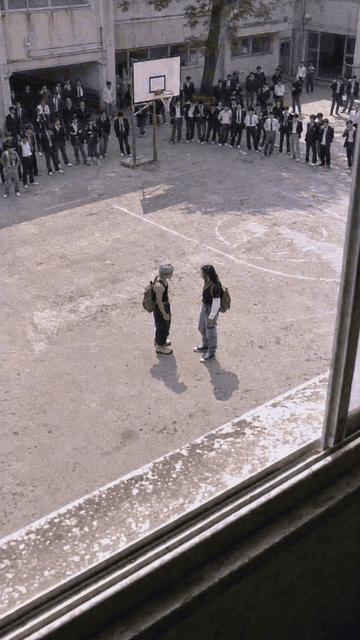](https://x.com/pabloprompt/status/2090146243682984134) | **[见证窗不切换｜对峙、越界位移与能量碰撞留在同一场](catalog/cases/x-pabloprompt-2090146243682984134-browser-2090146243682984134-video-1/SUMMARY.md)**<br><sub>x-pabloprompt-2090146243682984134-browser-2090146243682984134-video-1</sub> | MiniMax H3 · Seedance 2.0 |
| [](https://x.com/Naiknelofar788/status/2090131477145227354) | **[自拍路线小发现｜街行、侧看、品尝与带物继续](catalog/cases/x-naiknelofar788-2090131477145227354-browser-2090131477145227354-video-1/SUMMARY.md)**<br><sub>x-naiknelofar788-2090131477145227354-browser-2090131477145227354-video-1</sub> | MiniMax H3 · Seedance 2.0 |
| [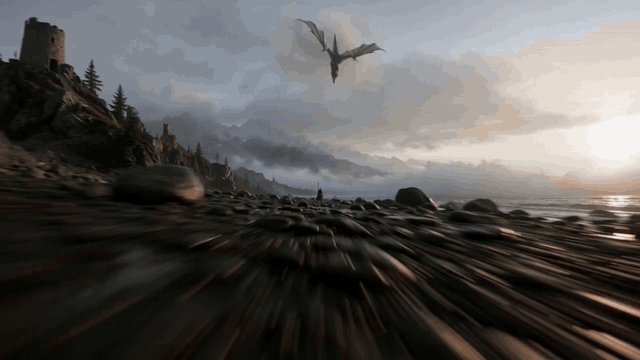](https://x.com/minuitIA/status/2090125003463278833) | **[地面召集天空编队｜近距确认、首领降落与乘骑离场](catalog/cases/x-minuitia-2090125003463278833-browser-2090125003463278833-video-1/SUMMARY.md)**<br><sub>x-minuitia-2090125003463278833-browser-2090125003463278833-video-1</sub> | MiniMax H3 · Seedance 2.0 |
| [](https://x.com/churvikv/status/2090124366134542770) | **[手作角色扮演｜分工亮相、道具误伤与集体和解](catalog/cases/x-churvikv-2090124366134542770-browser-2090124366134542770-video-1/SUMMARY.md)**<br><sub>x-churvikv-2090124366134542770-browser-2090124366134542770-video-1</sub> | MiniMax H3 · Seedance 2.0 |
| [](https://x.com/LadyWasabee/status/2090114253839863934) | **[符号布局单步改写｜空间揭示、手部决策与实体后果](catalog/cases/x-ladywasabee-2090114253839863934-browser-2090114253839863934-video-1/SUMMARY.md)**<br><sub>x-ladywasabee-2090114253839863934-browser-2090114253839863934-video-1</sub> | MiniMax H3 · Seedance 2.0 |
| [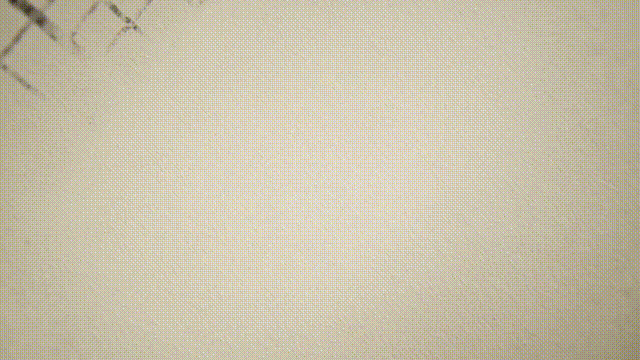](https://x.com/HBCoop_/status/2090107555712512053) | **[几何注册匹配片头｜平面路径、实体面板与终局印记](catalog/cases/x-hbcoop-2090107555712512053-browser-2090107555712512053-video-1/SUMMARY.md)**<br><sub>x-hbcoop-2090107555712512053-browser-2090107555712512053-video-1</sub> | MiniMax H3 · Seedance 2.0 |
| [](https://x.com/johnAGI168/status/2090099974121869462) | **[连续闯关赴约｜湿身残留、障碍升级与终点重逢](catalog/cases/x-johnagi168-2090099974121869462-browser-2090099974121869462-video-1/SUMMARY.md)**<br><sub>x-johnagi168-2090099974121869462-browser-2090099974121869462-video-1</sub> | MiniMax H3 · Seedance 2.0 |
| [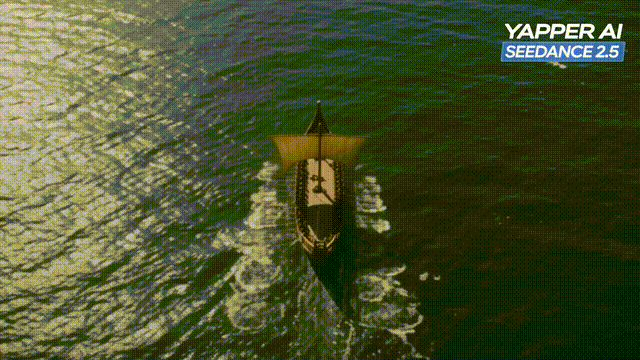](https://x.com/yapper_so/status/2090098617478795605) | **[连续拉远尺度揭危｜小型载体、扩张暗区与临界停留](catalog/cases/x-yapper-so-2090098617478795605-browser-2090098617478795605-video-1/SUMMARY.md)**<br><sub>x-yapper-so-2090098617478795605-browser-2090098617478795605-video-1</sub> | MiniMax H3 · Seedance 2.0 |
| [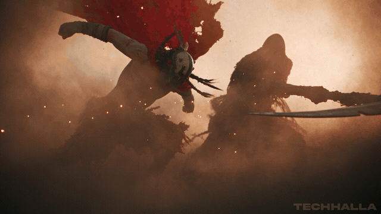](https://x.com/techhalla/status/2090568539325317401) | **[相态敌手攻防｜实体命中、粒子卸力与反向重组](catalog/cases/x-techhalla-2090568539325317401-browser-2090568539325317401-video-1/SUMMARY.md)**<br><sub>x-techhalla-2090568539325317401-browser-2090568539325317401-video-1</sub> | MiniMax H3 · Seedance 2.0 |
| [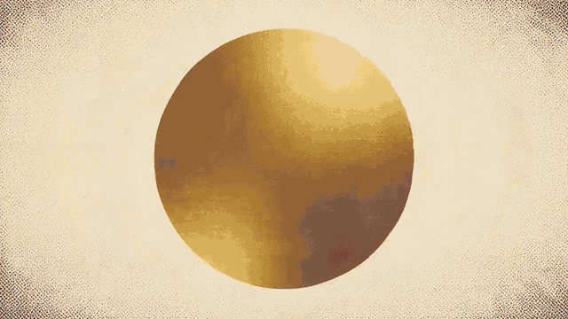](https://x.com/wakeupgfx/status/2090565921580425588) | **[角色字卡动作片头｜身份锚点、语义动作与模块轮转](catalog/cases/x-wakeupgfx-2090565921580425588-browser-2090565921580425588-video-1/SUMMARY.md)**<br><sub>x-wakeupgfx-2090565921580425588-browser-2090565921580425588-video-1</sub> | MiniMax H3 · Seedance 2.0 |
| [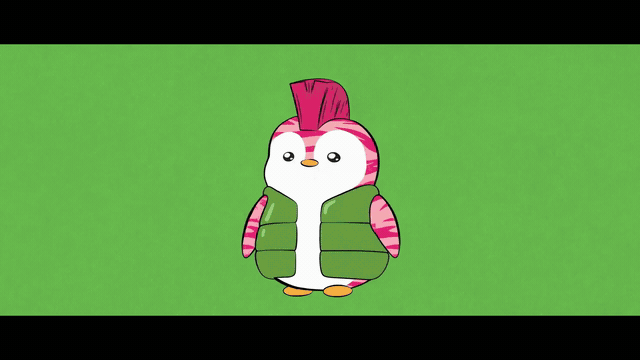](https://x.com/nett0eth/status/2090267753915498925) | **[扁平角色字卡轮转｜同一企鹅贯穿多种运动语法](catalog/cases/x-nett0eth-2090267753915498925-browser-2090267753915498925-video-1/SUMMARY.md)**<br><sub>x-nett0eth-2090267753915498925-browser-2090267753915498925-video-1</sub> | MiniMax H3 · Seedance 2.0 |
| [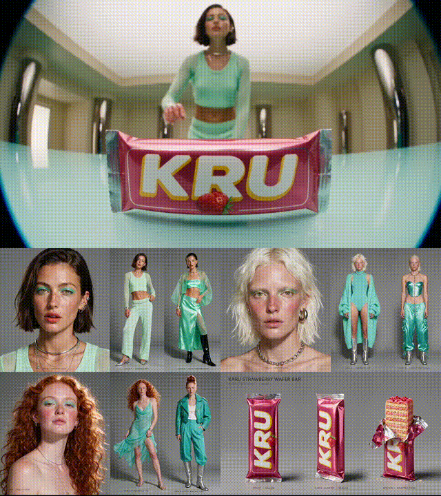](https://x.com/ivanka_humeniuk/status/2090065396057395276) | **[多人商品一致性｜常驻参考板与角色接力实证](catalog/cases/x-ivanka-humeniuk-2090065396057395276-browser-2090065396057395276-video-1/SUMMARY.md)**<br><sub>x-ivanka-humeniuk-2090065396057395276-browser-2090065396057395276-video-1</sub> | MiniMax H3 · Seedance 2.0 |
| [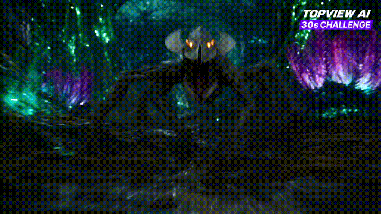](https://x.com/Castuananh/status/2090577363751039169) | **[威胁接力反转｜救援改写层级并重启追逐](catalog/cases/x-castuananh-2090577363751039169-browser-2090577363751039169-video-1/SUMMARY.md)**<br><sub>x-castuananh-2090577363751039169-browser-2090577363751039169-video-1</sub> | MiniMax H3 · Seedance 2.0 |
| [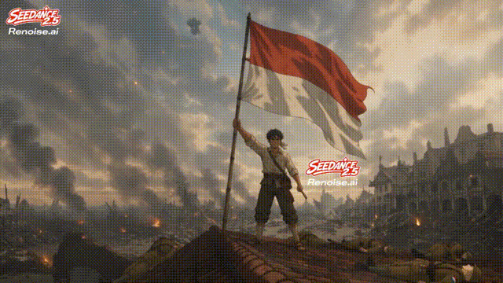](https://x.com/GilangR90760584/status/2090608131722338566) | **[连续前进闯阵｜防守闸门升级到高点标志](catalog/cases/x-gilangr90760584-2090608131722338566-browser-2090608131722338566-video-1/SUMMARY.md)**<br><sub>x-gilangr90760584-2090608131722338566-browser-2090608131722338566-video-1</sub> | MiniMax H3 · Seedance 2.0 |
| [](https://x.com/su_nagomi/status/2090556023178510671) | **[实拍印刷层接力｜人物、商品细节与字卡共同推进](catalog/cases/x-su-nagomi-2090556023178510671-browser-2090556023178510671-video-1/SUMMARY.md)**<br><sub>x-su-nagomi-2090556023178510671-browser-2090556023178510671-video-1</sub> | MiniMax H3 · Seedance 2.0 |
| [](https://x.com/nicolasmariar/status/2090552135947579701) | **[地下轨迹破土｜尺度反转、追逐穿越与空场余波](catalog/cases/x-nicolasmariar-2090552135947579701-browser-2090552135947579701-video-1/SUMMARY.md)**<br><sub>x-nicolasmariar-2090552135947579701-browser-2090552135947579701-video-1</sub> | MiniMax H3 · Seedance 2.0 |
| [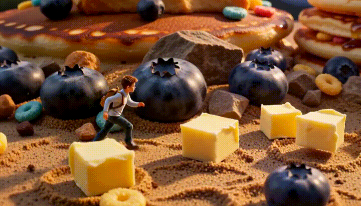](https://x.com/0nedi4ry/status/2090592575627628702) | **[微缩多材质路线｜动作动词接力到高点终点](catalog/cases/x-0nedi4ry-2090592575627628702-browser-2090592575627628702-video-1/SUMMARY.md)**<br><sub>x-0nedi4ry-2090592575627628702-browser-2090592575627628702-video-1</sub> | MiniMax H3 · Seedance 2.0 |
| [](https://x.com/shuxxess/status/2090601706648412626) | **[实用整理确认关系｜接触、退开与双向微反应](catalog/cases/x-shuxxess-2090601706648412626-browser-2090601706648412626-video-1/SUMMARY.md)**<br><sub>x-shuxxess-2090601706648412626-browser-2090601706648412626-video-1</sub> | MiniMax H3 · Seedance 2.0 |
| [](https://x.com/shuxxess/status/2090603098180132963) | **[帅气展示瞬间失手｜单次事故与社交收尾](catalog/cases/x-shuxxess-2090603098180132963-browser-2090603098180132963-video-1/SUMMARY.md)**<br><sub>x-shuxxess-2090603098180132963-browser-2090603098180132963-video-1</sub> | MiniMax H3 · Seedance 2.0 |
| [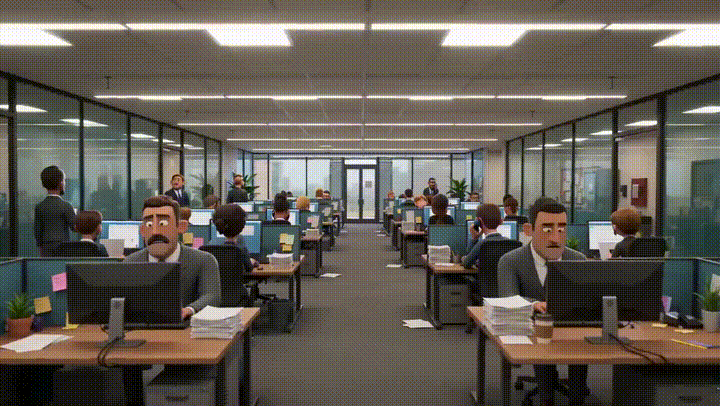](https://x.com/100xMart/status/2090597248946294902) | **[极端职业符号落入日常｜身份揭示到休假松弛](catalog/cases/x-100xmart-2090597248946294902-browser-2090597248946294902-video-1/SUMMARY.md)**<br><sub>x-100xmart-2090597248946294902-browser-2090597248946294902-video-1</sub> | MiniMax H3 · Seedance 2.0 |
| [](https://x.com/Cencencahya12/status/2090589088567136363) | **[平面民间故事展开｜章节换景与月轮升格](catalog/cases/x-cencencahya12-2090589088567136363-browser-2090589088567136363-video-1/SUMMARY.md)**<br><sub>x-cencencahya12-2090589088567136363-browser-2090589088567136363-video-1</sub> | MiniMax H3 · Seedance 2.0 |
| [](https://x.com/sarischerika/status/2090590155795234920) | **[不可见边界验真｜碰撞、手测与改道离开](catalog/cases/x-sarischerika-2090590155795234920-browser-2090590155795234920-video-1/SUMMARY.md)**<br><sub>x-sarischerika-2090590155795234920-browser-2090590155795234920-video-1</sub> | MiniMax H3 · Seedance 2.0 |
| [](https://x.com/100xMart/status/2090559508825210969) | **[目标先现的仪式行进｜前景队列与地标尺度同步放大](catalog/cases/x-100xmart-2090559508825210969-browser-2090559508825210969-video-1/SUMMARY.md)**<br><sub>x-100xmart-2090559508825210969-browser-2090559508825210969-video-1</sub> | MiniMax H3 · Seedance 2.0 |
| [](https://x.com/bmx_ai13/status/2091047466133283322) | **[自拍情绪峰值回落｜亲近笑意、中断与中性停留](catalog/cases/x-bmx-ai13-2091047466133283322-browser-2091047466133283322-video-1/SUMMARY.md)**<br><sub>x-bmx-ai13-2091047466133283322-browser-2091047466133283322-video-1</sub> | MiniMax H3 · Seedance 2.0 |
| [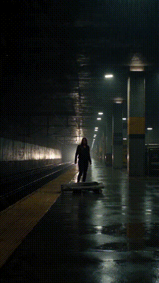](https://x.com/Noor_ul_ain43/status/2091044021460504779) | **[追逐路线崩塌再解释｜逃生载体毁灭后目标异地重现](catalog/cases/x-noor-ul-ain43-2091044021460504779-browser-2091044021460504779-video-1/SUMMARY.md)**<br><sub>x-noor-ul-ain43-2091044021460504779-browser-2091044021460504779-video-1</sub> | MiniMax H3 · Seedance 2.0 |
| [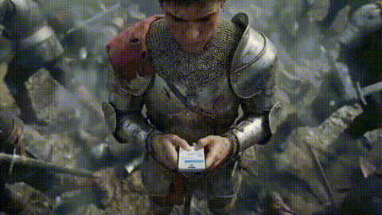](https://x.com/AiwithNomi/status/2091033183789912451) | **[前景执念对抗背景灾难｜危险升级但微小任务不断线](catalog/cases/x-aiwithnomi-2091033183789912451-browser-2091033183789912451-video-1/SUMMARY.md)**<br><sub>x-aiwithnomi-2091033183789912451-browser-2091033183789912451-video-1</sub> | MiniMax H3 · Seedance 2.0 |
| [](https://x.com/iamrealsnow/status/2091030795893043562) | **[静态群像异常升级｜表情异变、空间击穿与贴脸威胁](catalog/cases/x-iamrealsnow-2091030795893043562-browser-2091030795893043562-video-1/SUMMARY.md)**<br><sub>x-iamrealsnow-2091030795893043562-browser-2091030795893043562-video-1</sub> | MiniMax H3 · Seedance 2.0 |
| [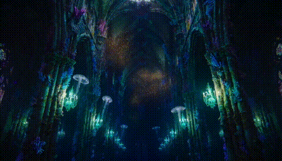](https://x.com/TechTalkNAVI/status/2091027098920157357) | **[纵深载体引导目的光｜稳定结构中逐级扩大出口](catalog/cases/x-techtalknavi-2091027098920157357-browser-2091027098920157357-video-1/SUMMARY.md)**<br><sub>x-techtalknavi-2091027098920157357-browser-2091027098920157357-video-1</sub> | MiniMax H3 · Seedance 2.0 |
| [](https://x.com/MrDasOnX/status/2091026087254036508) | **[道具携带者主动共享｜遮蔽物到位后完成亲密确认](catalog/cases/x-mrdasonx-2091026087254036508-browser-2091026087254036508-video-1/SUMMARY.md)**<br><sub>x-mrdasonx-2091026087254036508-browser-2091026087254036508-video-1</sub> | MiniMax H3 · Seedance 2.0 |
| [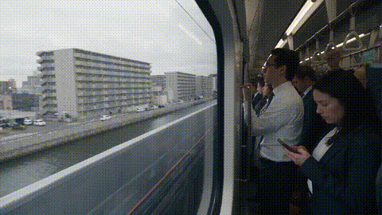](https://x.com/AiwithAlyar/status/2091023557560021314) | **[固定见证框架世界降级｜车厢不变、窗外状态逐级坠落](catalog/cases/x-aiwithalyar-2091023557560021314-browser-2091023557560021314-video-1/SUMMARY.md)**<br><sub>x-aiwithalyar-2091023557560021314-browser-2091023557560021314-video-1</sub> | MiniMax H3 · Seedance 2.0 |
| [](https://x.com/RuzainaMeer/status/2091022283569872939) | **[触觉攀登风险递增｜近身工具证据到峰顶尺度释放](catalog/cases/x-ruzainameer-2091022283569872939-browser-2091022283569872939-video-1/SUMMARY.md)**<br><sub>x-ruzainameer-2091022283569872939-browser-2091022283569872939-video-1</sub> | MiniMax H3 · Seedance 2.0 |
| [](https://x.com/ManuAGI01/status/2091022062404137221) | **[停顿型角色预告｜凝视、书法字卡、一次动作释放与徽记收束](catalog/cases/x-manuagi01-2091022062404137221-browser-2091022062404137221-video-1/SUMMARY.md)**<br><sub>x-manuagi01-2091022062404137221-browser-2091022062404137221-video-1</sub> | MiniMax H3 · Seedance 2.0 |
| [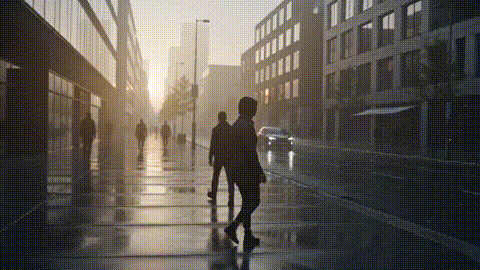](https://x.com/NoOneIsHere2603/status/2091021342602866951) | **[手势收集无形现象｜凝聚成球后释放并让环境回应](catalog/cases/x-nooneishere2603-2091021342602866951-browser-2091021342602866951-video-1/SUMMARY.md)**<br><sub>x-nooneishere2603-2091021342602866951-browser-2091021342602866951-video-1</sub> | MiniMax H3 · Seedance 2.0 |
| [](https://x.com/aiveed_io/status/2091020034785128769) | **[阳影护肤品证据链｜封装、质地、取用、涂抹与结果](catalog/cases/x-aiveed-io-2091020034785128769-browser-2091020034785128769-video-1/SUMMARY.md)**<br><sub>x-aiveed-io-2091020034785128769-browser-2091020034785128769-video-1</sub> | MiniMax H3 · Seedance 2.0 |
| [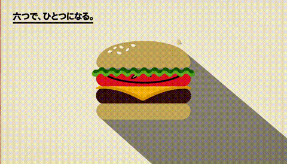](https://x.com/ryo05m/status/2091019054597431652) | **[成品先现的组件语法｜首秒爆拆、材质章节与符号化复归](catalog/cases/x-ryo05m-2091019054597431652-browser-2091019054597431652-video-1/SUMMARY.md)**<br><sub>x-ryo05m-2091019054597431652-browser-2091019054597431652-video-1</sub> | MiniMax H3 · Seedance 2.0 |
| [](https://x.com/noorlewisx/status/2091016705594274087) | **[同人城市天气轮转｜面部锚点不变、造型与环境成组切换](catalog/cases/x-noorlewisx-2091016705594274087-browser-2091016705594274087-video-1/SUMMARY.md)**<br><sub>x-noorlewisx-2091016705594274087-browser-2091016705594274087-video-1</sub> | MiniMax H3 · Seedance 2.0 |
| [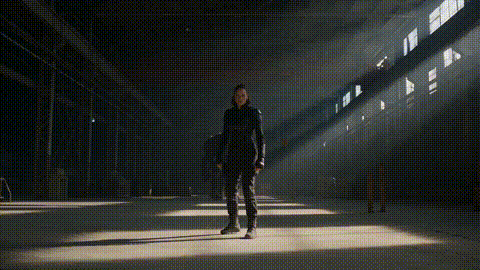](https://x.com/SyntheSarah/status/2091007759130988559) | **[速度对蛮力的非对称证明｜重击承诺、连续闪避与环境撞击](catalog/cases/x-synthesarah-2091007759130988559-browser-2091007759130988559-video-1/SUMMARY.md)**<br><sub>x-synthesarah-2091007759130988559-browser-2091007759130988559-video-1</sub> | MiniMax H3 · Seedance 2.0 |
| [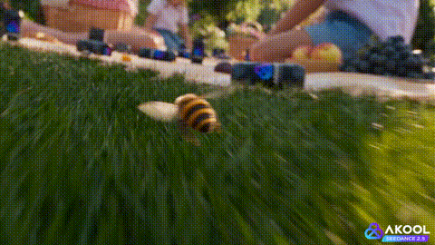](https://x.com/GilangR90760584/status/2091004987023454599) | **[微型载体FPV产品回环｜桌面障碍、生态穿越与包装复归](catalog/cases/x-gilangr90760584-2091004987023454599-browser-2091004987023454599-video-1/SUMMARY.md)**<br><sub>x-gilangr90760584-2091004987023454599-browser-2091004987023454599-video-1</sub> | MiniMax H3 · Seedance 2.0 |
| [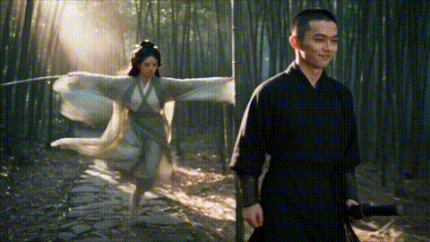](https://x.com/TanLuAI/status/2091004028180431097) | **[威胁动作被亲昵打断｜升级再打断后转成双人撤离](catalog/cases/x-tanluai-2091004028180431097-browser-2091004028180431097-video-1/SUMMARY.md)**<br><sub>x-tanluai-2091004028180431097-browser-2091004028180431097-video-1</sub> | MiniMax H3 · Seedance 2.0 |
| [](https://github.com/T8mars/minimax-h3-prompt-skill-T8/tree/main/catalog/cases/user-video-094e45c4f44a2cb1b9170c0689af8327) | **[指尖控制｜四向同拍全身响应](catalog/cases/user-video-094e45c4f44a2cb1b9170c0689af8327/SUMMARY.md)**<br><sub>user-video-094e45c4f44a2cb1b9170c0689af8327</sub> | MiniMax H3 · Seedance 2.0 |
| [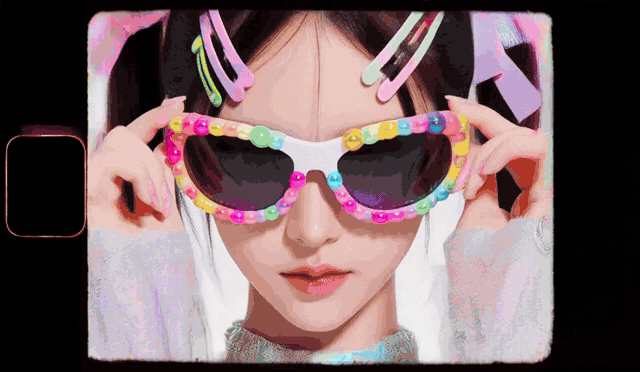](https://github.com/T8mars/minimax-h3-prompt-skill-T8/tree/main/catalog/cases/user-video-c60dc5cf8a4d200086e60498c10bbc49) | **[时尚密度复位｜身份锁定、拼贴回顾与英雄主标](catalog/cases/user-video-c60dc5cf8a4d200086e60498c10bbc49/SUMMARY.md)**<br><sub>user-video-c60dc5cf8a4d200086e60498c10bbc49</sub> | MiniMax H3 · Seedance 2.0 |
| [](https://github.com/T8mars/minimax-h3-prompt-skill-T8/tree/main/catalog/cases/user-video-715b76cd11b1098f170d41a9b71208ba) | **[手势边界换媒｜局部窗口、多形态验真与回归](catalog/cases/user-video-715b76cd11b1098f170d41a9b71208ba/SUMMARY.md)**<br><sub>user-video-715b76cd11b1098f170d41a9b71208ba</sub> | MiniMax H3 · Seedance 2.0 |
| [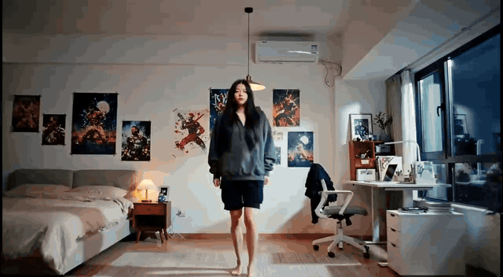](https://local.t8/user-supplied/c317cd9648205026eef7ad47e61b5bc4) | **[四角框域｜手势扩场、箭头峰值与收束](catalog/cases/user-video-c317cd9648205026eef7ad47e61b5bc4/SUMMARY.md)**<br><sub>user-video-c317cd9648205026eef7ad47e61b5bc4</sub> | MiniMax H3 · Seedance 2.0 |
| [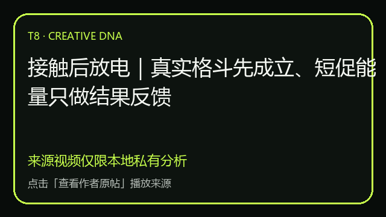](https://x.com/doctorwasif/status/2091388398153994395) | **[接触后放电｜真实格斗先成立、短促能量只做结果反馈](catalog/cases/x-doctorwasif-2091388398153994395-browser-2091388398153994395-video-1/SUMMARY.md)**<br><sub>x-doctorwasif-2091388398153994395-browser-2091388398153994395-video-1</sub> | MiniMax H3 · Seedance 2.0 |
| [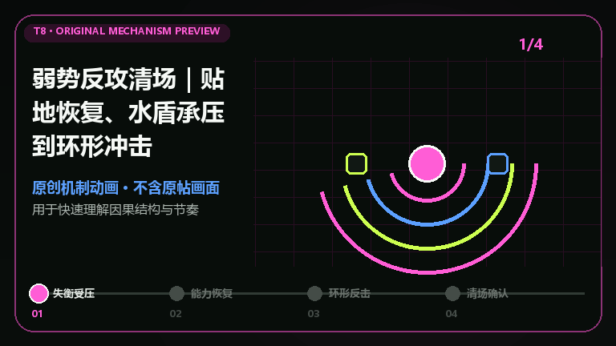](https://x.com/pyona_ai/status/2091862645720879213) | **[弱势反攻清场｜贴地恢复、水盾承压到环形冲击](catalog/cases/x-pyona-ai-2091862645720879213-browser-2091862645720879213-video-1/SUMMARY.md)**<br><sub>x-pyona-ai-2091862645720879213-browser-2091862645720879213-video-1</sub> | MiniMax H3 · Seedance 2.0 |
| [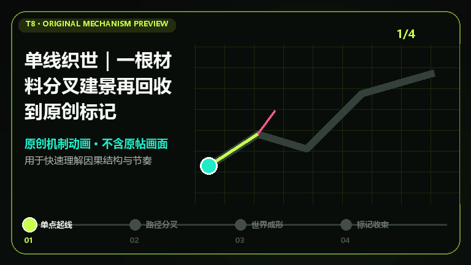](https://x.com/aimikoda/status/2091893350748025010) | **[单线织世｜一根材料分叉建景再回收到原创标记](catalog/cases/x-aimikoda-2091893350748025010-browser-2091893350748025010-video-1/SUMMARY.md)**<br><sub>x-aimikoda-2091893350748025010-browser-2091893350748025010-video-1</sub> | MiniMax H3 · Seedance 2.0 |
| [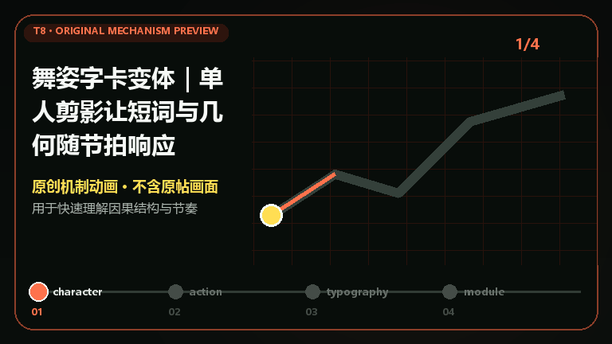](https://x.com/Naonekozamurai/status/2091352223968096561) | **[舞姿字卡变体｜单人剪影让短词与几何随节拍响应](catalog/cases/x-naonekozamurai-2091352223968096561-browser-2091352223968096561-video-1/SUMMARY.md)**<br><sub>x-naonekozamurai-2091352223968096561-browser-2091352223968096561-video-1</sub> | MiniMax H3 · Seedance 2.0 |
| [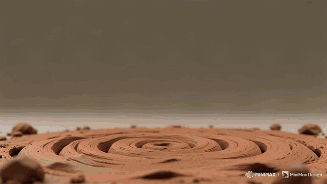](https://x.com/NVTDanh/status/2091114406839251020) | **[跨媒介角色集结｜五个独立风格模块最终共享同一舞台](catalog/cases/x-nvtdanh-2091114406839251020-browser-2091114406839251020-video-1/SUMMARY.md)**<br><sub>x-nvtdanh-2091114406839251020-browser-2091114406839251020-video-1</sub> | MiniMax H3 · Seedance 2.0 |
| [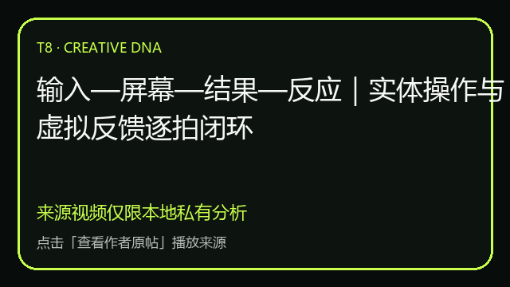](https://x.com/SimplyAnnisa/status/2091095890144395358) | **[输入—屏幕—结果—反应｜实体操作与虚拟反馈逐拍闭环](catalog/cases/x-simplyannisa-2091095890144395358-browser-2091095890144395358-video-1/SUMMARY.md)**<br><sub>x-simplyannisa-2091095890144395358-browser-2091095890144395358-video-1</sub> | MiniMax H3 · Seedance 2.0 |
| [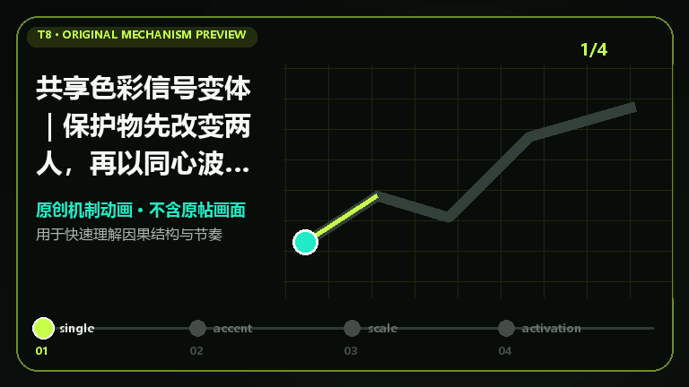](https://x.com/Soyo1538986Soyo/status/2092129848298762326) | **[共享色彩信号变体｜保护物先改变两人，再以同心波恢复城市](catalog/cases/x-soyo1538986soyo-2092129848298762326-browser-2092129848298762326-video-1/SUMMARY.md)**<br><sub>x-soyo1538986soyo-2092129848298762326-browser-2092129848298762326-video-1</sub> | MiniMax H3 · Seedance 2.0 |
| [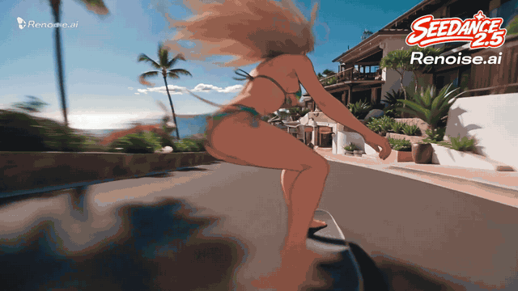](https://x.com/Bianca_AIart_mu/status/2091125813085118882) | **[连续载具升级｜滑行、冲浪、生物接力到高空释放](catalog/cases/x-bianca-aiart-mu-2091125813085118882-browser-2091125813085118882-video-1/SUMMARY.md)**<br><sub>x-bianca-aiart-mu-2091125813085118882-browser-2091125813085118882-video-1</sub> | MiniMax H3 · Seedance 2.0 |
| [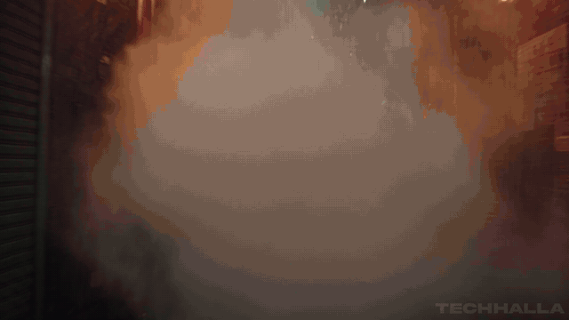](https://x.com/techhalla/status/2091231627653288150) | **[刻意遮断省略｜动作升级后以审查卡跳到余波结果](catalog/cases/x-techhalla-2091231627653288150-browser-2091231627653288150-video-1/SUMMARY.md)**<br><sub>x-techhalla-2091231627653288150-browser-2091231627653288150-video-1</sub> | MiniMax H3 · Seedance 2.0 |
| [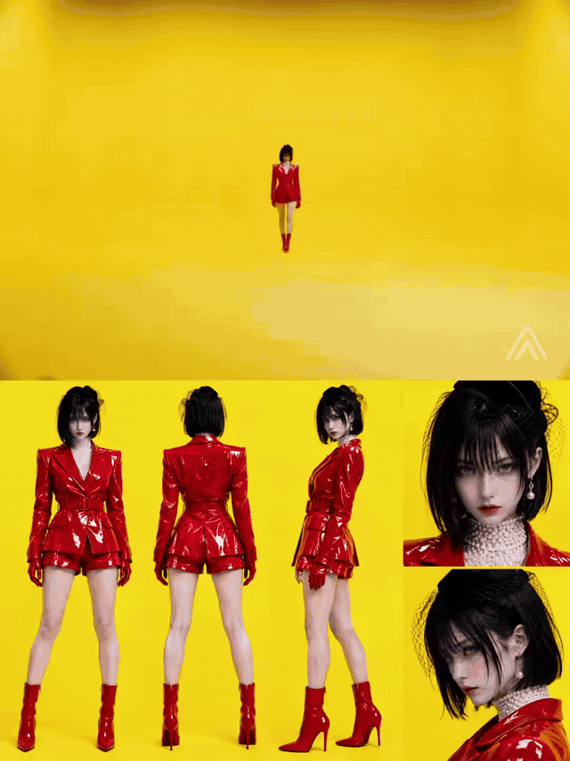](https://x.com/varts_works/status/2092069676272832714) | **[角色板时装变体｜固定参考条与舞台动作持续验真](catalog/cases/x-varts-works-2092069676272832714-browser-2092069676272832714-video-1/SUMMARY.md)**<br><sub>x-varts-works-2092069676272832714-browser-2092069676272832714-video-1</sub> | MiniMax H3 · Seedance 2.0 |
| [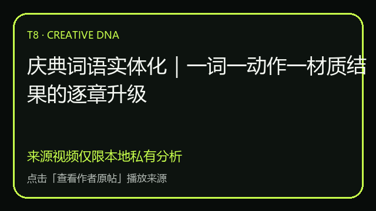](https://x.com/tokyo_Valentine/status/2092093848130617686) | **[庆典词语实体化｜一词一动作一材质结果的逐章升级](catalog/cases/x-tokyo-valentine-2092093848130617686-browser-2092093848130617686-video-1/SUMMARY.md)**<br><sub>x-tokyo-valentine-2092093848130617686-browser-2092093848130617686-video-1</sub> | MiniMax H3 · Seedance 2.0 |
| [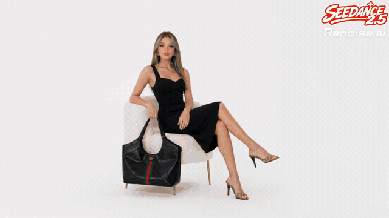](https://x.com/AIwithJessica/status/2091081481707802813) | **[配饰材质接力｜细节证据、全身回连与原创品牌收束](catalog/cases/x-aiwithjessica-2091081481707802813-browser-2091081481707802813-video-1/SUMMARY.md)**<br><sub>x-aiwithjessica-2091081481707802813-browser-2091081481707802813-video-1</sub> | MiniMax H3 · Seedance 2.0 |
| [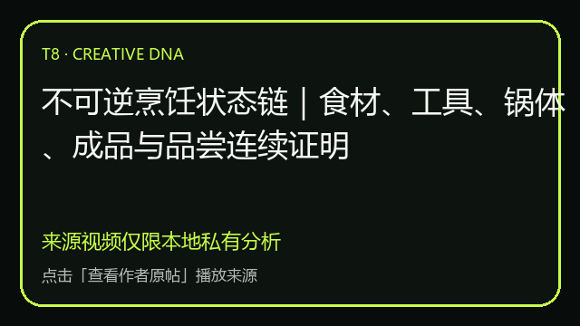](https://x.com/ElsaSofia__AI/status/2091483398972080172) | **[不可逆烹饪状态链｜食材、工具、锅体、成品与品尝连续证明](catalog/cases/x-elsasofia-ai-2091483398972080172-browser-2091483398972080172-video-1/SUMMARY.md)**<br><sub>x-elsasofia-ai-2091483398972080172-browser-2091483398972080172-video-1</sub> | MiniMax H3 · Seedance 2.0 |
| [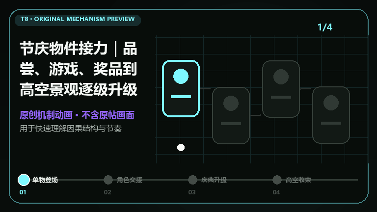](https://x.com/harboriis/status/2092131570908065852) | **[节庆物件接力｜品尝、游戏、奖品到高空景观逐级升级](catalog/cases/x-harboriis-2092131570908065852-browser-2092131570908065852-video-1/SUMMARY.md)**<br><sub>x-harboriis-2092131570908065852-browser-2092131570908065852-video-1</sub> | MiniMax H3 · Seedance 2.0 |
| [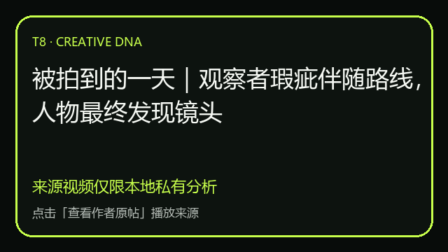](https://x.com/Aqib__786Ai/status/2092122339463090626) | **[被拍到的一天｜观察者瑕疵伴随路线，人物最终发现镜头](catalog/cases/x-aqib-786ai-2092122339463090626-browser-2092122339463090626-video-1/SUMMARY.md)**<br><sub>x-aqib-786ai-2092122339463090626-browser-2092122339463090626-video-1</sub> | MiniMax H3 · Seedance 2.0 |
| [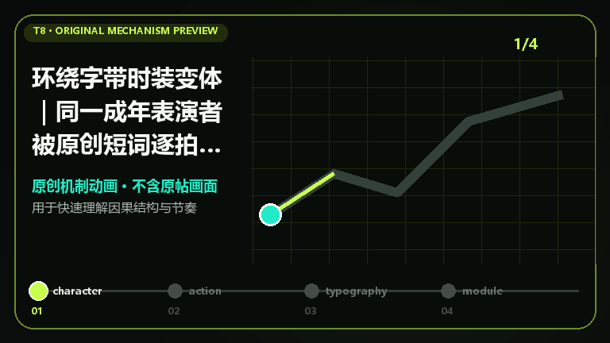](https://x.com/KiraKiraKaiju/status/2092132055857746375) | **[环绕字带时装变体｜同一成年表演者被原创短词逐拍编舞](catalog/cases/x-kirakirakaiju-2092132055857746375-browser-2092132055857746375-video-1/SUMMARY.md)**<br><sub>x-kirakirakaiju-2092132055857746375-browser-2092132055857746375-video-1</sub> | MiniMax H3 · Seedance 2.0 |
| [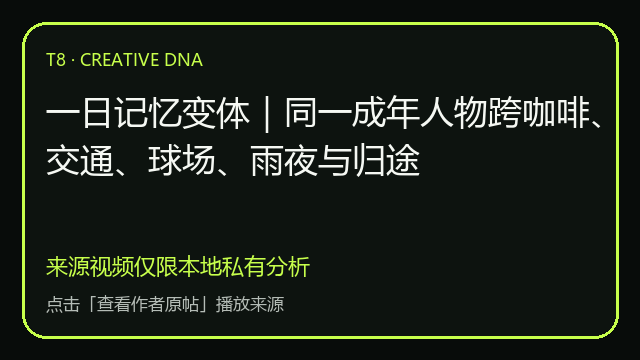](https://x.com/JoeScannellADHQ/status/2092124942825599358) | **[一日记忆变体｜同一成年人物跨咖啡、交通、球场、雨夜与归途](catalog/cases/x-joescannelladhq-2092124942825599358-browser-2092124942825599358-video-1/SUMMARY.md)**<br><sub>x-joescannelladhq-2092124942825599358-browser-2092124942825599358-video-1</sub> | MiniMax H3 · Seedance 2.0 |
| [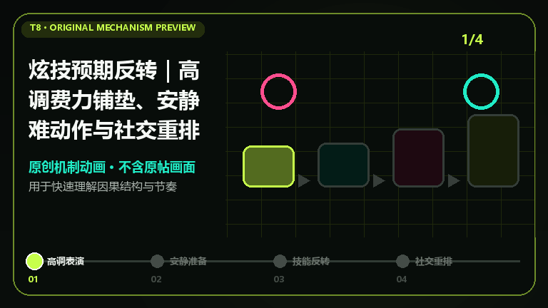](https://x.com/Viniai_/status/2092137445051744285) | **[炫技预期反转｜高调费力铺垫、安静难动作与社交重排](catalog/cases/x-viniai-2092137445051744285-browser-2092137445051744285-video-1/SUMMARY.md)**<br><sub>x-viniai-2092137445051744285-browser-2092137445051744285-video-1</sub> | MiniMax H3 · Seedance 2.0 |
| [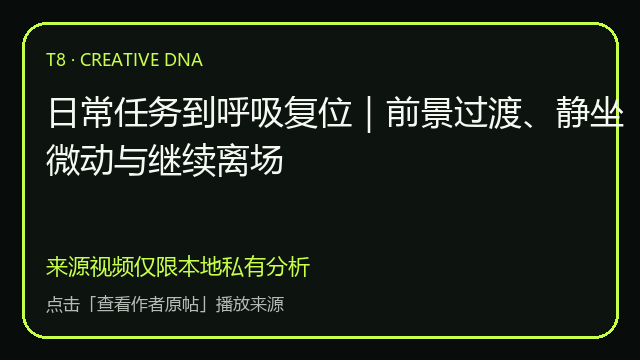](https://x.com/CaliraVal/status/2092124735081738349) | **[日常任务到呼吸复位｜前景过渡、静坐微动与继续离场](catalog/cases/x-caliraval-2092124735081738349-browser-2092124735081738349-video-1/SUMMARY.md)**<br><sub>x-caliraval-2092124735081738349-browser-2092124735081738349-video-1</sub> | MiniMax H3 · Seedance 2.0 |
| [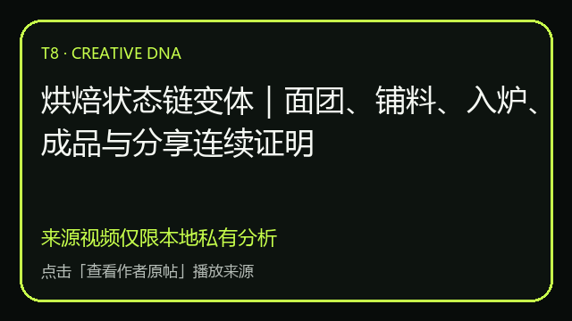](https://x.com/ZoeyBennettAi/status/2092124356709388475) | **[烘焙状态链变体｜面团、铺料、入炉、成品与分享连续证明](catalog/cases/x-zoeybennettai-2092124356709388475-browser-2092124356709388475-video-1/SUMMARY.md)**<br><sub>x-zoeybennettai-2092124356709388475-browser-2092124356709388475-video-1</sub> | MiniMax H3 · Seedance 2.0 |
| [](https://x.com/ImaStudio_ai/status/2091734655993291051) | **[时装世界节拍轮转｜同一成年角色跨风格、静默与英雄收束](catalog/cases/x-imastudio-ai-2091734655993291051-browser-2091734655993291051-video-1/SUMMARY.md)**<br><sub>x-imastudio-ai-2091734655993291051-browser-2091734655993291051-video-1</sub> | MiniMax H3 · Seedance 2.0 |
| [](https://x.com/ImaStudio_ai/status/2092457346526241208) | **[材质字构穿行｜同一成年人物跨九类物质语义空间](catalog/cases/x-imastudio-ai-2092457346526241208-browser-2092457346526241208-video-1/SUMMARY.md)**<br><sub>x-imastudio-ai-2092457346526241208-browser-2092457346526241208-video-1</sub> | MiniMax H3 · Seedance 2.0 |
| [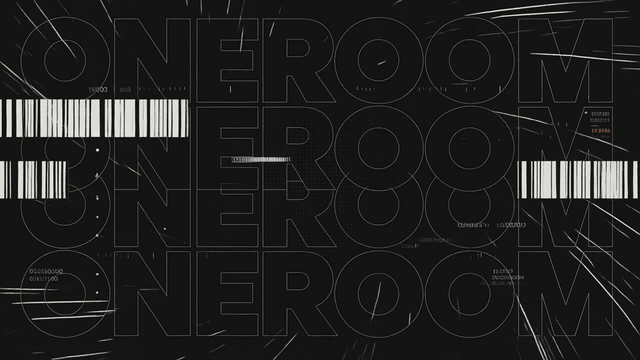](https://x.com/studio_oneroom/status/2092220604309205341) | **[字形结构运动系统｜组件组字、分栏、物理碰撞与双行锁定](catalog/cases/x-studio-oneroom-2092220604309205341-browser-2092220604309205341-video-1/SUMMARY.md)**<br><sub>x-studio-oneroom-2092220604309205341-browser-2092220604309205341-video-1</sub> | MiniMax H3 · Seedance 2.0 |
| [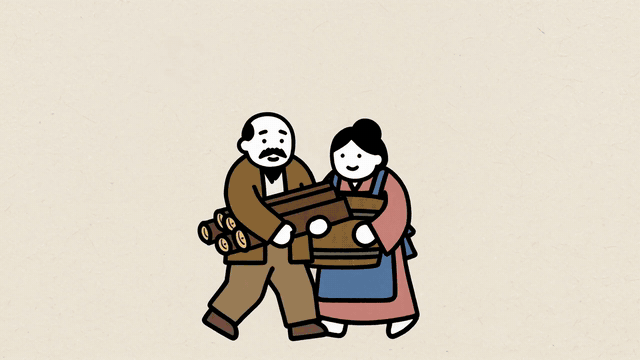](https://x.com/tanabe_fragm/status/2092118482129420785) | **[扁平民间故事变体｜章节换色、物件接力与结局回收](catalog/cases/x-tanabe-fragm-2092118482129420785-browser-2092118482129420785-video-1/SUMMARY.md)**<br><sub>x-tanabe-fragm-2092118482129420785-browser-2092118482129420785-video-1</sub> | MiniMax H3 · Seedance 2.0 |
| [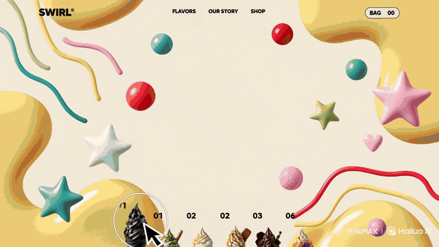](https://x.com/ShamsAmin56/status/2092188350476337613) | **[可见光标选择器变体｜固定网页控件同步切换产品与世界](catalog/cases/x-shamsamin56-2092188350476337613-browser-2092188350476337613-video-1/SUMMARY.md)**<br><sub>x-shamsamin56-2092188350476337613-browser-2092188350476337613-video-1</sub> | MiniMax H3 · Seedance 2.0 |
| [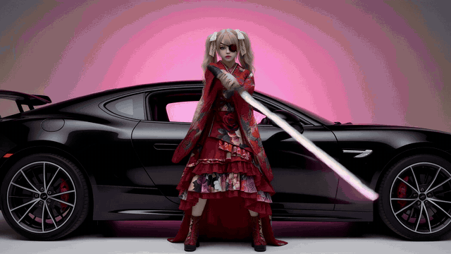](https://x.com/tokyo_Valentine/status/2091449476242440387) | **[语义字场动作接力｜成年角色每次行动生成一个空间短词](catalog/cases/x-tokyo-valentine-2091449476242440387-browser-2091449476242440387-video-1/SUMMARY.md)**<br><sub>x-tokyo-valentine-2091449476242440387-browser-2091449476242440387-video-1</sub> | MiniMax H3 · Seedance 2.0 |
| [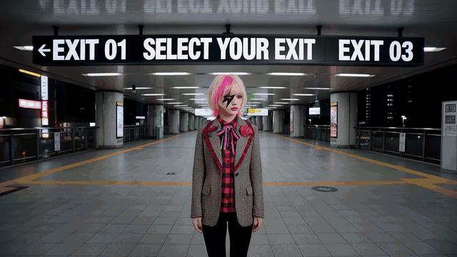](https://x.com/tokyo_Valentine/status/2091697364906254361) | **[设施语义字场变体｜成年旅客选择让站牌、闸机与路线说话](catalog/cases/x-tokyo-valentine-2091697364906254361-browser-2091697364906254361-video-1/SUMMARY.md)**<br><sub>x-tokyo-valentine-2091697364906254361-browser-2091697364906254361-video-1</sub> | MiniMax H3 · Seedance 2.0 |
| [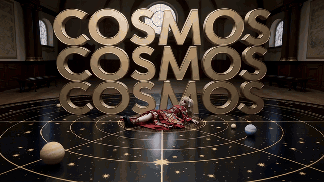](https://x.com/tokyo_Valentine/status/2091722040978063594) | **[天体语义字场变体｜成年观测者让轨道、脉冲与引力成为文字](catalog/cases/x-tokyo-valentine-2091722040978063594-browser-2091722040978063594-video-1/SUMMARY.md)**<br><sub>x-tokyo-valentine-2091722040978063594-browser-2091722040978063594-video-1</sub> | MiniMax H3 · Seedance 2.0 |
| [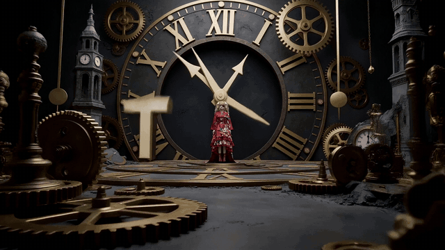](https://x.com/tokyo_Valentine/status/2091810150567039347) | **[机械语义字场变体｜成年角色让齿轮、弹簧与倒带成为文字](catalog/cases/x-tokyo-valentine-2091810150567039347-browser-2091810150567039347-video-1/SUMMARY.md)**<br><sub>x-tokyo-valentine-2091810150567039347-browser-2091810150567039347-video-1</sub> | MiniMax H3 · Seedance 2.0 |
| [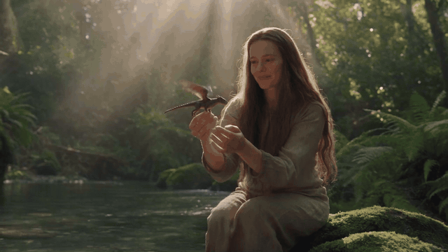](https://x.com/RuzainaMeer/status/2092195435385630983) | **[接触触发尺度生长｜小型陪伴物入介质后长成巨体](catalog/cases/x-ruzainameer-2092195435385630983-browser-2092195435385630983-video-1/SUMMARY.md)**<br><sub>x-ruzainameer-2092195435385630983-browser-2092195435385630983-video-1</sub> | MiniMax H3 · Seedance 2.0 |
| [](https://x.com/HBCoop_/status/2091616500440572217) | **[翻片矩阵字标组装｜像素激活、平面组字、厚度长出与卡片收束](catalog/cases/x-hbcoop-2091616500440572217-browser-2091616500440572217-video-1/SUMMARY.md)**<br><sub>x-hbcoop-2091616500440572217-browser-2091616500440572217-video-1</sub> | MiniMax H3 · Seedance 2.0 |
| [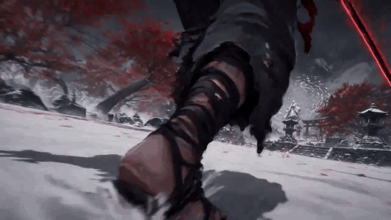](https://x.com/yourPlugAI/status/2092269036167934445) | **[重击对轻群体反制｜诱饵让位、群体绕行与武器缠束](catalog/cases/x-yourplugai-2092269036167934445-browser-2092269036167934445-video-1/SUMMARY.md)**<br><sub>x-yourplugai-2092269036167934445-browser-2092269036167934445-video-1</sub> | MiniMax H3 · Seedance 2.0 |
| [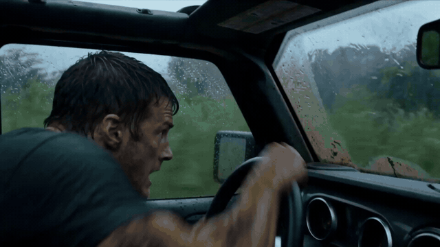](https://x.com/DtheW1995/status/2091783920467456468) | **[连续脱险变体｜追车、铁轨倒计时、遮挡假安全与更大威胁](catalog/cases/x-dthew1995-2091783920467456468-browser-2091783920467456468-video-1/SUMMARY.md)**<br><sub>x-dthew1995-2091783920467456468-browser-2091783920467456468-video-1</sub> | MiniMax H3 · Seedance 2.0 |
| [](https://x.com/Zyrellix/status/2091760321866186908) | **[产品环境提取回环｜材质微距、原料世界、喷雾门户与透明球归返](catalog/cases/x-zyrellix-2091760321866186908-browser-2091760321866186908-video-1/SUMMARY.md)**<br><sub>x-zyrellix-2091760321866186908-browser-2091760321866186908-video-1</sub> | MiniMax H3 · Seedance 2.0 |
| [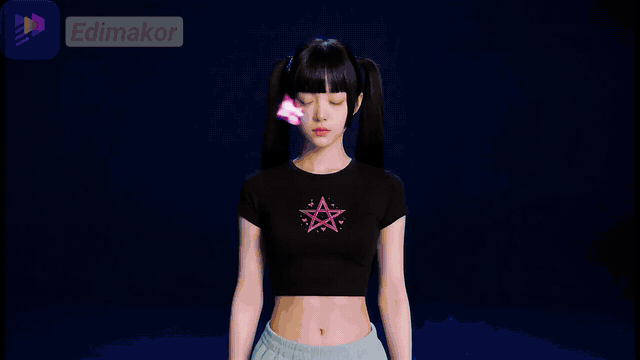](https://x.com/T_st_love_love/status/2091535156687655371) | **[真人字舞变体｜成年表演者动作驱动巨型短词与彩色模块](catalog/cases/x-t-st-love-love-2091535156687655371-browser-2091535156687655371-video-1/SUMMARY.md)**<br><sub>x-t-st-love-love-2091535156687655371-browser-2091535156687655371-video-1</sub> | MiniMax H3 · Seedance 2.0 |
| [](https://x.com/Weeleey6/status/2092237693849575494) | **[个人设备状态开关｜普通环境在佩戴后进入表演模式再归稳](catalog/cases/x-weeleey6-2092237693849575494-browser-2092237693849575494-video-1/SUMMARY.md)**<br><sub>x-weeleey6-2092237693849575494-browser-2092237693849575494-video-1</sub> | MiniMax H3 · Seedance 2.0 |
| [](https://x.com/laviniavelle/status/2091812173391790374) | **[不可能奢华姿态｜极远尺度钩子、连续推进与配饰细节阶梯](catalog/cases/x-laviniavelle-2091812173391790374-browser-2091812173391790374-video-1/SUMMARY.md)**<br><sub>x-laviniavelle-2091812173391790374-browser-2091812173391790374-video-1</sub> | MiniMax H3 · Seedance 2.0 |
| [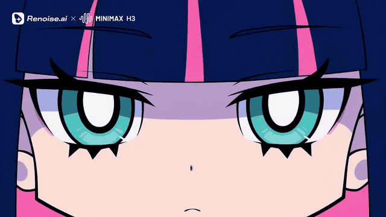](https://x.com/Mayz1169/status/2091464848848846983) | **[角色板验真变体｜眼部钩子、全身转面、细节宏观与英雄卡](catalog/cases/x-mayz1169-2091464848848846983-browser-2091464848848846983-video-1/SUMMARY.md)**<br><sub>x-mayz1169-2091464848848846983-browser-2091464848848846983-video-1</sub> | MiniMax H3 · Seedance 2.0 |
| [](https://x.com/noorlewisx/status/2092478694078251087) | **[美容功效证据变体｜成年用户基线、取量、使用、触感与持瓶回扣](catalog/cases/x-noorlewisx-2092478694078251087-browser-2092478694078251087-video-1/SUMMARY.md)**<br><sub>x-noorlewisx-2092478694078251087-browser-2092478694078251087-video-1</sub> | MiniMax H3 · Seedance 2.0 |
| [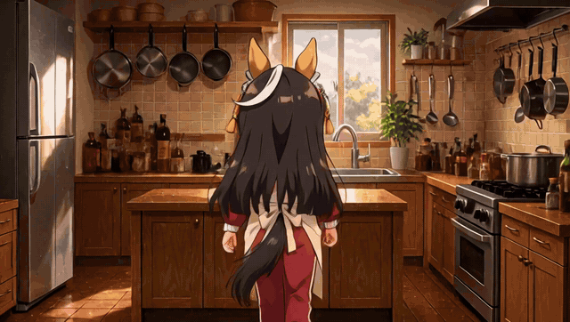](https://x.com/nnanchi_uma/status/2091508732866032061) | **[拉面状态链变体｜原料、切配、汤锅、沥水、装碗与品尝连续证明](catalog/cases/x-nnanchi-uma-2091508732866032061-browser-2091508732866032061-video-1/SUMMARY.md)**<br><sub>x-nnanchi-uma-2091508732866032061-browser-2091508732866032061-video-1</sub> | MiniMax H3 · Seedance 2.0 |
| [](https://x.com/akemiwork/status/2092242385141219589) | **[墨烟试装升级｜日常基线、遮挡换装与黑白合流](catalog/cases/x-akemiwork-2092242385141219589-browser-2092242385141219589-video-1/SUMMARY.md)**<br><sub>x-akemiwork-2092242385141219589-browser-2092242385141219589-video-1</sub> | MiniMax H3 · Seedance 2.0 |
| [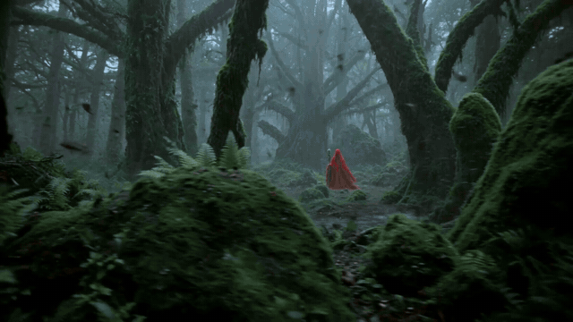](https://x.com/minuitIA/status/2092285935056568787) | **[全域冻结回溯｜唯一行动者触发环境复流](catalog/cases/x-minuitia-2092285935056568787-browser-2092285935056568787-video-1/SUMMARY.md)**<br><sub>x-minuitia-2092285935056568787-browser-2092285935056568787-video-1</sub> | MiniMax H3 · Seedance 2.0 |
| [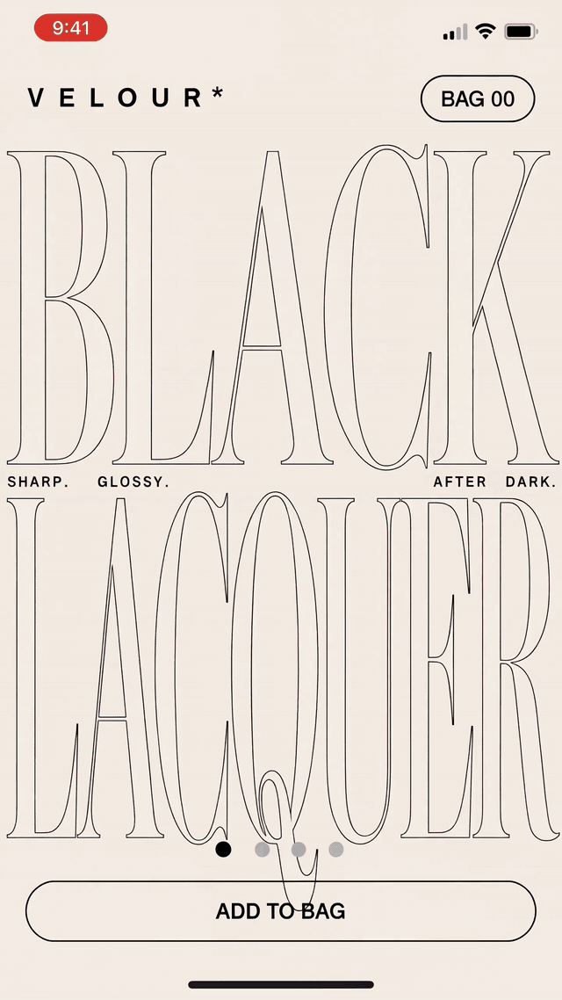](https://x.com/onofumi_AI/status/2092528740475785520) | **[触屏造型切换｜固定界面、手势触发与人物实装](catalog/cases/x-onofumi-ai-2092528740475785520-browser-2092528740475785520-video-1/SUMMARY.md)**<br><sub>x-onofumi-ai-2092528740475785520-browser-2092528740475785520-video-1</sub> | MiniMax H3 · Seedance 2.0 |
| [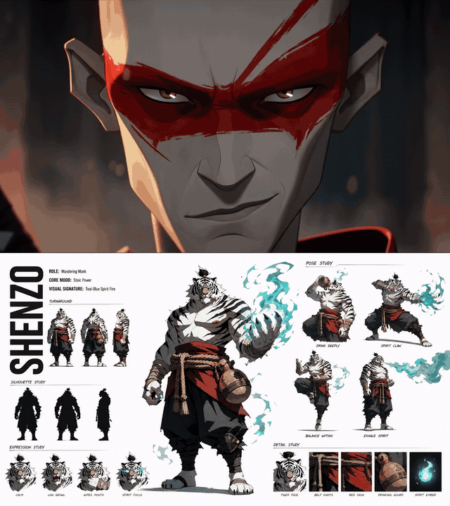](https://x.com/itsPixieVerse/status/2092439841564995765) | **[体型差格斗｜身份插页、反应镜头与力量反制](catalog/cases/x-itspixieverse-2092439841564995765-browser-2092439841564995765-video-1/SUMMARY.md)**<br><sub>x-itspixieverse-2092439841564995765-browser-2092439841564995765-video-1</sub> | MiniMax H3 · Seedance 2.0 |
| [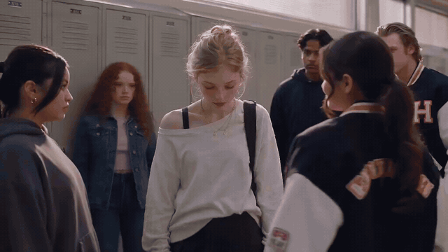](https://x.com/AiwithElisia/status/2092119695201837059) | **[接触能量反击｜受压触发、连续清场与余波复位](catalog/cases/x-aiwithelisia-2092119695201837059-browser-2092119695201837059-video-1/SUMMARY.md)**<br><sub>x-aiwithelisia-2092119695201837059-browser-2092119695201837059-video-1</sub> | MiniMax H3 · Seedance 2.0 |
| [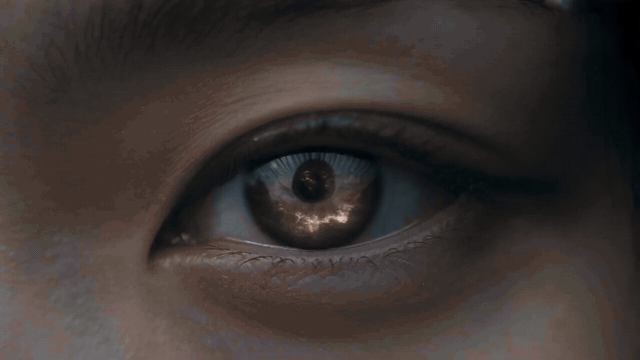](https://x.com/Zyrellix/status/2092121112746287527) | **[祭坛唤醒巨物｜目标先现、路径点亮与尺度兑现](catalog/cases/x-zyrellix-2092121112746287527-browser-2092121112746287527-video-1/SUMMARY.md)**<br><sub>x-zyrellix-2092121112746287527-browser-2092121112746287527-video-1</sub> | MiniMax H3 · Seedance 2.0 |
| [](https://x.com/mimu_ai1/status/2092302901842682213) | **[善意载体接力｜小动作跨人物传递到情绪兑现](catalog/cases/x-mimu-ai1-2092302901842682213-browser-2092302901842682213-video-1/SUMMARY.md)**<br><sub>x-mimu-ai1-2092302901842682213-browser-2092302901842682213-video-1</sub> | MiniMax H3 · Seedance 2.0 |
| [](https://x.com/SimplyAnnisa/status/2092107287355875538) | **[生活触点旅行｜屋顶出发、街巷互动与私密纪念](catalog/cases/x-simplyannisa-2092107287355875538-browser-2092107287355875538-video-1/SUMMARY.md)**<br><sub>x-simplyannisa-2092107287355875538-browser-2092107287355875538-video-1</sub> | MiniMax H3 · Seedance 2.0 |
| [](https://x.com/Ciri_ai/status/2091842148970996054) | **[旧DV美食漫游｜自拍锚点、摊位试吃与群体回应](catalog/cases/x-ciri-ai-2091842148970996054-browser-2091842148970996054-video-1/SUMMARY.md)**<br><sub>x-ciri-ai-2091842148970996054-browser-2091842148970996054-video-1</sub> | MiniMax H3 · Seedance 2.0 |
| [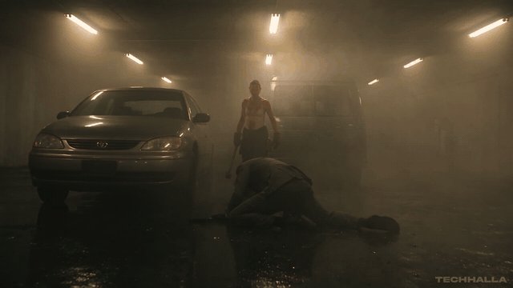](https://x.com/techhalla/status/2092026849077371380) | **[车库写实格斗｜工具接触、车辆遮挡与近身反制](catalog/cases/x-techhalla-2092026849077371380-browser-2092026849077371380-video-1/SUMMARY.md)**<br><sub>x-techhalla-2092026849077371380-browser-2092026849077371380-video-1</sub> | MiniMax H3 · Seedance 2.0 |
| [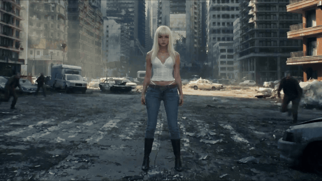](https://x.com/ou_zhen599/status/2091899796554715250) | **[围攻伪弱势反转｜静立诱近、近身爆发与路线继续](catalog/cases/x-ou-zhen599-2091899796554715250-browser-2091899796554715250-video-1/SUMMARY.md)**<br><sub>x-ou-zhen599-2091899796554715250-browser-2091899796554715250-video-1</sub> | MiniMax H3 · Seedance 2.0 |
| [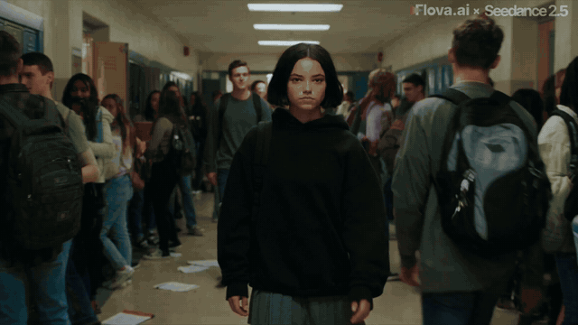](https://x.com/Strength04_X/status/2092427591814906005) | **[蓄能清场回稳｜手部微光、通道突进与人物复位](catalog/cases/x-strength04-x-2092427591814906005-browser-2092427591814906005-video-1/SUMMARY.md)**<br><sub>x-strength04-x-2092427591814906005-browser-2092427591814906005-video-1</sub> | MiniMax H3 · Seedance 2.0 |
| [](https://x.com/wiliam_web3/status/2092314524808335772) | **[双材质舞斗｜水冰攻防、尺度升级与镜像终局](catalog/cases/x-wiliam-web3-2092314524808335772-browser-2092314524808335772-video-1/SUMMARY.md)**<br><sub>x-wiliam-web3-2092314524808335772-browser-2092314524808335772-video-1</sub> | MiniMax H3 · Seedance 2.0 |
| [](https://x.com/navi_Ai2/status/2092612115970342970) | **[单物微距英雄片｜材质证据、轮廓确认与静态收束](catalog/cases/x-navi-ai2-2092612115970342970-browser-2092612115970342970-video-1/SUMMARY.md)**<br><sub>x-navi-ai2-2092612115970342970-browser-2092612115970342970-video-1</sub> | MiniMax H3 · Seedance 2.0 |
| [](https://x.com/HBCoop_/status/2091889307200172438) | **[功能材质成字｜丝束交叉、编织字标与实物铭牌落位](catalog/cases/x-hbcoop-2091889307200172438-browser-2091889307200172438-video-1/SUMMARY.md)**<br><sub>x-hbcoop-2091889307200172438-browser-2091889307200172438-video-1</sub> | MiniMax H3 · Seedance 2.0 |
| [](https://x.com/sakhil_ai/status/2092197944846151794) | **[三人群舞锁步｜中心领舞、队形推进与同步手势收束](catalog/cases/x-sakhil-ai-2092197944846151794-browser-2092197944846151794-video-1/SUMMARY.md)**<br><sub>x-sakhil-ai-2092197944846151794-browser-2092197944846151794-video-1</sub> | MiniMax H3 · Seedance 2.0 |
| [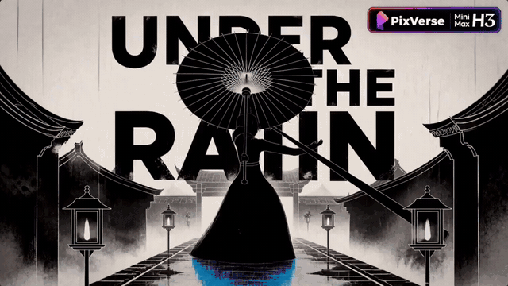](https://x.com/PixVerse/status/2093126466792034728) | **[拟音字武侠接力｜动作承诺、语义撞击与三章升级](catalog/cases/x-pixverse-2093126466792034728-browser-2093126466792034728-video-1/SUMMARY.md)**<br><sub>x-pixverse-2093126466792034728-browser-2093126466792034728-video-1</sub> | MiniMax H3 · Seedance 2.0 |
| [](https://x.com/Naonekozamurai/status/2093090433085895156) | **[运动鞋功能证据｜运动承诺、微距材质与产品英雄收束](catalog/cases/x-naonekozamurai-2093090433085895156-browser-2093090433085895156-video-1/SUMMARY.md)**<br><sub>x-naonekozamurai-2093090433085895156-browser-2093090433085895156-video-1</sub> | MiniMax H3 · Seedance 2.0 |
| [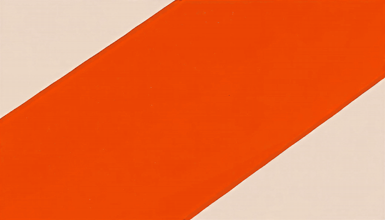](https://x.com/onofumi_AI/status/2093175677373845634) | **[汽水平面冲击广告｜罐体锚定、气泡撞击与字标归位](catalog/cases/x-onofumi-ai-2093175677373845634-browser-2093175677373845634-video-1/SUMMARY.md)**<br><sub>x-onofumi-ai-2093175677373845634-browser-2093175677373845634-video-1</sub> | MiniMax H3 · Seedance 2.0 |
| [](https://x.com/afrinxai/status/2093171721952256117) | **[日常路线情绪释放｜居家准备、候车推进与海边兑现](catalog/cases/x-afrinxai-2093171721952256117-browser-2093171721952256117-video-1/SUMMARY.md)**<br><sub>x-afrinxai-2093171721952256117-browser-2093171721952256117-video-1</sub> | MiniMax H3 · Seedance 2.0 |
| [](https://x.com/Creatify_AI/status/2093116596915192075) | **[饮品欲望证明链｜包装出现、液体微距与饮用反馈](catalog/cases/x-creatify-ai-2093116596915192075-browser-2093116596915192075-video-1/SUMMARY.md)**<br><sub>x-creatify-ai-2093116596915192075-browser-2093116596915192075-video-1</sub> | MiniMax H3 · Seedance 2.0 |
| [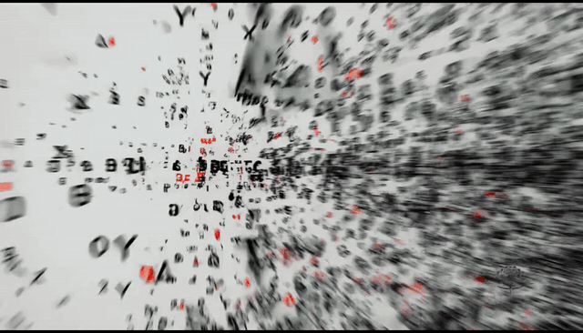](https://x.com/gane0wav/status/2093172023942078844) | **[植物材质片头｜物种切片、粒子生长与总标题归拢](catalog/cases/x-gane0wav-2093172023942078844-browser-2093172023942078844-video-1/SUMMARY.md)**<br><sub>x-gane0wav-2093172023942078844-browser-2093172023942078844-video-1</sub> | MiniMax H3 · Seedance 2.0 |
| [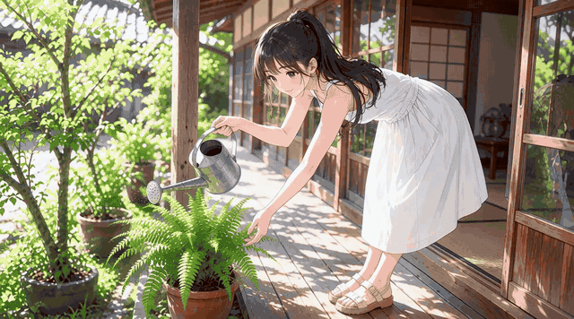](https://x.com/PhotogenicWeekE/status/2093133440359317751) | **[手绘成真｜真实笔触、线稿生长与彩色成品回证](catalog/cases/x-photogenicweeke-2093133440359317751-browser-2093133440359317751-video-1/SUMMARY.md)**<br><sub>x-photogenicweeke-2093133440359317751-browser-2093133440359317751-video-1</sub> | MiniMax H3 · Seedance 2.0 |
| [](https://x.com/Just_sharon7/status/2093171913698988151) | **[可见光标身份编辑｜拖拽改位、像素转换与人物连续](catalog/cases/x-just-sharon7-2093171913698988151-browser-2093171913698988151-video-1/SUMMARY.md)**<br><sub>x-just-sharon7-2093171913698988151-browser-2093171913698988151-video-1</sub> | MiniMax H3 · Seedance 2.0 |
| [](https://x.com/mugi_AI_Art/status/2093104167321825301) | **[几何通道角色MV｜身份钩子、环形穿越与模块复归](catalog/cases/x-mugi-ai-art-2093104167321825301-browser-2093104167321825301-video-1/SUMMARY.md)**<br><sub>x-mugi-ai-art-2093104167321825301-browser-2093104167321825301-video-1</sub> | MiniMax H3 · Seedance 2.0 |
| [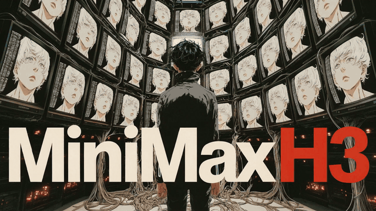](https://x.com/studio_oneroom/status/2093124514284712336) | **[动画片头混合接力｜角色锚点、数字字卡与街景推进](catalog/cases/x-studio-oneroom-2093124514284712336-browser-2093124514284712336-video-1/SUMMARY.md)**<br><sub>x-studio-oneroom-2093124514284712336-browser-2093124514284712336-video-1</sub> | MiniMax H3 · Seedance 2.0 |
| [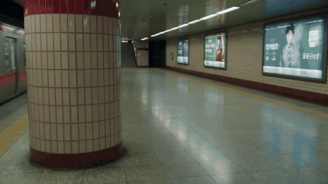](https://x.com/laviniavelle/status/2093162800747282739) | **[地铁冲撞格斗｜环境碰撞、恢复动作与近身反制](catalog/cases/x-laviniavelle-2093162800747282739-browser-2093162800747282739-video-1/SUMMARY.md)**<br><sub>x-laviniavelle-2093162800747282739-browser-2093162800747282739-video-1</sub> | MiniMax H3 · Seedance 2.0 |
| [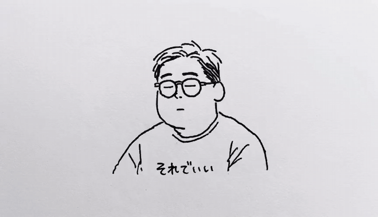](https://x.com/keneth_ai/status/2093122430747488309) | **[自绘身体成形｜线稿补全、色彩恢复与世界生成](catalog/cases/x-keneth-ai-2093122430747488309-browser-2093122430747488309-video-1/SUMMARY.md)**<br><sub>x-keneth-ai-2093122430747488309-browser-2093122430747488309-video-1</sub> | MiniMax H3 · Seedance 2.0 |
| [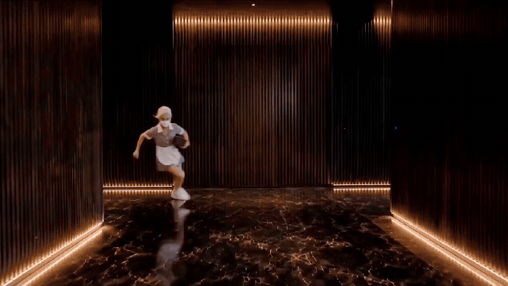](https://x.com/AvelyrahnAI/status/2093190544335728719) | **[伪装任务反转｜道具递送、身份揭示与连续突围](catalog/cases/x-avelyrahnai-2093190544335728719-browser-2093190544335728719-video-1/SUMMARY.md)**<br><sub>x-avelyrahnai-2093190544335728719-browser-2093190544335728719-video-1</sub> | MiniMax H3 · Seedance 2.0 |
| [](https://x.com/nakazakifam/status/2093093073077023109) | **[双层表演语义同步｜真人锚点、图形回应与关键词推进](catalog/cases/x-nakazakifam-2093093073077023109-browser-2093093073077023109-video-1/SUMMARY.md)**<br><sub>x-nakazakifam-2093093073077023109-browser-2093093073077023109-video-1</sub> | MiniMax H3 · Seedance 2.0 |
| [](https://x.com/kan8888kawa/status/2093175490173677993) | **[双人近景合唱｜身份交替、视线接力与同步副歌](catalog/cases/x-kan8888kawa-2093175490173677993-browser-2093175490173677993-video-1/SUMMARY.md)**<br><sub>x-kan8888kawa-2093175490173677993-browser-2093175490173677993-video-1</sub> | MiniMax H3 · Seedance 2.0 |
| [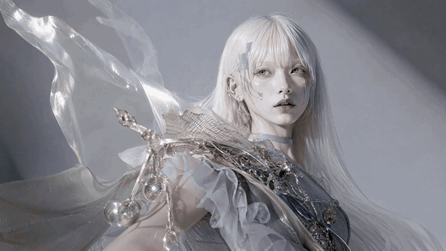](https://x.com/junyait/status/2093090305289662901) | **[单角材质轮转｜身份锚定、玻璃晶体与宇宙状态变换](catalog/cases/x-junyait-2093090305289662901-browser-2093090305289662901-video-1/SUMMARY.md)**<br><sub>x-junyait-2093090305289662901-browser-2093090305289662901-video-1</sub> | MiniMax H3 · Seedance 2.0 |
| [](https://x.com/sarischerika/status/2093136273603260680) | **[触手追逐恢复弧｜连续路线、力竭跌倒与决心复起](catalog/cases/x-sarischerika-2093136273603260680-browser-2093136273603260680-video-1/SUMMARY.md)**<br><sub>x-sarischerika-2093136273603260680-browser-2093136273603260680-video-1</sub> | MiniMax H3 · Seedance 2.0 |
| [](https://x.com/Naonekozamurai/status/2093166617589113232) | **[单图产品扩展｜完整鞋先现、材质爆拆与英雄复归](catalog/cases/x-naonekozamurai-2093166617589113232-browser-2093166617589113232-video-1/SUMMARY.md)**<br><sub>x-naonekozamurai-2093166617589113232-browser-2093166617589113232-video-1</sub> | MiniMax H3 · Seedance 2.0 |
| [](https://x.com/highsan_works/status/2093088917402874275) | **[单人舞台动作链｜固定空间、连续舞姿与终拍锁定](catalog/cases/x-highsan-works-2093088917402874275-browser-2093088917402874275-video-1/SUMMARY.md)**<br><sub>x-highsan-works-2093088917402874275-browser-2093088917402874275-video-1</sub> | MiniMax H3 · Seedance 2.0 |
| [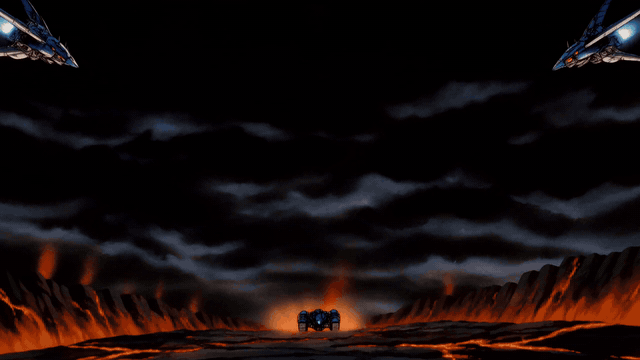](https://x.com/fantanglitchbox/status/2093165840229355992) | **[多载具机械组装｜组件到位、功能映射与机器人终局](catalog/cases/x-fantanglitchbox-2093165840229355992-browser-2093165840229355992-video-1/SUMMARY.md)**<br><sub>x-fantanglitchbox-2093165840229355992-browser-2093165840229355992-video-1</sub> | MiniMax H3 · Seedance 2.0 |
| [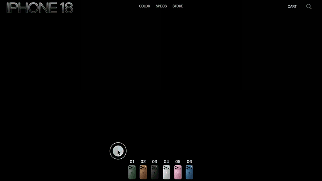](https://x.com/mrdejie/status/2093200521360499158) | **[产品配色章节｜固定轮廓、色名接力与英雄收束](catalog/cases/x-mrdejie-2093200521360499158-browser-2093200521360499158-video-1/SUMMARY.md)**<br><sub>x-mrdejie-2093200521360499158-browser-2093200521360499158-video-1</sub> | MiniMax H3 · Seedance 2.0 |
| [](https://x.com/CaliraVal/status/2093196455351902636) | **[家常烹饪状态链｜备料、加热、成形与品尝证明](catalog/cases/x-caliraval-2093196455351902636-browser-2093196455351902636-video-1/SUMMARY.md)**<br><sub>x-caliraval-2093196455351902636-browser-2093196455351902636-video-1</sub> | MiniMax H3 · Seedance 2.0 |
| [](https://x.com/MissDelulu9/status/2093243810994413592) | **[微动作改写全场｜指尖触发、分布失衡与冷静穿行](catalog/cases/x-missdelulu9-2093243810994413592-browser-2093243810994413592-video-1/SUMMARY.md)**<br><sub>x-missdelulu9-2093243810994413592-browser-2093243810994413592-video-1</sub> | MiniMax H3 · Seedance 2.0 |
| [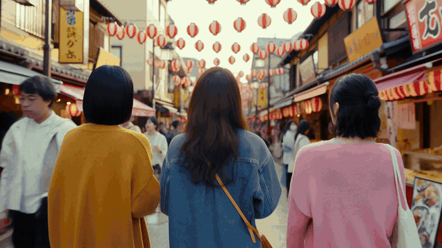](https://x.com/Lianaalane/status/2093213626664706410) | **[多人旅行路线｜同伴锚点、食物接力与纪念品收束](catalog/cases/x-lianaalane-2093213626664706410-browser-2093213626664706410-video-1/SUMMARY.md)**<br><sub>x-lianaalane-2093213626664706410-browser-2093213626664706410-video-1</sub> | MiniMax H3 · Seedance 2.0 |
| [](https://x.com/AllaAisling/status/2093055195215540688) | **[天体事件改写路线｜新光源、障碍生成与航向适配](catalog/cases/x-allaaisling-2093055195215540688-browser-2093055195215540688-video-1/SUMMARY.md)**<br><sub>x-allaaisling-2093055195215540688-browser-2093055195215540688-video-1</sub> | MiniMax H3 · Seedance 2.0 |
| [](https://x.com/AIwithAliya/status/2093022598187954484) | **[座驾旅程揭示｜地标俯瞰、车辆接管与驾驶者证明](catalog/cases/x-aiwithaliya-2093022598187954484-browser-2093022598187954484-video-1/SUMMARY.md)**<br><sub>x-aiwithaliya-2093022598187954484-browser-2093022598187954484-video-1</sub> | MiniMax H3 · Seedance 2.0 |
| [](https://x.com/maybeegreen/status/2093201693429334344) | **[能量物越界再稳定｜室内激活、环境替换与原位回收](catalog/cases/x-maybeegreen-2093201693429334344-browser-2093201693429334344-video-1/SUMMARY.md)**<br><sub>x-maybeegreen-2093201693429334344-browser-2093201693429334344-video-1</sub> | MiniMax H3 · Seedance 2.0 |
| [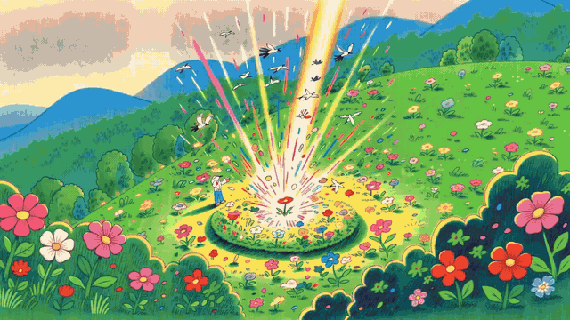](https://x.com/whorange__/status/2093201601024725317) | **[扫描束环境耗竭｜局部变灰、跨景传播与有限回馈](catalog/cases/x-whorange-2093201601024725317-browser-2093201601024725317-video-1/SUMMARY.md)**<br><sub>x-whorange-2093201601024725317-browser-2093201601024725317-video-1</sub> | MiniMax H3 · Seedance 2.0 |
| [](https://x.com/juliaevee/status/2093021520146915393) | **[阅读触发身份转化｜书页发光、形态交接与动作连续](catalog/cases/x-juliaevee-2093021520146915393-browser-2093021520146915393-video-1/SUMMARY.md)**<br><sub>x-juliaevee-2093021520146915393-browser-2093021520146915393-video-1</sub> | MiniMax H3 · Seedance 2.0 |
| [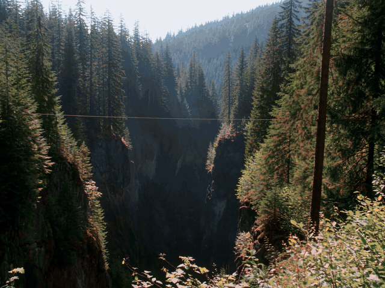](https://x.com/VxRender/status/2093096797275074853) | **[表演受扰坠落｜能力建立、外部破坏与失衡结果](catalog/cases/x-vxrender-2093096797275074853-browser-2093096797275074853-video-1/SUMMARY.md)**<br><sub>x-vxrender-2093096797275074853-browser-2093096797275074853-video-1</sub> | MiniMax H3 · Seedance 2.0 |
| [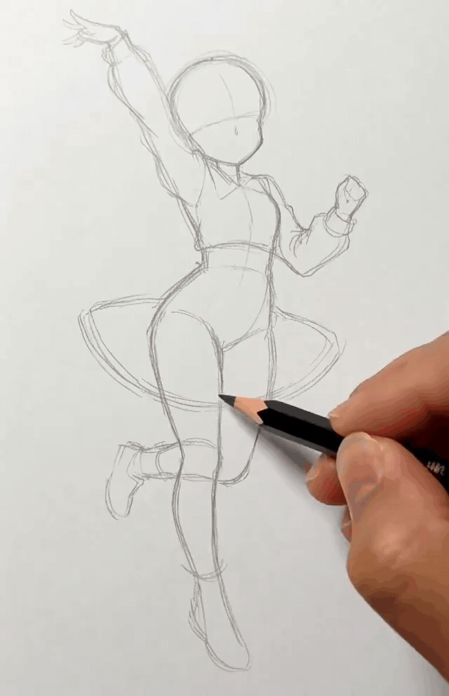](https://x.com/kiyoshi_shin/status/2093149595861930044) | **[手绘逐层完成｜骨架线稿、细节闭合与彩色成品](catalog/cases/x-kiyoshi-shin-2093149595861930044-browser-2093149595861930044-video-1/SUMMARY.md)**<br><sub>x-kiyoshi-shin-2093149595861930044-browser-2093149595861930044-video-1</sub> | MiniMax H3 · Seedance 2.0 |
| [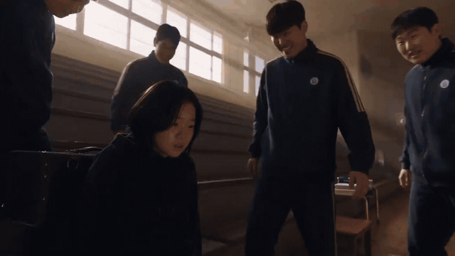](https://x.com/AIwithMinal/status/2093255620845576248) | **[近身能量格斗｜受围起势、接触闪光与逐敌清场](catalog/cases/x-aiwithminal-2093255620845576248-browser-2093255620845576248-video-1/SUMMARY.md)**<br><sub>x-aiwithminal-2093255620845576248-browser-2093255620845576248-video-1</sub> | MiniMax H3 · Seedance 2.0 |
| [](https://x.com/Mayz1169/status/2093263619677212894) | **[单角图形舞台｜动作短句、发辫擦镜与循环回标](catalog/cases/x-mayz1169-2093263619677212894-browser-2093263619677212894-video-1/SUMMARY.md)**<br><sub>x-mayz1169-2093263619677212894-browser-2093263619677212894-video-1</sub> | MiniMax H3 · Seedance 2.0 |
| [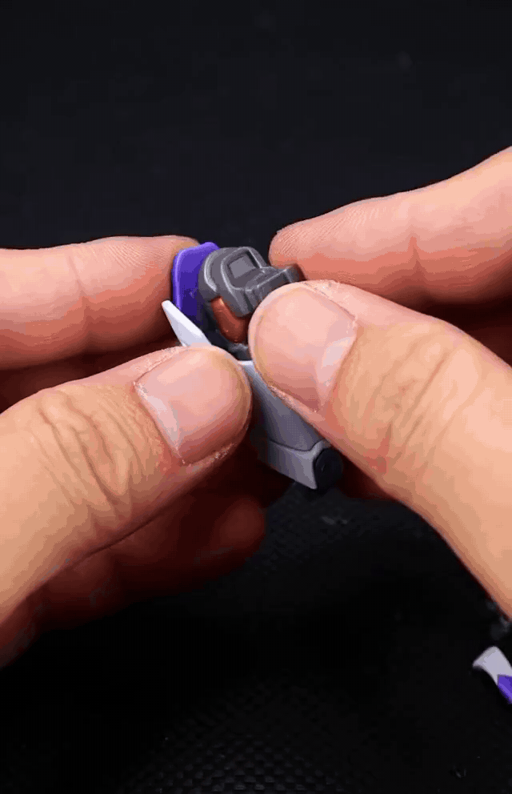](https://x.com/kiyoshi_shin/status/2093182133548560776) | **[微型拼装递进｜局部扣合、结构扩展与整体验收](catalog/cases/x-kiyoshi-shin-2093182133548560776-browser-2093182133548560776-video-1/SUMMARY.md)**<br><sub>x-kiyoshi-shin-2093182133548560776-browser-2093182133548560776-video-1</sub> | MiniMax H3 · Seedance 2.0 |
| [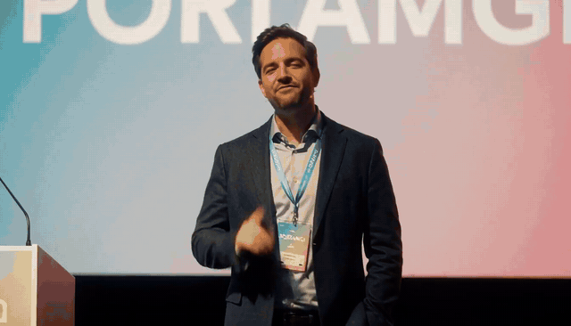](https://x.com/GamerHashCom/status/2093208454781423755) | **[宣讲到远端结果｜人物承诺、观众响应与设备证明](catalog/cases/x-gamerhashcom-2093208454781423755-browser-2093208454781423755-video-1/SUMMARY.md)**<br><sub>x-gamerhashcom-2093208454781423755-browser-2093208454781423755-video-1</sub> | MiniMax H3 · Seedance 2.0 |
| [](https://x.com/NicoTk167694/status/2093262288384151858) | **[同行者升空消散｜静态合影、并肩前进与光翼释放](catalog/cases/x-nicotk167694-2093262288384151858-browser-2093262288384151858-video-1/SUMMARY.md)**<br><sub>x-nicotk167694-2093262288384151858-browser-2093262288384151858-video-1</sub> | MiniMax H3 · Seedance 2.0 |
| [](https://x.com/fathermerry/status/2093179789242667193) | **[车内紧急双人反应｜痛感发作、驾驶应答与拥堵压力](catalog/cases/x-fathermerry-2093179789242667193-browser-2093179789242667193-video-1/SUMMARY.md)**<br><sub>x-fathermerry-2093179789242667193-browser-2093179789242667193-video-1</sub> | MiniMax H3 · Seedance 2.0 |
| [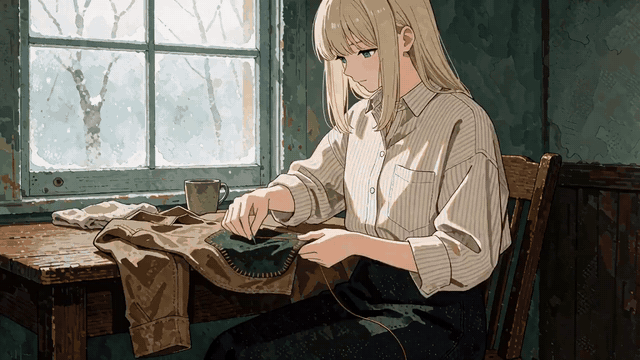](https://x.com/imaginaldomain/status/2093137271067427119) | **[静谧手作循环｜缝合推进、茶歇停顿与原位恢复](catalog/cases/x-imaginaldomain-2093137271067427119-browser-2093137271067427119-video-1/SUMMARY.md)**<br><sub>x-imaginaldomain-2093137271067427119-browser-2093137271067427119-video-1</sub> | MiniMax H3 · Seedance 2.0 |
| [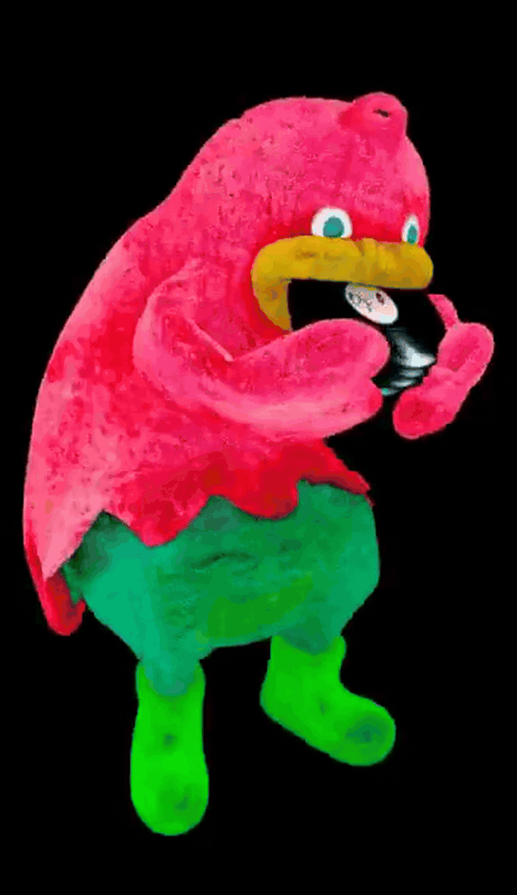](https://x.com/mu_uumm/status/2093213081396756775) | **[吉祥物道具律动｜唱片托举、吞吐错觉与重复舞步](catalog/cases/x-mu-uumm-2093213081396756775-browser-2093213081396756775-video-1/SUMMARY.md)**<br><sub>x-mu-uumm-2093213081396756775-browser-2093213081396756775-video-1</sub> | MiniMax H3 · Seedance 2.0 |
| [](https://x.com/Nora_GMI/status/2093222355665322439) | **[尺度俯冲揭示｜轨道、城市、街巷与人物连续锁定](catalog/cases/x-nora-gmi-2093222355665322439-browser-2093222355665322439-video-1/SUMMARY.md)**<br><sub>x-nora-gmi-2093222355665322439-browser-2093222355665322439-video-1</sub> | MiniMax H3 · Seedance 2.0 |
| [](https://x.com/ponyodong/status/2093523920045699263) | **[双角色片头汇合｜独立署名、前景擦镜与主标题收束](catalog/cases/x-ponyodong-2093523920045699263-browser-2093523920045699263-video-1/SUMMARY.md)**<br><sub>x-ponyodong-2093523920045699263-browser-2093523920045699263-video-1</sub> | MiniMax H3 · Seedance 2.0 |
| [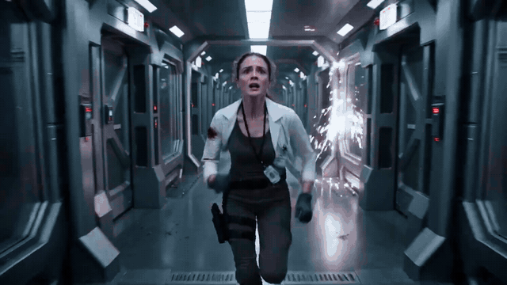](https://x.com/DeCat2025/status/2093546935789535237) | **[连续逃生阈值链｜追击压迫、出口进入与巨构揭示](catalog/cases/x-decat2025-2093546935789535237-browser-2093546935789535237-video-1/SUMMARY.md)**<br><sub>x-decat2025-2093546935789535237-browser-2093546935789535237-video-1</sub> | MiniMax H3 · Seedance 2.0 |
| [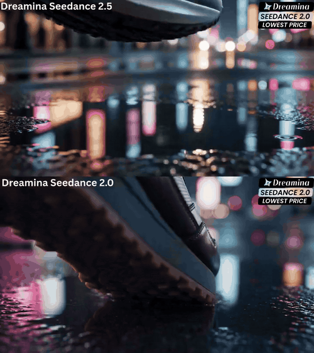](https://x.com/CharaspowerAI/status/2093262336811503893) | **[运动鞋使用证据｜涉水步态、路面压力与产品英雄镜头](catalog/cases/x-charaspowerai-2093262336811503893-browser-2093262336811503893-video-1/SUMMARY.md)**<br><sub>x-charaspowerai-2093262336811503893-browser-2093262336811503893-video-1</sub> | MiniMax H3 · Seedance 2.0 |
| [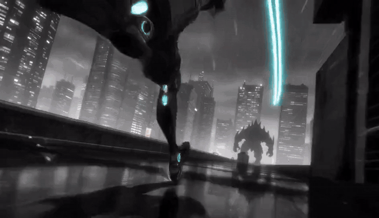](https://x.com/DeCat2025/status/2093529560931242087) | **[体型不对称追逐｜窄路规避、武器转向与临界对峙](catalog/cases/x-decat2025-2093529560931242087-browser-2093529560931242087-video-1/SUMMARY.md)**<br><sub>x-decat2025-2093529560931242087-browser-2093529560931242087-video-1</sub> | MiniMax H3 · Seedance 2.0 |
| [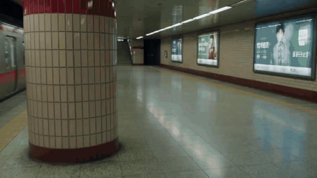](https://x.com/AbdulahOrifi/status/2093513855896867224) | **[冲撞后近战升级｜柱体损伤、身体恢复与挑战者接管](catalog/cases/x-abdulahorifi-2093513855896867224-browser-2093513855896867224-video-1/SUMMARY.md)**<br><sub>x-abdulahorifi-2093513855896867224-browser-2093513855896867224-video-1</sub> | MiniMax H3 · Seedance 2.0 |
| [](https://x.com/applete77191758/status/2092968204390027307) | **[角色署名图形轮播｜身份锚点、姿势交接与主字回归](catalog/cases/x-applete77191758-2092968204390027307-browser-2092968204390027307-video-1/SUMMARY.md)**<br><sub>x-applete77191758-2092968204390027307-browser-2092968204390027307-video-1</sub> | MiniMax H3 · Seedance 2.0 |
| [](https://x.com/abxxai/status/2092968802283852088) | **[平面饮品证据链｜包装锚定、开启因果与倒杯落版](catalog/cases/x-abxxai-2092968802283852088-browser-2092968802283852088-video-1/SUMMARY.md)**<br><sub>x-abxxai-2092968802283852088-browser-2092968802283852088-video-1</sub> | MiniMax H3 · Seedance 2.0 |
| [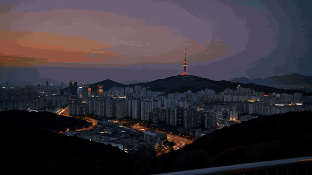](https://x.com/ayzalnooor24521/status/2093520969600278810) | **[同装旅行章节｜地标换景、街头触感与目的地收束](catalog/cases/x-ayzalnooor24521-2093520969600278810-browser-2093520969600278810-video-1/SUMMARY.md)**<br><sub>x-ayzalnooor24521-2093520969600278810-browser-2093520969600278810-video-1</sub> | MiniMax H3 · Seedance 2.0 |
| [](https://x.com/aimikoda/status/2093516077674246461) | **[激励短句动力排版｜语义层级、动作词推进与终句锁定](catalog/cases/x-aimikoda-2093516077674246461-browser-2093516077674246461-video-1/SUMMARY.md)**<br><sub>x-aimikoda-2093516077674246461-browser-2093516077674246461-video-1</sub> | MiniMax H3 · Seedance 2.0 |
| [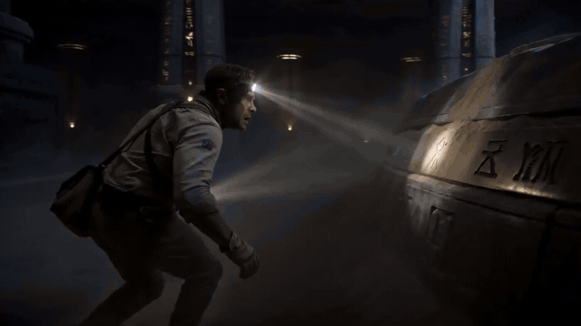](https://x.com/DeCat2025/status/2093504644567740693) | **[微小接触激活巨构｜符号点亮、同心扩展与空间门户](catalog/cases/x-decat2025-2093504644567740693-browser-2093504644567740693-video-1/SUMMARY.md)**<br><sub>x-decat2025-2093504644567740693-browser-2093504644567740693-video-1</sub> | MiniMax H3 · Seedance 2.0 |
| [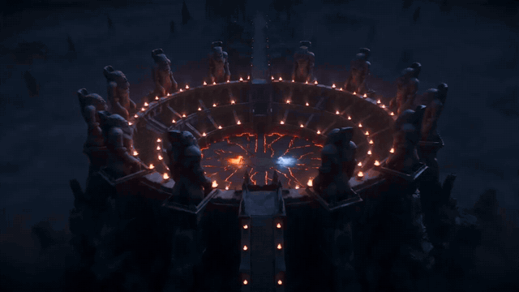](https://x.com/DeCat2025/status/2093421654223237139) | **[双材质对称决斗｜身份预备、远近交换与具象终撞](catalog/cases/x-decat2025-2093421654223237139-browser-2093421654223237139-video-1/SUMMARY.md)**<br><sub>x-decat2025-2093421654223237139-browser-2093421654223237139-video-1</sub> | MiniMax H3 · Seedance 2.0 |
| [](https://x.com/AiStork_/status/2093497006509719677) | **[固定地点历史建造｜年份阶梯、施工累积与地标完成](catalog/cases/x-aistork-2093497006509719677-browser-2093497006509719677-video-1/SUMMARY.md)**<br><sub>x-aistork-2093497006509719677-browser-2093497006509719677-video-1</sub> | MiniMax H3 · Seedance 2.0 |
| [](https://x.com/jboogx_creative/status/2093439452098252810) | **[日常规则具象后果｜提醒出现、忽视停顿与清理行动](catalog/cases/x-jboogx-creative-2093439452098252810-browser-2093439452098252810-video-1/SUMMARY.md)**<br><sub>x-jboogx-creative-2093439452098252810-browser-2093439452098252810-video-1</sub> | MiniMax H3 · Seedance 2.0 |
| [](https://x.com/prompt_soru/status/2093532752541024373) | **[封闭路线自由物越界｜手工建立、窗口释放与远景提问](catalog/cases/x-prompt-soru-2093532752541024373-browser-2093532752541024373-video-1/SUMMARY.md)**<br><sub>x-prompt-soru-2093532752541024373-browser-2093532752541024373-video-1</sub> | MiniMax H3 · Seedance 2.0 |
| [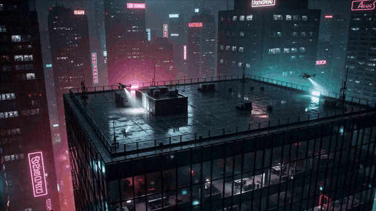](https://x.com/nicolasmariar/status/2093534643395940382) | **[赛博潜入三段式｜高处抵达、能力证明与室内揭面](catalog/cases/x-nicolasmariar-2093534643395940382-browser-2093534643395940382-video-1/SUMMARY.md)**<br><sub>x-nicolasmariar-2093534643395940382-browser-2093534643395940382-video-1</sub> | MiniMax H3 · Seedance 2.0 |
| [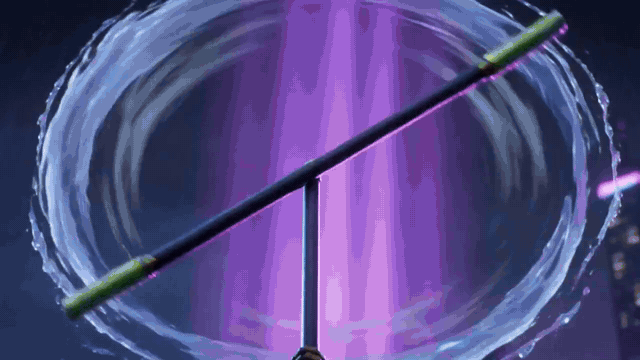](https://x.com/0xemotions_/status/2093348913101050293) | **[单道具技巧阶梯｜基础循环、空中升级与英雄回位](catalog/cases/x-0xemotions-2093348913101050293-browser-2093348913101050293-video-1/SUMMARY.md)**<br><sub>x-0xemotions-2093348913101050293-browser-2093348913101050293-video-1</sub> | MiniMax H3 · Seedance 2.0 |
| [](https://x.com/imaginaldomain/status/2093497840358264932) | **[安静书写进度钟｜落笔推进、蘸墨复位与无缝续写](catalog/cases/x-imaginaldomain-2093497840358264932-browser-2093497840358264932-video-1/SUMMARY.md)**<br><sub>x-imaginaldomain-2093497840358264932-browser-2093497840358264932-video-1</sub> | MiniMax H3 · Seedance 2.0 |
| [](https://x.com/kan8888kawa/status/2093514079180894701) | **[近距威胁接触链｜单体打击、抓握挣脱与逃跑转接](catalog/cases/x-kan8888kawa-2093514079180894701-browser-2093514079180894701-video-1/SUMMARY.md)**<br><sub>x-kan8888kawa-2093514079180894701-browser-2093514079180894701-video-1</sub> | MiniMax H3 · Seedance 2.0 |
| [](https://x.com/HBCoop_/status/2093512228242931917) | **[单工作位微表演｜控制确认、视线转移与静默待命](catalog/cases/x-hbcoop-2093512228242931917-browser-2093512228242931917-video-1/SUMMARY.md)**<br><sub>x-hbcoop-2093512228242931917-browser-2093512228242931917-video-1</sub> | MiniMax H3 · Seedance 2.0 |
| [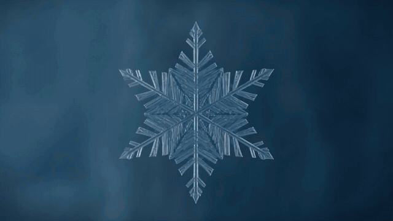](https://x.com/100xMart/status/2093458605215490468) | **[冰封世界状态游历｜规则标记、地貌证据与静止终局](catalog/cases/x-100xmart-2093458605215490468-browser-2093458605215490468-video-1/SUMMARY.md)**<br><sub>x-100xmart-2093458605215490468-browser-2093458605215490468-video-1</sub> | MiniMax H3 · Seedance 2.0 |
| [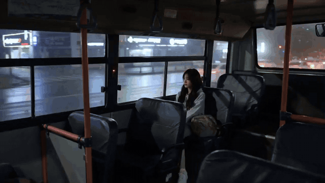](https://x.com/AIwithMinal/status/2093560634822762971) | **[雾窗触痕回应｜人物注视、指尖作画与情绪回望](catalog/cases/x-aiwithminal-2093560634822762971-browser-2093560634822762971-video-1/SUMMARY.md)**<br><sub>x-aiwithminal-2093560634822762971-browser-2093560634822762971-video-1</sub> | MiniMax H3 · Seedance 2.0 |
| [](https://x.com/Lianaalane/status/2093553083104350554) | **[晨间训练递进｜准备、力量组、补水与离场兑现](catalog/cases/x-lianaalane-2093553083104350554-browser-2093553083104350554-video-1/SUMMARY.md)**<br><sub>x-lianaalane-2093553083104350554-browser-2093553083104350554-video-1</sub> | MiniMax H3 · Seedance 2.0 |
| [](https://x.com/MissDelulu9/status/2093553021817073718) | **[色材围绕产品成形｜液态环、粒子爆发与英雄复位](catalog/cases/x-missdelulu9-2093553021817073718-browser-2093553021817073718-video-1/SUMMARY.md)**<br><sub>x-missdelulu9-2093553021817073718-browser-2093553021817073718-video-1</sub> | MiniMax H3 · Seedance 2.0 |
| [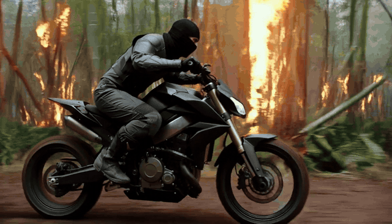](https://x.com/WuxiaRocks/status/2093550413144584656) | **[高速追逐再解释｜侧跟载具、巨物介入与爆炸余波](catalog/cases/x-wuxiarocks-2093550413144584656-browser-2093550413144584656-video-1/SUMMARY.md)**<br><sub>x-wuxiarocks-2093550413144584656-browser-2093550413144584656-video-1</sub> | MiniMax H3 · Seedance 2.0 |
| [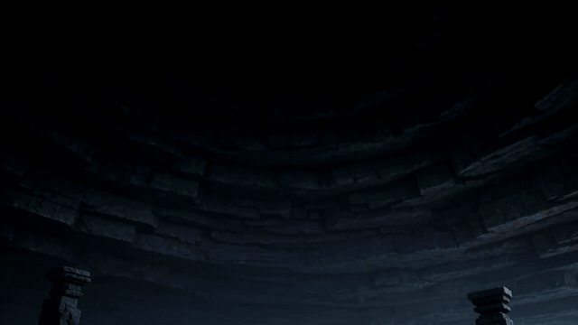](https://x.com/johnAGI168/status/2093545479338373323) | **[召唤尺度兑现｜能量成形、人物显现与巨相护持](catalog/cases/x-johnagi168-2093545479338373323-browser-2093545479338373323-video-1/SUMMARY.md)**<br><sub>x-johnagi168-2093545479338373323-browser-2093545479338373323-video-1</sub> | MiniMax H3 · Seedance 2.0 |
| [](https://x.com/floopers966/status/2093544965485859087) | **[工业载体失控｜海面异常、驾驶反应与港区余波](catalog/cases/x-floopers966-2093544965485859087-browser-2093544965485859087-video-1/SUMMARY.md)**<br><sub>x-floopers966-2093544965485859087-browser-2093544965485859087-video-1</sub> | MiniMax H3 · Seedance 2.0 |
| [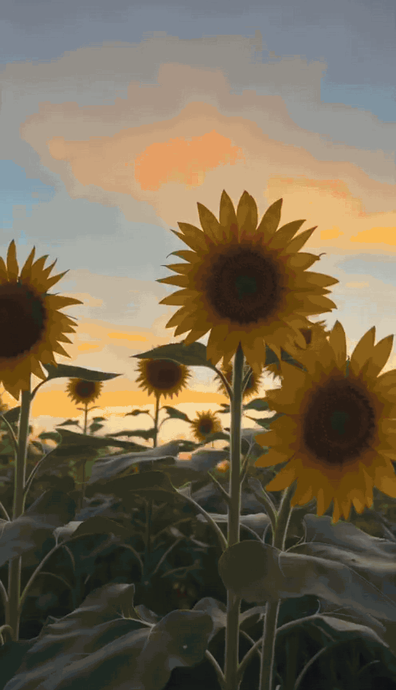](https://x.com/PolloAIJP/status/2093498113583439908) | **[季节记忆组曲｜群体活动、空场残留与个人回望](catalog/cases/x-polloaijp-2093498113583439908-browser-2093498113583439908-video-1/SUMMARY.md)**<br><sub>x-polloaijp-2093498113583439908-browser-2093498113583439908-video-1</sub> | MiniMax H3 · Seedance 2.0 |
| [](https://x.com/yudotanaka/status/2093481504139591787) | **[几何形态转场链｜实体箭头、圆形遮罩与像素故障](catalog/cases/x-yudotanaka-2093481504139591787-browser-2093481504139591787-video-1/SUMMARY.md)**<br><sub>x-yudotanaka-2093481504139591787-browser-2093481504139591787-video-1</sub> | MiniMax H3 · Seedance 2.0 |
| [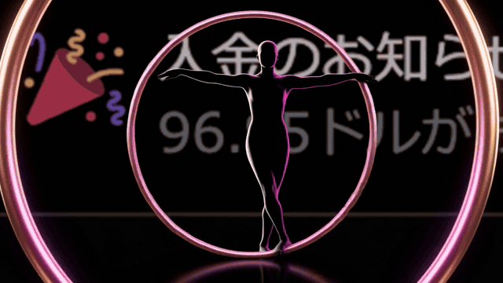](https://x.com/Naonekozamurai/status/2093474780683149442) | **[庆祝舞姿字卡｜圆环舞台、数字回应与感谢收束](catalog/cases/x-naonekozamurai-2093474780683149442-browser-2093474780683149442-video-1/SUMMARY.md)**<br><sub>x-naonekozamurai-2093474780683149442-browser-2093474780683149442-video-1</sub> | MiniMax H3 · Seedance 2.0 |
| [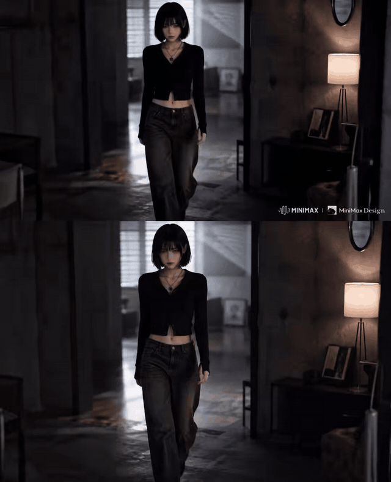](https://x.com/varts_works/status/2093457990661853670) | **[室内连续跟随｜侧向人物锚点、墙体穿越与俯视揭图](catalog/cases/x-varts-works-2093457990661853670-browser-2093457990661853670-video-1/SUMMARY.md)**<br><sub>x-varts-works-2093457990661853670-browser-2093457990661853670-video-1</sub> | MiniMax H3 · Seedance 2.0 |
| [](https://x.com/airina_xyz/status/2093372840598974696) | **[受挫修复再出发｜失败字卡、局部调整与路线重启](catalog/cases/x-airina-xyz-2093372840598974696-browser-2093372840598974696-video-1/SUMMARY.md)**<br><sub>x-airina-xyz-2093372840598974696-browser-2093372840598974696-video-1</sub> | MiniMax H3 · Seedance 2.0 |
| [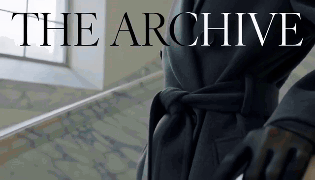](https://x.com/sahilvermaai/status/2093371555350716920) | **[编号时装章节｜同一造型跨天气、材质与姿势回归](catalog/cases/x-sahilvermaai-2093371555350716920-browser-2093371555350716920-video-1/SUMMARY.md)**<br><sub>x-sahilvermaai-2093371555350716920-browser-2093371555350716920-video-1</sub> | MiniMax H3 · Seedance 2.0 |
| [](https://x.com/Venom_Creations/status/2093371464682799229) | **[睡眠微动状态｜固定身份、呼吸证据与安静回稳](catalog/cases/x-venom-creations-2093371464682799229-browser-2093371464682799229-video-1/SUMMARY.md)**<br><sub>x-venom-creations-2093371464682799229-browser-2093371464682799229-video-1</sub> | MiniMax H3 · Seedance 2.0 |
| [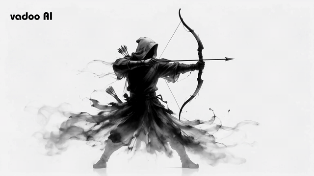](https://x.com/vadooai/status/2093345360710344839) | **[水墨兵器接力｜轮廓成形、招式交接与烟墨消散](catalog/cases/x-vadooai-2093345360710344839-browser-2093345360710344839-video-1/SUMMARY.md)**<br><sub>x-vadooai-2093345360710344839-browser-2093345360710344839-video-1</sub> | MiniMax H3 · Seedance 2.0 |
| [](https://x.com/ZoeyBennettAi/status/2093343507872383069) | **[食材到饮品状态链｜切开、取肉、搅打与倒杯证明](catalog/cases/x-zoeybennettai-2093343507872383069-browser-2093343507872383069-video-1/SUMMARY.md)**<br><sub>x-zoeybennettai-2093343507872383069-browser-2093343507872383069-video-1</sub> | MiniMax H3 · Seedance 2.0 |
| [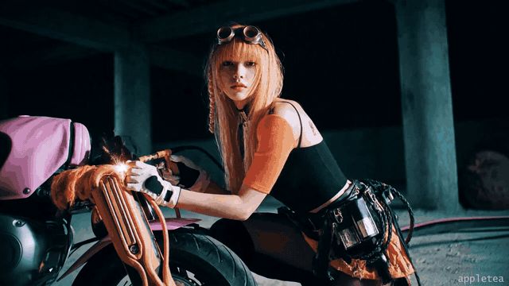](https://x.com/applete77191758/status/2093340157621760470) | **[赛博时装动作字卡｜身份近景、道具触发与载具离场](catalog/cases/x-applete77191758-2093340157621760470-browser-2093340157621760470-video-1/SUMMARY.md)**<br><sub>x-applete77191758-2093340157621760470-browser-2093340157621760470-video-1</sub> | MiniMax H3 · Seedance 2.0 |
| [](https://x.com/Kiril_AI_art/status/2093322991602176374) | **[灾后情绪收紧｜双人依靠、环境浪压与泪痕终局](catalog/cases/x-kiril-ai-art-2093322991602176374-browser-2093322991602176374-video-1/SUMMARY.md)**<br><sub>x-kiril-ai-art-2093322991602176374-browser-2093322991602176374-video-1</sub> | MiniMax H3 · Seedance 2.0 |
| [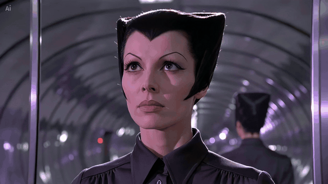](https://x.com/airina_xyz/status/2093322055995240877) | **[双轮对话反应｜固定轴线、表情加压与悬念停顿](catalog/cases/x-airina-xyz-2093322055995240877-browser-2093322055995240877-video-1/SUMMARY.md)**<br><sub>x-airina-xyz-2093322055995240877-browser-2093322055995240877-video-1</sub> | MiniMax H3 · Seedance 2.0 |
| [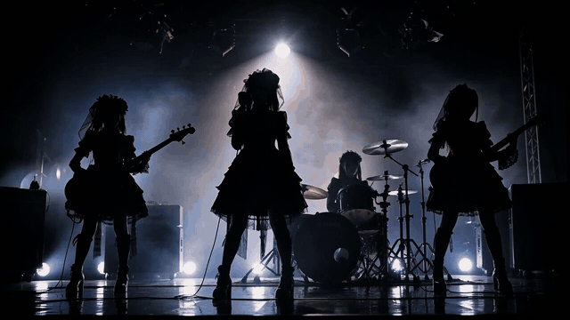](https://x.com/tsukuyomi2021/status/2093309199027757134) | **[乐队聚焦接力｜全场建立、成员特写与合奏回归](catalog/cases/x-tsukuyomi2021-2093309199027757134-browser-2093309199027757134-video-1/SUMMARY.md)**<br><sub>x-tsukuyomi2021-2093309199027757134-browser-2093309199027757134-video-1</sub> | MiniMax H3 · Seedance 2.0 |
| [](https://x.com/VigoCreativeAI/status/2093291618673578434) | **[插画战斗相态接力｜冲刺、接触弧、碎石与远景余波](catalog/cases/x-vigocreativeai-2093291618673578434-browser-2093291618673578434-video-1/SUMMARY.md)**<br><sub>x-vigocreativeai-2093291618673578434-browser-2093291618673578434-video-1</sub> | MiniMax H3 · Seedance 2.0 |
| [](https://x.com/aimikoda/status/2093697204384887023) | **[角色姿态验真｜面部、服装与全身尺度持续回连](catalog/cases/x-aimikoda-2093697204384887023-browser-2093697204384887023-video-1/SUMMARY.md)**<br><sub>x-aimikoda-2093697204384887023-browser-2093697204384887023-video-1</sub> | MiniMax H3 · Seedance 2.0 |
| [](https://x.com/LoveUolanda/status/2089764797361582208) | **[贴身环绕换人｜身体遮挡、背部接力与三人汇合](catalog/cases/x-loveuolanda-2089764797361582208-browser-2089764797361582208-video-1/SUMMARY.md)**<br><sub>x-loveuolanda-2089764797361582208-browser-2089764797361582208-video-1</sub> | MiniMax H3 · Seedance 2.0 |
| [](https://x.com/Diplomeme/status/2090136981112250653) | **[红毯材质递进｜正面逼近、裙摆掠镜与远景回连](catalog/cases/x-diplomeme-2090136981112250653-browser-2090136981112250653-video-1/SUMMARY.md)**<br><sub>x-diplomeme-2090136981112250653-browser-2090136981112250653-video-1</sub> | MiniMax H3 · Seedance 2.0 |
| [](https://x.com/techhalla/status/2091676049251688806) | **[墨烟角色字卡｜横向笔迹、人物显形与总句消散](catalog/cases/x-techhalla-2091676049251688806-browser-2091676049251688806-video-1/SUMMARY.md)**<br><sub>x-techhalla-2091676049251688806-browser-2091676049251688806-video-1</sub> | MiniMax H3 · Seedance 2.0 |
| [](https://x.com/navi_Ai2/status/2082819036182917160) | **[目标定位突入｜车辆侦察、队伍部署与门内兑现](catalog/cases/x-navi-ai2-2082819036182917160-browser-2082819036182917160-video-1/SUMMARY.md)**<br><sub>x-navi-ai2-2082819036182917160-browser-2082819036182917160-video-1</sub> | MiniMax H3 · Seedance 2.0 |
| [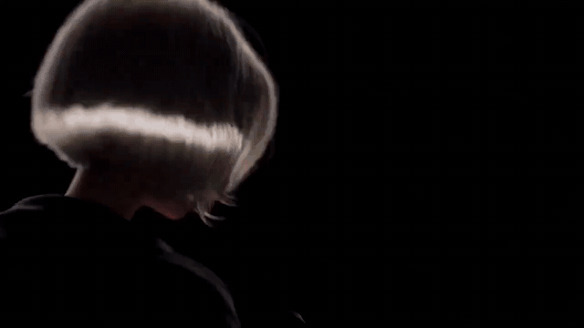](https://x.com/Noor_ul_ain43/status/2092184590001799236) | **[暗场人物揭晓｜眼部钩子、步态全身与外套释放](catalog/cases/x-noor-ul-ain43-2092184590001799236-browser-2092184590001799236-video-1/SUMMARY.md)**<br><sub>x-noor-ul-ain43-2092184590001799236-browser-2092184590001799236-video-1</sub> | MiniMax H3 · Seedance 2.0 |
| [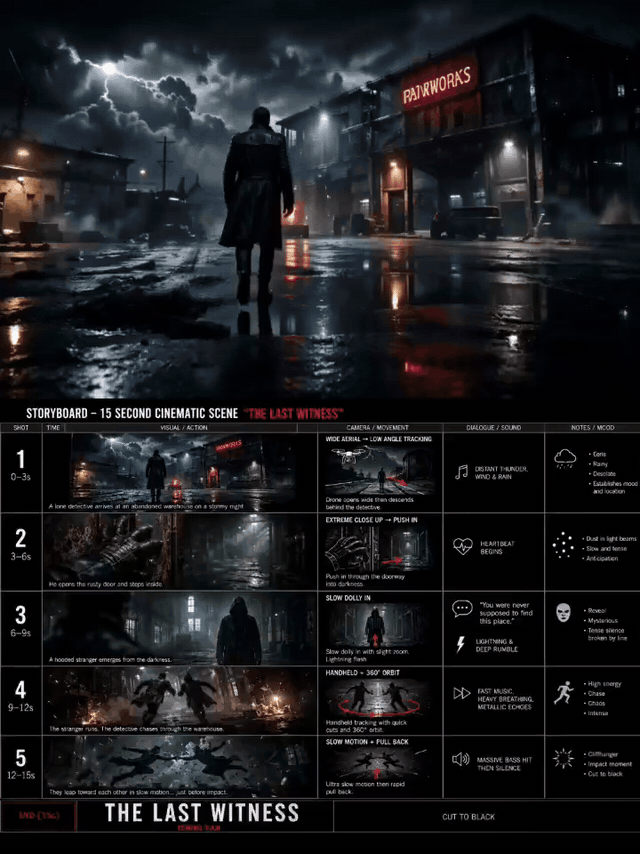](https://x.com/aiwithaly/status/2074718162650861989) | **[雨夜线索追入｜街道建立、门锁突破与仓库对峙](catalog/cases/x-aiwithaly-2074718162650861989-browser-2074718162650861989-video-1/SUMMARY.md)**<br><sub>x-aiwithaly-2074718162650861989-browser-2074718162650861989-video-1</sub> | MiniMax H3 · Seedance 2.0 |
| [](https://x.com/ayzalnooor24521/status/2053105541615136991) | **[舞步生墨｜足底触发、身体带流与山水终态](catalog/cases/x-ayzalnooor24521-2053105541615136991-browser-2053105541615136991-video-1/SUMMARY.md)**<br><sub>x-ayzalnooor24521-2053105541615136991-browser-2053105541615136991-video-1</sub> | MiniMax H3 · Seedance 2.0 |
| [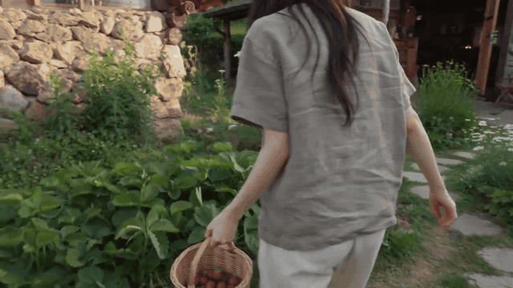](https://x.com/iamahmedfaraz66/status/2090285193307271614) | **[采摘一口实证｜环境基线、成熟选择、品尝与离场](catalog/cases/x-iamahmedfaraz66-2090285193307271614-browser-2090285193307271614-video-1/SUMMARY.md)**<br><sub>x-iamahmedfaraz66-2090285193307271614-browser-2090285193307271614-video-1</sub> | MiniMax H3 · Seedance 2.0 |
| [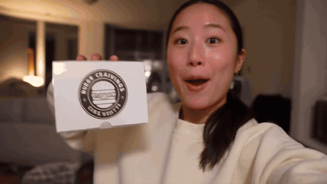](https://x.com/oggii_0/status/2088500493308084326) | **[UGC开箱一口实证｜包装、质地拉伸、品尝与结论](catalog/cases/x-oggii-0-2088500493308084326-browser-2088500493308084326-video-1/SUMMARY.md)**<br><sub>x-oggii-0-2088500493308084326-browser-2088500493308084326-video-1</sub> | MiniMax H3 · Seedance 2.0 |
| [](https://x.com/meng_dagg695/status/2088521954940813636) | **[基础服装验真｜面料细节、正侧背面与姿态回归](catalog/cases/x-meng-dagg695-2088521954940813636-browser-2088521954940813636-video-1/SUMMARY.md)**<br><sub>x-meng-dagg695-2088521954940813636-browser-2088521954940813636-video-1</sub> | MiniMax H3 · Seedance 2.0 |
| [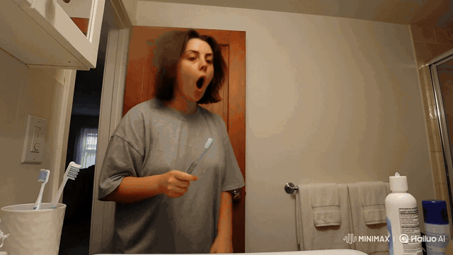](https://x.com/itxabdullaa/status/2087825234053464154) | **[困倦晨间复位｜打哈欠、刷牙失误与毛巾清醒](catalog/cases/x-itxabdullaa-2087825234053464154-browser-2087825234053464154-video-1/SUMMARY.md)**<br><sub>x-itxabdullaa-2087825234053464154-browser-2087825234053464154-video-1</sub> | MiniMax H3 · Seedance 2.0 |
| [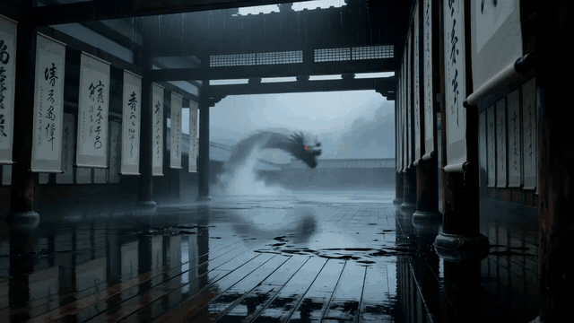](https://x.com/Dheepanratnam/status/2042020362091720848) | **[双材质攻防｜人物墨域、纸龙环绕与接触后回落](catalog/cases/x-dheepanratnam-2042020362091720848-browser-2042020362091720848-video-1/SUMMARY.md)**<br><sub>x-dheepanratnam-2042020362091720848-browser-2042020362091720848-video-1</sub> | MiniMax H3 · Seedance 2.0 |
| [](https://x.com/Itswsm105f/status/2077666970707890376) | **[洁面过程证据链｜包装、泵出、起泡、冲洗与肤感收束](catalog/cases/x-itswsm105f-2077666970707890376-browser-2077666970707890376-video-1/SUMMARY.md)**<br><sub>x-itswsm105f-2077666970707890376-browser-2077666970707890376-video-1</sub> | MiniMax H3 · Seedance 2.0 |
| [](https://x.com/Maercihh/status/2088876013140967588) | **[料理一口验收｜持续翻炒、食材软化与直接品尝](catalog/cases/x-maercihh-2088876013140967588-browser-2088876013140967588-video-1/SUMMARY.md)**<br><sub>x-maercihh-2088876013140967588-browser-2088876013140967588-video-1</sub> | MiniMax H3 · Seedance 2.0 |
| [](https://x.com/Inshrah_ali_/status/2081183987826049125) | **[抵达庆祝升级｜奔入人群、蛋糕峰值与城市烟花](catalog/cases/x-inshrah-ali-2081183987826049125-browser-2081183987826049125-video-1/SUMMARY.md)**<br><sub>x-inshrah-ali-2081183987826049125-browser-2081183987826049125-video-1</sub> | MiniMax H3 · Seedance 2.0 |
| [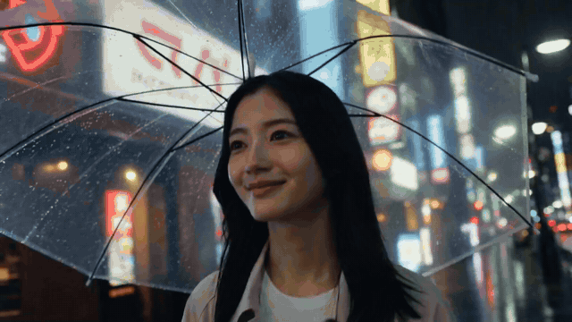](https://x.com/Inshrah_ali_/status/2078316824328872040) | **[告别物证回环｜雨中回望、戒指落桌与空街余震](catalog/cases/x-inshrah-ali-2078316824328872040-browser-2078316824328872040-video-1/SUMMARY.md)**<br><sub>x-inshrah-ali-2078316824328872040-browser-2078316824328872040-video-1</sub> | MiniMax H3 · Seedance 2.0 |
| [](https://x.com/yourPlugAI/status/2086663334133215401) | **[饮品感官跃迁｜搅拌基线、吸饮触发与包装回归](catalog/cases/x-yourplugai-2086663334133215401-browser-2086663334133215401-video-1/SUMMARY.md)**<br><sub>x-yourplugai-2086663334133215401-browser-2086663334133215401-video-1</sub> | MiniMax H3 · Seedance 2.0 |
| [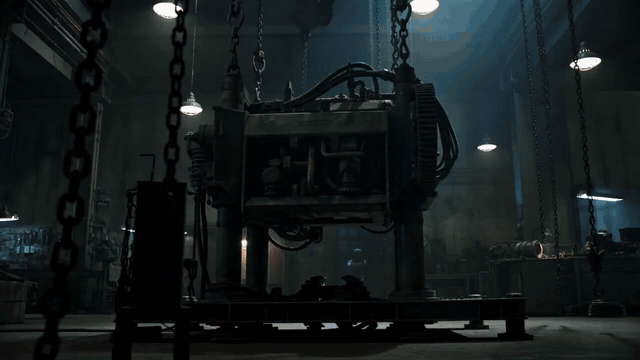](https://x.com/NEXUS_TO_NOVA/status/2079568028971208983) | **[机器前潜伏揭示｜遮挡基线、人物逼近与红警反打](catalog/cases/x-nexus-to-nova-2079568028971208983-browser-2079568028971208983-video-1/SUMMARY.md)**<br><sub>x-nexus-to-nova-2079568028971208983-browser-2079568028971208983-video-1</sub> | MiniMax H3 · Seedance 2.0 |
| [](https://x.com/Romi2656/status/2076254636328304699) | **[香气状态切换｜人群基线、喷洒触发、步态兑现与瓶身收束](catalog/cases/x-romi2656-2076254636328304699-browser-2076254636328304699-video-1/SUMMARY.md)**<br><sub>x-romi2656-2076254636328304699-browser-2076254636328304699-video-1</sub> | MiniMax H3 · Seedance 2.0 |
| [](https://x.com/Just_sharon7/status/2094305294117429711) | **[动作触发漫画字效｜角色锁定、冲击字与海报定格](catalog/cases/x-just-sharon7-2094305294117429711-browser-2094305294117429711-video-1/SUMMARY.md)**<br><sub>x-just-sharon7-2094305294117429711-browser-2094305294117429711-video-1</sub> | MiniMax H3 · Seedance 2.0 |
| [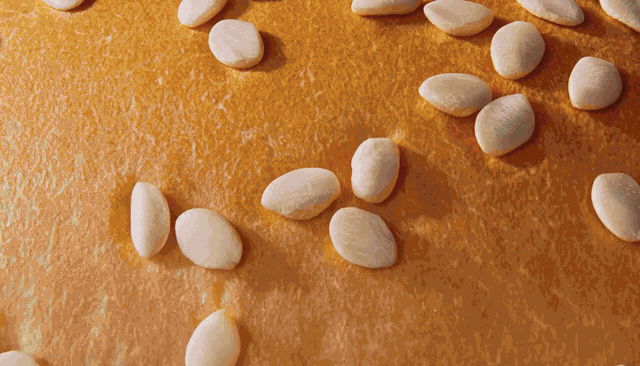](https://x.com/aimikoda/status/2094279178602283013) | **[食品分层证明｜完整基线、爆炸结构与英雄复位](catalog/cases/x-aimikoda-2094279178602283013-browser-2094279178602283013-video-1/SUMMARY.md)**<br><sub>x-aimikoda-2094279178602283013-browser-2094279178602283013-video-1</sub> | MiniMax H3 · Seedance 2.0 |
| [](https://x.com/AIwithJames/status/2094270762001514657) | **[自拍跨城接力｜同一人物、在地动作与前景擦镜](catalog/cases/x-aiwithjames-2094270762001514657-browser-2094270762001514657-video-1/SUMMARY.md)**<br><sub>x-aiwithjames-2094270762001514657-browser-2094270762001514657-video-1</sub> | MiniMax H3 · Seedance 2.0 |
| [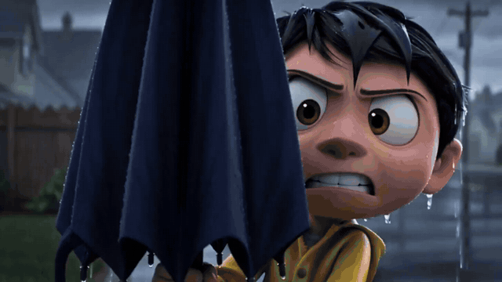](https://x.com/Ejaz_bashir1/status/2094292563704643811) | **[道具反复失控｜展开失败、短暂恢复与飞走收梗](catalog/cases/x-ejaz-bashir1-2094292563704643811-browser-2094292563704643811-video-1/SUMMARY.md)**<br><sub>x-ejaz-bashir1-2094292563704643811-browser-2094292563704643811-video-1</sub> | MiniMax H3 · Seedance 2.0 |
| [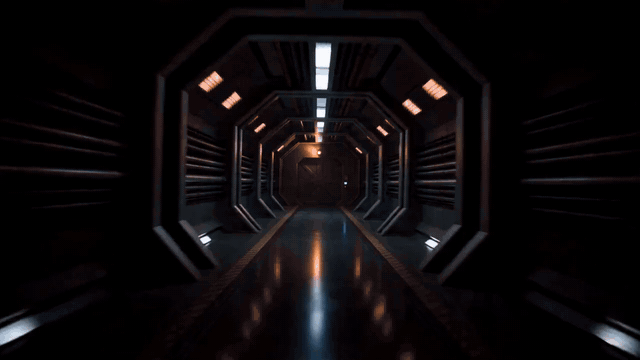](https://x.com/DeCat2025/status/2094197194584723764) | **[固定试验室换灾态｜门槛进入、四种介质与中心碰撞](catalog/cases/x-decat2025-2094197194584723764-browser-2094197194584723764-video-1/SUMMARY.md)**<br><sub>x-decat2025-2094197194584723764-browser-2094197194584723764-video-1</sub> | MiniMax H3 · Seedance 2.0 |
| [](https://x.com/CaliraVal/status/2094284844792520881) | **[移动载体时装退镜｜步态近脸与城市尺度回连](catalog/cases/x-caliraval-2094284844792520881-browser-2094284844792520881-video-1/SUMMARY.md)**<br><sub>x-caliraval-2094284844792520881-browser-2094284844792520881-video-1</sub> | MiniMax H3 · Seedance 2.0 |
| [](https://x.com/MrDasOnX/status/2094318362470101207) | **[散叶成灵鸟｜粒子聚合、展翼升空与光尘消散](catalog/cases/x-mrdasonx-2094318362470101207-browser-2094318362470101207-video-1/SUMMARY.md)**<br><sub>x-mrdasonx-2094318362470101207-browser-2094318362470101207-video-1</sub> | MiniMax H3 · Seedance 2.0 |
| [](https://x.com/DeCat2025/status/2094229194653733265) | **[平台尺度揭危｜小人物锚点、漂石逼近与巨面苏醒](catalog/cases/x-decat2025-2094229194653733265-browser-2094229194653733265-video-1/SUMMARY.md)**<br><sub>x-decat2025-2094229194653733265-browser-2094229194653733265-video-1</sub> | MiniMax H3 · Seedance 2.0 |
| [](https://x.com/afrinxai/status/2094304601919074308) | **[晨间收获闭环｜人物巡园、连续采摘与动物回应](catalog/cases/x-afrinxai-2094304601919074308-browser-2094304601919074308-video-1/SUMMARY.md)**<br><sub>x-afrinxai-2094304601919074308-browser-2094304601919074308-video-1</sub> | MiniMax H3 · Seedance 2.0 |
| [](https://x.com/maybeegreen/status/2094290118706335756) | **[停时失误复位｜倾倒冻结、手势归杯与日常继续](catalog/cases/x-maybeegreen-2094290118706335756-browser-2094290118706335756-video-1/SUMMARY.md)**<br><sub>x-maybeegreen-2094290118706335756-browser-2094290118706335756-video-1</sub> | MiniMax H3 · Seedance 2.0 |
| [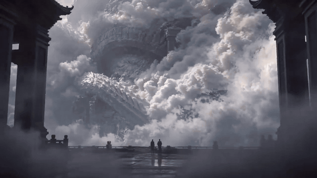](https://x.com/NexlowX/status/2094144180884849051) | **[云门巨兽逼近｜人类剪影、雾中显形与鼻端停留](catalog/cases/x-nexlowx-2094144180884849051-browser-2094144180884849051-video-1/SUMMARY.md)**<br><sub>x-nexlowx-2094144180884849051-browser-2094144180884849051-video-1</sub> | MiniMax H3 · Seedance 2.0 |
| [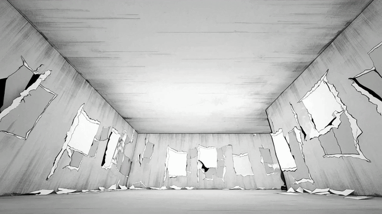](https://x.com/ponyodong/status/2094282576542470337) | **[拼贴舞姿字效｜黑白红角色、海报墙与短词接力](catalog/cases/x-ponyodong-2094282576542470337-browser-2094282576542470337-video-1/SUMMARY.md)**<br><sub>x-ponyodong-2094282576542470337-browser-2094282576542470337-video-1</sub> | MiniMax H3 · Seedance 2.0 |
| [](https://x.com/CanAiStudios/status/2094319440745677219) | **[双巨兽近身交换｜同场尺度、咬合试探与侧向压迫](catalog/cases/x-canaistudios-2094319440745677219-browser-2094319440745677219-video-1/SUMMARY.md)**<br><sub>x-canaistudios-2094319440745677219-browser-2094319440745677219-video-1</sub> | MiniMax H3 · Seedance 2.0 |
| [](https://x.com/ayzalnooor24521/status/2094243156225315270) | **[雪板路线升级｜装备确认、滑轨通过与腾空兑现](catalog/cases/x-ayzalnooor24521-2094243156225315270-browser-2094243156225315270-video-1/SUMMARY.md)**<br><sub>x-ayzalnooor24521-2094243156225315270-browser-2094243156225315270-video-1</sub> | MiniMax H3 · Seedance 2.0 |
| [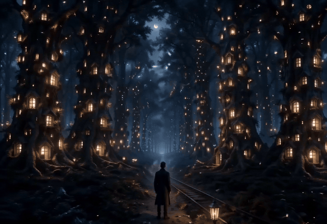](https://x.com/codewithhajra/status/2094099803407835369) | **[灯窗森林回环｜静默树屋、轨道显形与列车唤醒](catalog/cases/x-codewithhajra-2094099803407835369-browser-2094099803407835369-video-1/SUMMARY.md)**<br><sub>x-codewithhajra-2094099803407835369-browser-2094099803407835369-video-1</sub> | MiniMax H3 · Seedance 2.0 |
| [](https://x.com/ewotanosimo2310/status/2094299737839305097) | **[水光造境｜面具舞者聚球、绘阵与浮岛展开](catalog/cases/x-ewotanosimo2310-2094299737839305097-browser-2094299737839305097-video-1/SUMMARY.md)**<br><sub>x-ewotanosimo2310-2094299737839305097-browser-2094299737839305097-video-1</sub> | MiniMax H3 · Seedance 2.0 |
| [](https://x.com/jonnyboy/status/2094319381647966415) | **[正式场合反差钩子｜权威基线、服装错位与日常收束](catalog/cases/x-jonnyboy-2094319381647966415-browser-2094319381647966415-video-1/SUMMARY.md)**<br><sub>x-jonnyboy-2094319381647966415-browser-2094319381647966415-video-1</sub> | MiniMax H3 · Seedance 2.0 |
| [](https://x.com/AIwithMinal/status/2094297733175902349) | **[灾难停时释放｜静止人物、悬浮废墟与重力恢复](catalog/cases/x-aiwithminal-2094297733175902349-browser-2094297733175902349-video-1/SUMMARY.md)**<br><sub>x-aiwithminal-2094297733175902349-browser-2094297733175902349-video-1</sub> | MiniMax H3 · Seedance 2.0 |
| [](https://x.com/GeekCatX/status/2094279910034706924) | **[单角色姿态验真｜服装锚点、景别变化与全身回连](catalog/cases/x-geekcatx-2094279910034706924-browser-2094279910034706924-video-1/SUMMARY.md)**<br><sub>x-geekcatx-2094279910034706924-browser-2094279910034706924-video-1</sub> | MiniMax H3 · Seedance 2.0 |
| [](https://x.com/sarischerika/status/2094199982463340589) | **[室内暴走破界｜骑乘基线、障碍冲撞与彩窗出口](catalog/cases/x-sarischerika-2094199982463340589-browser-2094199982463340589-video-1/SUMMARY.md)**<br><sub>x-sarischerika-2094199982463340589-browser-2094199982463340589-video-1</sub> | MiniMax H3 · Seedance 2.0 |
| [](https://x.com/100xMart/status/2094545772012257382) | **[埋沙古城揭露｜空旷基线、轮廓显形与城门抵达](catalog/cases/x-100xmart-2094545772012257382-browser-2094545772012257382-video-1/SUMMARY.md)**<br><sub>x-100xmart-2094545772012257382-browser-2094545772012257382-video-1</sub> | MiniMax H3 · Seedance 2.0 |
| [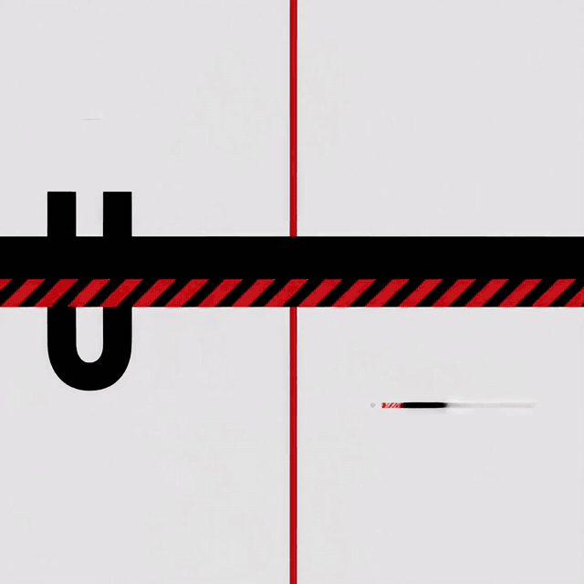](https://x.com/ai_lifehack55/status/2094385760514589091) | **[黑白红动作字场｜身份锁定、短词碰撞与角色回标](catalog/cases/x-ai-lifehack55-2094385760514589091-browser-2094385760514589091-video-1/SUMMARY.md)**<br><sub>x-ai-lifehack55-2094385760514589091-browser-2094385760514589091-video-1</sub> | MiniMax H3 · Seedance 2.0 |
| [](https://x.com/aimikoda/status/2094490203335352524) | **[流体地貌成城｜金色路径、山脊生长与实景回归](catalog/cases/x-aimikoda-2094490203335352524-browser-2094490203335352524-video-1/SUMMARY.md)**<br><sub>x-aimikoda-2094490203335352524-browser-2094490203335352524-video-1</sub> | MiniMax H3 · Seedance 2.0 |
| [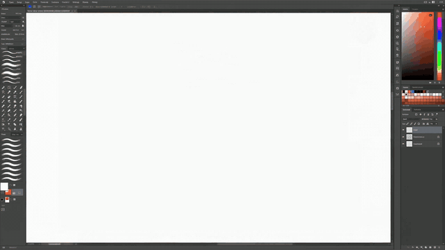](https://x.com/aimikoda/status/2094576083198951676) | **[绘图界面渐成角色｜骨架、线稿、上色与完成态回连](catalog/cases/x-aimikoda-2094576083198951676-browser-2094576083198951676-video-1/SUMMARY.md)**<br><sub>x-aimikoda-2094576083198951676-browser-2094576083198951676-video-1</sub> | MiniMax H3 · Seedance 2.0 |
| [](https://x.com/aiwithaly/status/2091749172361978149) | **[洗衣任务到喘息复位｜装载、完成证明与阳台收束](catalog/cases/x-aiwithaly-2091749172361978149-browser-2091749172361978149-video-1/SUMMARY.md)**<br><sub>x-aiwithaly-2091749172361978149-browser-2091749172361978149-video-1</sub> | MiniMax H3 · Seedance 2.0 |
| [](https://x.com/aiwithaly/status/2094643685338300751) | **[市场取物再入雨巷｜摊位基线、交易接触与路线续行](catalog/cases/x-aiwithaly-2094643685338300751-browser-2094643685338300751-video-1/SUMMARY.md)**<br><sub>x-aiwithaly-2094643685338300751-browser-2094643685338300751-video-1</sub> | MiniMax H3 · Seedance 2.0 |
| [](https://x.com/CaliraVal/status/2091012158280917271) | **[公路饮品证据链｜步态钩子、感官近脸与包装回归](catalog/cases/x-caliraval-2091012158280917271-browser-2091012158280917271-video-1/SUMMARY.md)**<br><sub>x-caliraval-2091012158280917271-browser-2091012158280917271-video-1</sub> | MiniMax H3 · Seedance 2.0 |
| [](https://x.com/CaliraVal/status/2091736749441736927) | **[双品护肤接力｜完整包装、单次涂抹与脸部结果](catalog/cases/x-caliraval-2091736749441736927-browser-2091736749441736927-video-1/SUMMARY.md)**<br><sub>x-caliraval-2091736749441736927-browser-2091736749441736927-video-1</sub> | MiniMax H3 · Seedance 2.0 |
| [](https://x.com/CaliraVal/status/2092464771874664617) | **[度假自拍定位｜迎面讲述、设施转向与脸部回连](catalog/cases/x-caliraval-2092464771874664617-browser-2092464771874664617-video-1/SUMMARY.md)**<br><sub>x-caliraval-2092464771874664617-browser-2092464771874664617-video-1</sub> | MiniMax H3 · Seedance 2.0 |
| [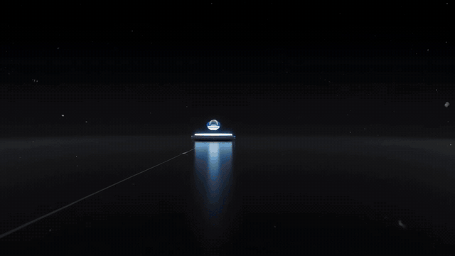](https://x.com/CaliraVal/status/2093923736483504439) | **[剪辑界面闭环｜导入素材、文字改写与机器人结果](catalog/cases/x-caliraval-2093923736483504439-browser-2093923736483504439-video-1/SUMMARY.md)**<br><sub>x-caliraval-2093923736483504439-browser-2093923736483504439-video-1</sub> | MiniMax H3 · Seedance 2.0 |
| [](https://x.com/CaliraVal/status/2094640598733234488) | **[雪板路线升级｜装备确认、连续转弯与腾空收束](catalog/cases/x-caliraval-2094640598733234488-browser-2094640598733234488-video-1/SUMMARY.md)**<br><sub>x-caliraval-2094640598733234488-browser-2094640598733234488-video-1</sub> | MiniMax H3 · Seedance 2.0 |
| [](https://x.com/CharaspowerAI/status/2091103106746442226) | **[液态铬字凝聚｜水滴汇流、字形锁定与粒子消散](catalog/cases/x-charaspowerai-2091103106746442226-browser-2091103106746442226-video-1/SUMMARY.md)**<br><sub>x-charaspowerai-2091103106746442226-browser-2091103106746442226-video-1</sub> | MiniMax H3 · Seedance 2.0 |
| [](https://x.com/codewithhajra/status/2091724679027265705) | **[山谷巨龙显形｜人物尺度、地貌眼睛与完整头部揭示](catalog/cases/x-codewithhajra-2091724679027265705-browser-2091724679027265705-video-1/SUMMARY.md)**<br><sub>x-codewithhajra-2091724679027265705-browser-2091724679027265705-video-1</sub> | MiniMax H3 · Seedance 2.0 |
| [](https://x.com/ImaStudio_ai/status/2094628597126558123) | **[洗衣房近距表演｜自拍邀请、机器互动与道具回环](catalog/cases/x-imastudio-ai-2094628597126558123-browser-2094628597126558123-video-1/SUMMARY.md)**<br><sub>x-imastudio-ai-2094628597126558123-browser-2094628597126558123-video-1</sub> | MiniMax H3 · Seedance 2.0 |
| [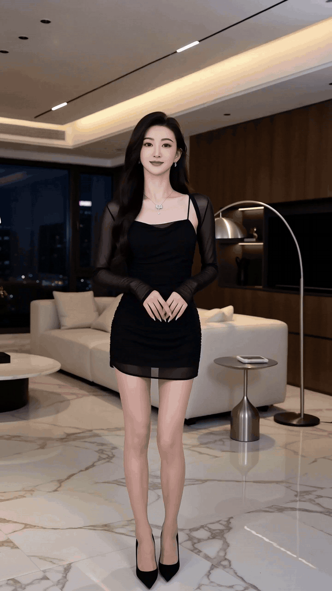](https://x.com/johnAGI168/status/2094686415585972658) | **[点选换装闭环｜阵列基线、光标选择与单人结果](catalog/cases/x-johnagi168-2094686415585972658-browser-2094686415585972658-video-1/SUMMARY.md)**<br><sub>x-johnagi168-2094686415585972658-browser-2094686415585972658-video-1</sub> | MiniMax H3 · Seedance 2.0 |
| [](https://x.com/nawalsehar/status/2091759912917327944) | **[缆车离站到远景｜登乘证明、车厢视野与目的地收束](catalog/cases/x-nawalsehar-2091759912917327944-browser-2091759912917327944-video-1/SUMMARY.md)**<br><sub>x-nawalsehar-2091759912917327944-browser-2091759912917327944-video-1</sub> | MiniMax H3 · Seedance 2.0 |
| [](https://x.com/noorlewisx/status/2091401178425008256) | **[昼夜底妆证明｜街景基线、持妆跨时与包装收束](catalog/cases/x-noorlewisx-2091401178425008256-browser-2091401178425008256-video-1/SUMMARY.md)**<br><sub>x-noorlewisx-2091401178425008256-browser-2091401178425008256-video-1</sub> | MiniMax H3 · Seedance 2.0 |
| [](https://x.com/onofumi_AI/status/2093951338367599004) | **[蓝色动漫宣传字卡｜角色锁定、冲击姿势与标题复归](catalog/cases/x-onofumi-ai-2093951338367599004-browser-2093951338367599004-video-1/SUMMARY.md)**<br><sub>x-onofumi-ai-2093951338367599004-browser-2093951338367599004-video-1</sub> | MiniMax H3 · Seedance 2.0 |
| [](https://x.com/TaliaAariz/status/2091496513432105182) | **[花境列车换装｜坐姿基线、窗景跃迁与礼服递进](catalog/cases/x-taliaaariz-2091496513432105182-browser-2091496513432105182-video-1/SUMMARY.md)**<br><sub>x-taliaaariz-2091496513432105182-browser-2091496513432105182-video-1</sub> | MiniMax H3 · Seedance 2.0 |
| [](https://x.com/TaliaAariz/status/2093755381050929623) | **[孔雀高定展开｜正面步态、尾扇增长与完整礼服回连](catalog/cases/x-taliaaariz-2093755381050929623-browser-2093755381050929623-video-1/SUMMARY.md)**<br><sub>x-taliaaariz-2093755381050929623-browser-2093755381050929623-video-1</sub> | MiniMax H3 · Seedance 2.0 |
| [](https://x.com/sophiaparkerr_/status/2094701248045789443) | **[颜色规则搜寻｜任务宣布、同色取物与满载回报](catalog/cases/x-sophiaparkerr-2094701248045789443-browser-2094701248045789443-video-1/SUMMARY.md)**<br><sub>x-sophiaparkerr-2094701248045789443-browser-2094701248045789443-video-1</sub> | MiniMax H3 · Seedance 2.0 |
| [](https://x.com/DesignSorceress/status/2094698020642132172) | **[护肤步骤证据链｜包装轮播、取用触点与脸部回验](catalog/cases/x-designsorceress-2094698020642132172-browser-2094698020642132172-video-1/SUMMARY.md)**<br><sub>x-designsorceress-2094698020642132172-browser-2094698020642132172-video-1</sub> | MiniMax H3 · Seedance 2.0 |
| [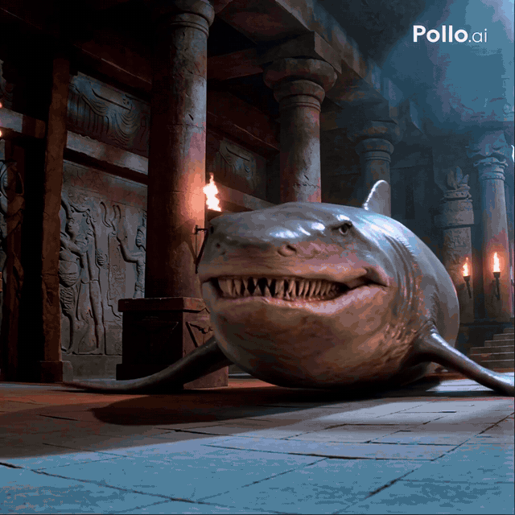](https://x.com/awesome_visuals/status/2094698010055696386) | **[威胁转商品｜危险逼近、反制命中与材质定型](catalog/cases/x-awesome-visuals-2094698010055696386-browser-2094698010055696386-video-1/SUMMARY.md)**<br><sub>x-awesome-visuals-2094698010055696386-browser-2094698010055696386-video-1</sub> | MiniMax H3 · Seedance 2.0 |
| [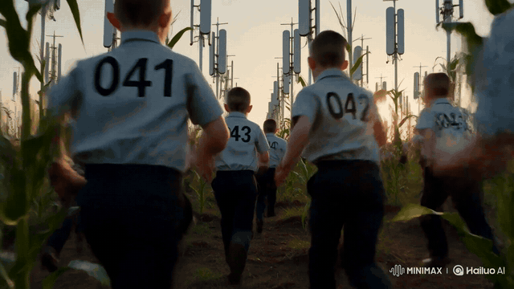](https://x.com/Alin_Reaper05/status/2094686295951859825) | **[群体路线个体停步｜共同奔跑、微物吸引与静场余韵](catalog/cases/x-alin-reaper05-2094686295951859825-browser-2094686295951859825-video-1/SUMMARY.md)**<br><sub>x-alin-reaper05-2094686295951859825-browser-2094686295951859825-video-1</sub> | MiniMax H3 · Seedance 2.0 |
| [](https://x.com/afrinxai/status/2094696983311339953) | **[山脊步行尺度揭示｜近身侧跟到海岸远景](catalog/cases/x-afrinxai-2094696983311339953-browser-2094696983311339953-video-1/SUMMARY.md)**<br><sub>x-afrinxai-2094696983311339953-browser-2094696983311339953-video-1</sub> | MiniMax H3 · Seedance 2.0 |
| [](https://x.com/SadiaMalik182/status/2094688480744083924) | **[拉面冲击状态链｜火焰、落锅、配料爆发与成品停留](catalog/cases/x-sadiamalik182-2094688480744083924-browser-2094688480744083924-video-1/SUMMARY.md)**<br><sub>x-sadiamalik182-2094688480744083924-browser-2094688480744083924-video-1</sub> | MiniMax H3 · Seedance 2.0 |
| [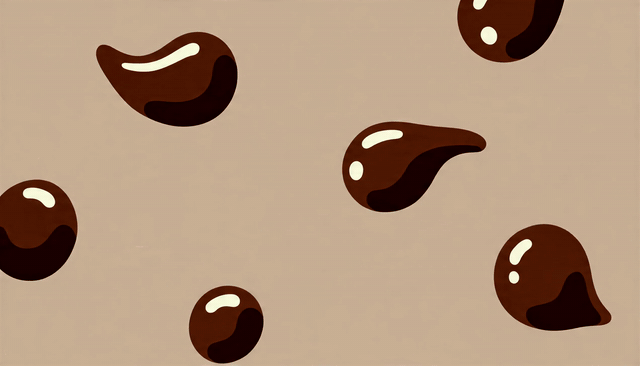](https://x.com/Just_sharon7/status/2094667719497187408) | **[平面巧克力饮品链｜液滴聚杯、包装倾倒与字标收束](catalog/cases/x-just-sharon7-2094667719497187408-browser-2094667719497187408-video-1/SUMMARY.md)**<br><sub>x-just-sharon7-2094667719497187408-browser-2094667719497187408-video-1</sub> | MiniMax H3 · Seedance 2.0 |
| [](https://x.com/arsalannazir07/status/2094652983309214152) | **[违规者自摔反制｜偷取、逃跑失衡与目击者追加惩罚](catalog/cases/x-arsalannazir07-2094652983309214152-browser-2094652983309214152-video-1/SUMMARY.md)**<br><sub>x-arsalannazir07-2094652983309214152-browser-2094652983309214152-video-1</sub> | MiniMax H3 · Seedance 2.0 |
| [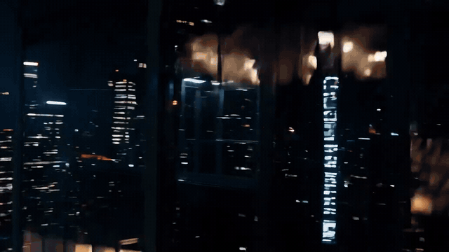](https://x.com/iamrealsnow/status/2094648618729017505) | **[坠落轿厢破界｜外部下降、内部冲击与烟尘出口](catalog/cases/x-iamrealsnow-2094648618729017505-browser-2094648618729017505-video-1/SUMMARY.md)**<br><sub>x-iamrealsnow-2094648618729017505-browser-2094648618729017505-video-1</sub> | MiniMax H3 · Seedance 2.0 |
| [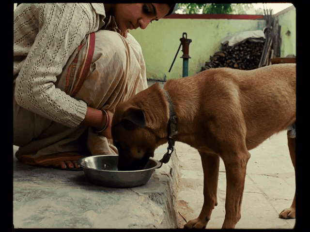](https://x.com/bmx_ai13/status/2094645801808969771) | **[庭院喂狗微任务｜进食基线、等待观察与轻触收束](catalog/cases/x-bmx-ai13-2094645801808969771-browser-2094645801808969771-video-1/SUMMARY.md)**<br><sub>x-bmx-ai13-2094645801808969771-browser-2094645801808969771-video-1</sub> | MiniMax H3 · Seedance 2.0 |
| [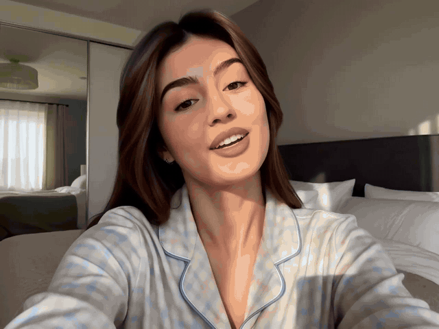](https://x.com/Sairah_0/status/2094636604237213941) | **[晨间自拍视频压缩｜卧室问候、饮水、换装与出门](catalog/cases/x-sairah-0-2094636604237213941-browser-2094636604237213941-video-1/SUMMARY.md)**<br><sub>x-sairah-0-2094636604237213941-browser-2094636604237213941-video-1</sub> | MiniMax H3 · Seedance 2.0 |
| [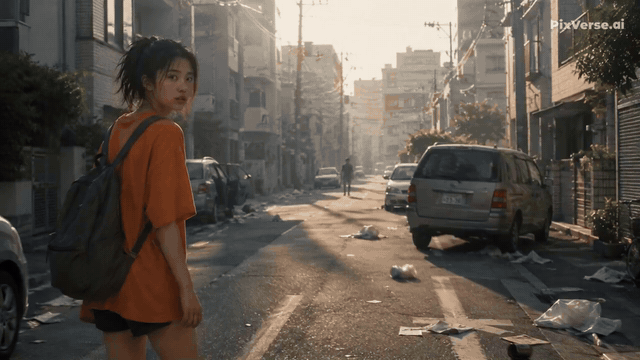](https://x.com/afrinxai/status/2094628869592748271) | **[空街回望追逐｜孤立基线、远端人影与巷道逼近](catalog/cases/x-afrinxai-2094628869592748271-browser-2094628869592748271-video-1/SUMMARY.md)**<br><sub>x-afrinxai-2094628869592748271-browser-2094628869592748271-video-1</sub> | MiniMax H3 · Seedance 2.0 |
| [](https://x.com/KaminiKamini222/status/2094620054113673230) | **[汉堡质感证明｜完整基线、融化拉丝与剖面收束](catalog/cases/x-kaminikamini222-2094620054113673230-browser-2094620054113673230-video-1/SUMMARY.md)**<br><sub>x-kaminikamini222-2094620054113673230-browser-2094620054113673230-video-1</sub> | MiniMax H3 · Seedance 2.0 |
| [](https://x.com/AIwithJessica/status/2094580769905934790) | **[平面汽水冲击链｜轮廓成罐、落地破冰与包装复归](catalog/cases/x-aiwithjessica-2094580769905934790-browser-2094580769905934790-video-1/SUMMARY.md)**<br><sub>x-aiwithjessica-2094580769905934790-browser-2094580769905934790-video-1</sub> | MiniMax H3 · Seedance 2.0 |
| [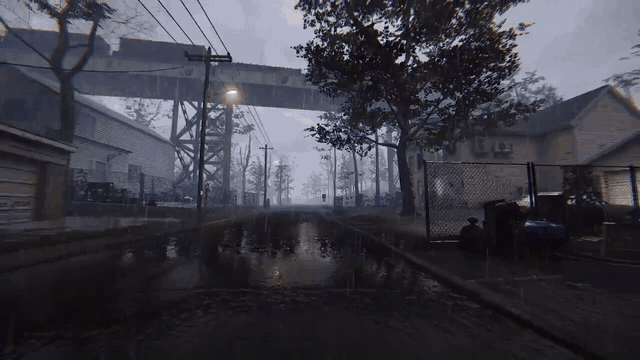](https://x.com/GamesByNoori/status/2094463311521968548) | **[第一视角工具调查｜雨镇抵达、器材切换与窥孔验真](catalog/cases/x-gamesbynoori-2094463311521968548-browser-2094463311521968548-video-1/SUMMARY.md)**<br><sub>x-gamesbynoori-2094463311521968548-browser-2094463311521968548-video-1</sub> | MiniMax H3 · Seedance 2.0 |
| [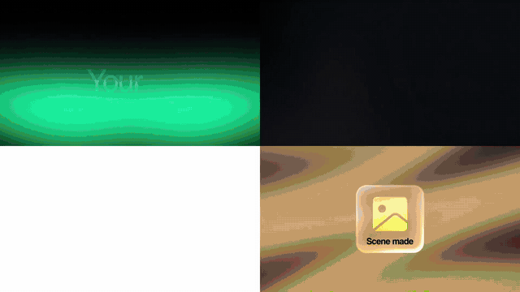](https://x.com/anugrahthegoat/status/2094562955107221821) | **[界面能力证明蒙太奇｜输入、工具、生成结果与复盘回标](catalog/cases/x-anugrahthegoat-2094562955107221821-browser-2094562955107221821-video-1/SUMMARY.md)**<br><sub>x-anugrahthegoat-2094562955107221821-browser-2094562955107221821-video-1</sub> | MiniMax H3 · Seedance 2.0 |
| [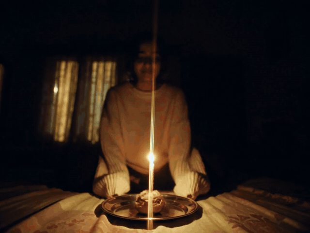](https://x.com/bmx_ai13/status/2094556015165636649) | **[仪式黑场复位｜期待微笑、吹灭中断与冷光回归](catalog/cases/x-bmx-ai13-2094556015165636649-browser-2094556015165636649-video-1/SUMMARY.md)**<br><sub>x-bmx-ai13-2094556015165636649-browser-2094556015165636649-video-1</sub> | MiniMax H3 · Seedance 2.0 |
| [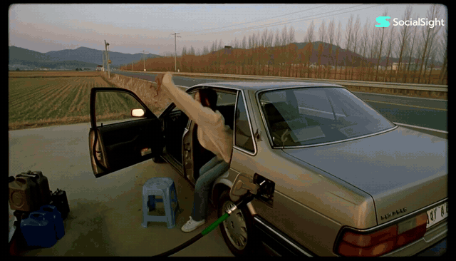](https://x.com/bmx_ai13/status/2094541985466216780) | **[加油站固定广角互动｜迎镜表演、坐上车身与同伴入画](catalog/cases/x-bmx-ai13-2094541985466216780-browser-2094541985466216780-video-1/SUMMARY.md)**<br><sub>x-bmx-ai13-2094541985466216780-browser-2094541985466216780-video-1</sub> | MiniMax H3 · Seedance 2.0 |
| [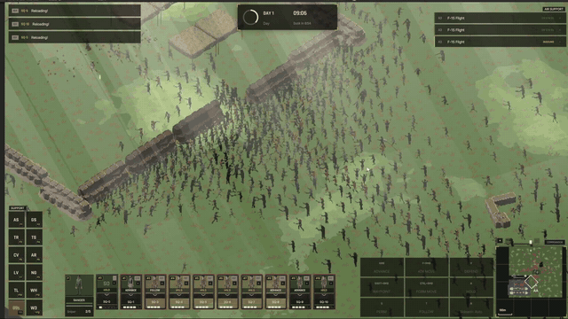](https://x.com/ProjectAliveDev/status/2094498350922141870) | **[俯视战场双波打击｜密集基线、空投冲击与回程齐射](catalog/cases/x-projectalivedev-2094498350922141870-browser-2094498350922141870-video-1/SUMMARY.md)**<br><sub>x-projectalivedev-2094498350922141870-browser-2094498350922141870-video-1</sub> | MiniMax H3 · Seedance 2.0 |
| [](https://x.com/AllaAisling/status/2094479832419799506) | **[外线超车证明｜并排行驶、较长路线与车头领先](catalog/cases/x-allaaisling-2094479832419799506-browser-2094479832419799506-video-1/SUMMARY.md)**<br><sub>x-allaaisling-2094479832419799506-browser-2094479832419799506-video-1</sub> | MiniMax H3 · Seedance 2.0 |

<!-- CASE_GALLERY:END -->

## 快速开始

### 使用桌面查看器

1. 打开 [Releases](https://github.com/T8mars/minimax-h3-prompt-skill-T8/releases)。
2. Windows 可下载安装版 `T8-Prompt-Library-Setup-v1.4.3.exe`，或无需安装的 `T8-Prompt-Library-Portable-v1.4.3.exe`；macOS 下载 `T8-Prompt-Library-v1.4.3-mac-universal.dmg`。
3. 安装版正常安装后启动；便携版放入可写目录直接运行，个人数据会保存在程序旁的 `T8-Prompt-Library-Data`。
4. Windows 安装版可在应用内检查并由用户确认安装更新；Windows 便携版与当前未签名 macOS 版本通过 Releases 页面手动更新。

当前提供 Windows x64 安装版、Windows x64 便携版与 universal macOS（Intel + Apple Silicon）安装包。macOS 预览包尚未 Apple 签名或公证，安装前请核对 SHA-256；更详细说明见 [安装指南](./docs/installation.md)。

### API 增强工作台

主界面的“API 增强工作台”包含两个隔离能力：视频提示词模式提供由当前 API / 本地 Qwen 驱动的全库语义推荐、模板实例化、MiniMax H3 / Seedance 2.0、参考图片/视频与静态锚点验收；MiniMax Music 3 模式按官方 Skill 渐进读取最多 2 个索引和 3 份模板，输出歌词、结构化描述、Payload JSON 与安全报告。模板推荐不会按时长或关键词在前端猜测：第一次模型调用理解真实意图并扩展同义表达，随后对统一总索引做全量召回检查，第二次模型调用只从证据卡中语义复排，可靠结果不足时不会凑满 3 个。

当前统一总索引记录 446 个目录条目、435 个案例行和 223 个可推荐的去重模板 / 社区 Skill；同机制的 214 个证据变体仍逐条记账。每次新增入库都会随目录生成器重建 `catalog/template-index.json`，验证发现漏记或陈旧索引会直接失败。AI 分镜、双机制组合、视频 / Music 3 桥接与模板改进提案同样必须使用当前配置的 API 或本地 Qwen；本地代码只做时码、ID、哈希与合同校验，不代替创意判断。

工作台现有 4 个增强渠道：贞贞的平价小屋、贞贞的 AI 工坊、OpenAI 兼容接口，以及本地 GGUF。本地渠道会递归扫描用户选择的模型根目录，支持 ComfyUI 节点已实测的两个 Qwen3.8-27B 与轻量 Qwen3.8-9B，也允许选择其他 llama.cpp 兼容文字 GGUF；已验收型号和用户自备未验收型号会明确分开标记。图片/视频需要匹配的 mmproj，视频另需 FFmpeg。模型和本地运行时不会打包进 Release，也不会自动下载。

- 贞贞的平价小屋：[注册地址](https://api.seedance.nz/sign-up?aff=5f4w)
- 贞贞的 AI 工坊：[注册地址](https://ai.t8star.org/register?aff=dP7j)
- OpenAI 兼容接口：用户填写 HTTPS Base URL 与模型

Renderer 保持离线；公网请求、素材读取、Key、本地模型路径、一次性确认和错误归一化只在 Electron Main。每次远端调用或本地计算都需要当次确认，不静默换渠道；视频保持 0 retry，Music 3 只对平价小屋可确定的网关失败执行确认单已披露的有界重试。详见 [API 增强工作台](./docs/api-workbench.md)。

### 安装单个 Skill

```powershell
Copy-Item -Recurse .\skills\<skill-name> "$env:CODEX_HOME\skills\<skill-name>"
```

如果没有设置 `CODEX_HOME`，请将 Skill 复制到当前 Agent 产品指定的 Skills 目录。安装后重新加载 Agent。完整说明见 [Skill 安装](./docs/skill-installation.md)。

### 直接使用提示词

进入 `catalog/cases/<case-id>/prompts/`：

- `minimax-h3.md`：MiniMax H3 版本；
- `seedance-2.0.md`：Seedance 2.0 版本。

先阅读同目录的 `SUMMARY.md` 与 `creative-dna.json`，再替换主体、场景和产品变量；不要只复制画面名词。参见 [使用指南](./docs/usage.md)。

## 内容质量原则

只有状态为 `released` 的脱敏案例可以进入本仓库。公开案例必须包含：

- 可追溯的原始帖子地址与作者信息；
- 对时间、动作、运镜、光影、构图、声音或叙事机制的可复用分析；
- MiniMax H3 与 Seedance 2.0 两份经过校验的提示词；
- Creative DNA、适用范围、变量及 anti-copy 说明；
- GitHub GIF 预览，以及按权利状态明确声明的 Electron MP4 或本地回退映射；
- 不含本地绝对路径、账号凭据或内部采集信息。

技术教程、安装指南、性能/加速 Benchmark、模型 A/B 对比、新闻讨论和工作流演示不会进入案例目录。案例提交流程见 [贡献案例](./docs/contributing-cases.md)。

## 公开边界

本仓库是公共发行层，不是内部采集与审核工程。以下内容永远不随发布包公开：

- 内部路线图和项目级 Skill 指令；
- Codex 搜索、采集、审核、下载或自动化脚本；
- ComfyUI 节点、增强器及内部接入脚本；
- 草稿、被拒案例、浏览器状态、Cookie、Token、密钥和本地绝对路径。

CI 会执行公开边界、秘密、路径、目录结构、案例状态和 Skill frontmatter 检查。详情见 [公共发行边界](./docs/public-boundary.md)。

## 版本与更新

当前目标版本是 **v1.4.3**。项目使用十进制进位：

```text
v1.0.0 -> ... -> v1.0.9 -> v1.1.0
v1.1.9 -> v1.2.0
v1.2.0 -> v1.2.1
v1.2.1 -> v1.2.2
v1.2.2 -> v1.2.3
v1.2.3 -> v1.2.4
v1.2.4 -> v1.2.5
v1.2.6 -> v1.2.7
v1.2.7 -> v1.2.8
v1.2.8 -> v1.2.9
v1.3.5 -> v1.3.6
v1.3.8 -> v1.3.9
v1.3.9 -> v1.4.0
v1.4.0 -> v1.4.1
v1.4.1 -> v1.4.2
v1.4.2 -> v1.4.3
v1.9.9 -> v2.0.0
```

应用版本、案例目录版本和 Schema 版本分别记录，避免为了增加案例而不必要地改变数据合同。参见 [发布政策](./docs/release-policy.md)。

## 文档

- [安装](./docs/installation.md)
- [使用](./docs/usage.md)
- [双语与复制合同](./docs/localization-and-copy.md)
- [安装 Skills](./docs/skill-installation.md)
- [贡献案例](./docs/contributing-cases.md)
- [来源与引用](./docs/source-attribution.md)
- [公共发行边界](./docs/public-boundary.md)
- [发布与自动更新](./docs/release-policy.md)
- [隐私](./docs/privacy.md)
- [安全政策](./SECURITY.md)

## 许可与署名

- 应用和公共校验代码：[`MIT`](./LICENSE)
- 本项目原创的摘要、Creative DNA 与提示词模板：[`CC BY 4.0`](./LICENSE-CONTENT)
- 引用视频、GIF 中呈现的原始作品、平台标志和作者素材仍归各自权利人所有，并在案例中链接原帖。

本项目是社区策展项目，与 MiniMax、ByteDance、X、Reddit 或 YouTube 无官方隶属关系。上表只是对 MiniMax 官方仓库内容的固定版本索引；上游 Skill 的使用受其自身许可约束。
